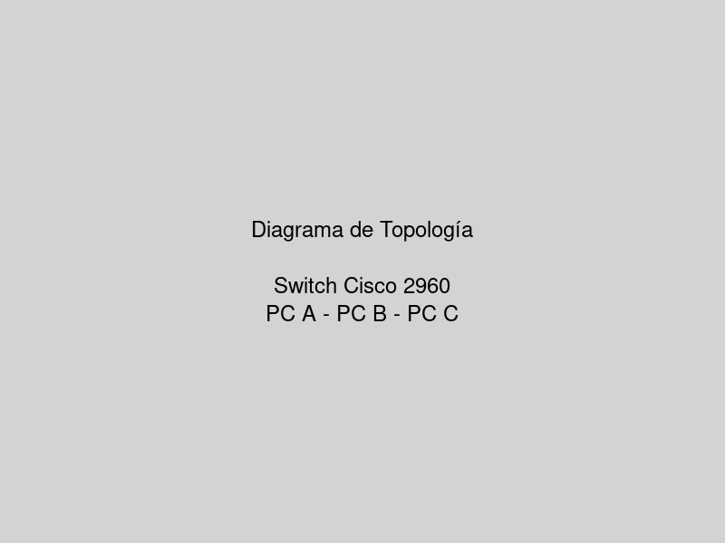
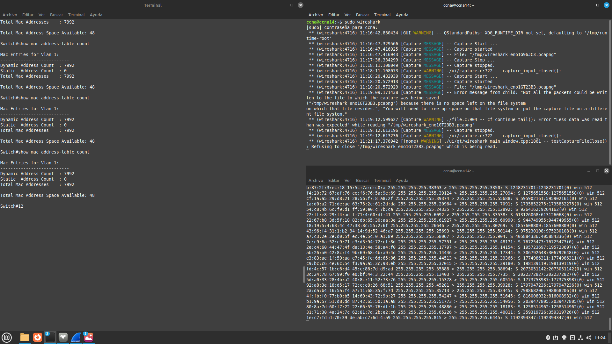
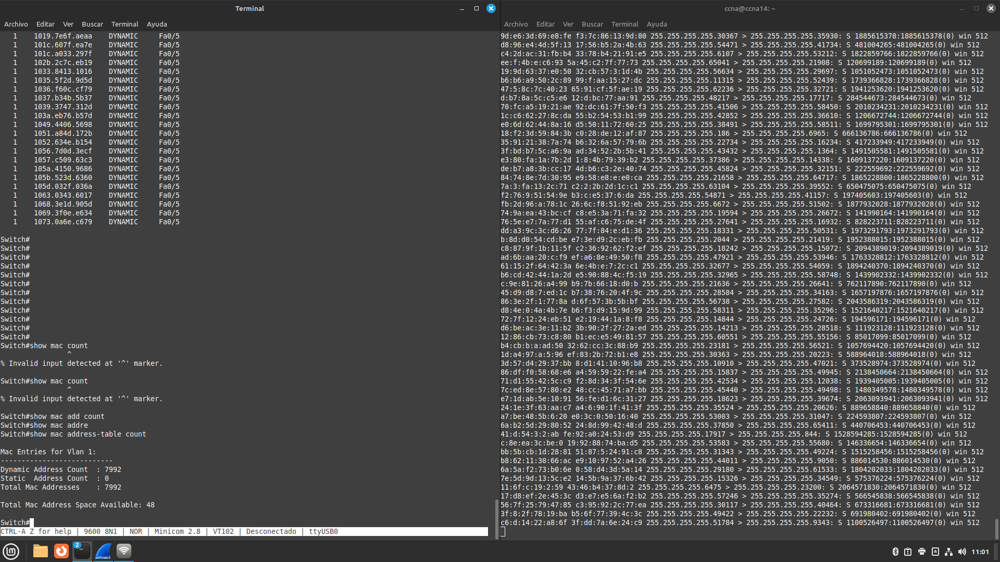
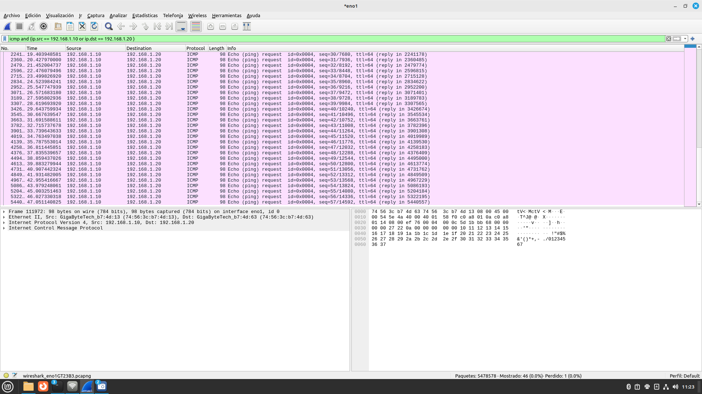
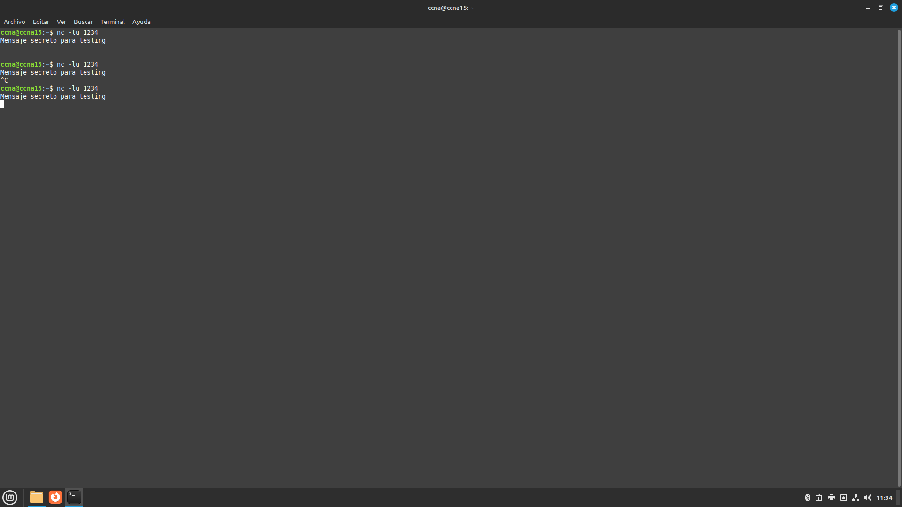
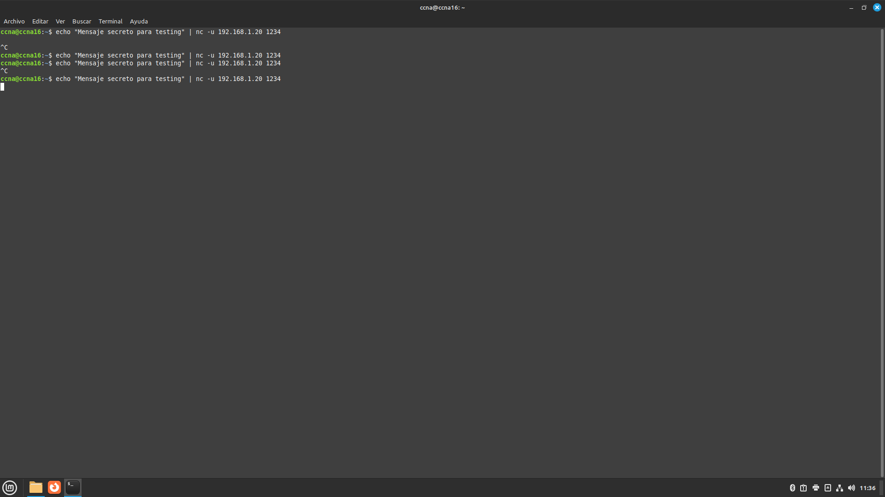
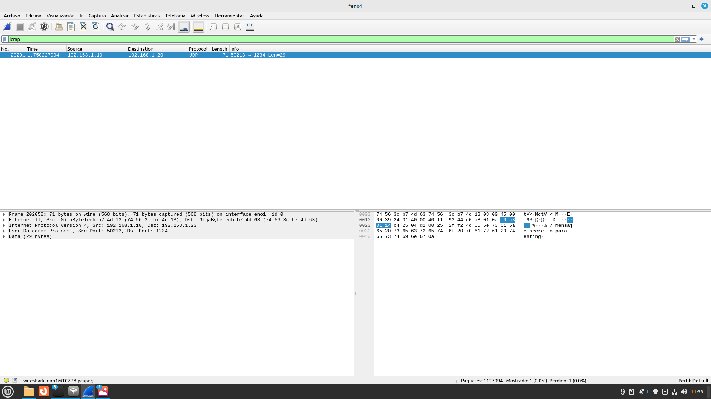

# Resumen Ejecutivo

Esta práctica documenta la implementación y análisis de un ataque de inundación MAC (MAC Flooding) sobre un switch Cisco 2960 en un entorno de laboratorio controlado. El objetivo es comprender las vulnerabilidades inherentes en las tablas CAM (Content Addressable Memory) de los switches y demostrar cómo un atacante puede explotar estas vulnerabilidades para interceptar tráfico de red mediante la saturación de la tabla de direcciones MAC.

**Objetivos alcanzados:**

- Implementación exitosa de ataque MAC flooding usando herramientas dsniff
- Análisis del comportamiento del switch ante saturación de tabla CAM
- Captura y análisis de tráfico interceptado usando Wireshark
- Documentación de técnicas de mitigación y mejores prácticas de seguridad

**Resultados clave:** Se logró saturar la tabla MAC del switch, forzando el comportamiento de hub y permitiendo la intercepción de comunicaciones entre dispositivos de la red.

# Identificación del Problema

## Contexto de Seguridad

Los switches de capa 2 mantienen una tabla de direcciones MAC (CAM table) que mapea direcciones MAC a puertos físicos. Esta tabla tiene un tamaño limitado y, cuando se satura, el switch puede comportarse como un hub, enviando tramas a todos los puertos (flooding mode).

## Vulnerabilidad Identificada

::: warning
**Problema:** Los switches Cisco 2960 son susceptibles a ataques de inundación MAC que pueden comprometer la segmentación de la red y permitir la intercepción pasiva de tráfico.
:::

**Impacto potencial:**
- Pérdida de confidencialidad del tráfico de red
- Degradación del rendimiento de la red
- Comprometimiento de la segmentación de VLANs

## Objetivos Específicos

1. Demostrar la vulnerabilidad MAC flooding en equipos físicos
2. Analizar el comportamiento del switch durante el ataque
3. Implementar técnicas de captura de tráfico
4. Documentar contramedidas de seguridad

# Metodología Aplicada

## Enfoque de Laboratorio Controlado

La práctica se realizó en un entorno de laboratorio aislado utilizando equipos físicos Cisco y herramientas de código abierto para análisis de seguridad.

## Herramientas Utilizadas

: Herramientas de análisis de seguridad y sus propósitos

| Herramienta | Versión | Propósito |
|-------------|---------|-----------|
| Cisco IOS | 15.x | Sistema operativo del switch |
| dsniff | 2.4 | Suite de herramientas de sniffing |
| macof | Incluida en dsniff | Generación de tramas MAC falsas |
| Wireshark | 4.x | Análisis de tráfico de red |
| netcat (nc) | 1.x | Generación de tráfico UDP/TCP |

## Metodología de Ataque

1. **Reconocimiento:** Análisis de la topología y configuración inicial
2. **Preparación:** Instalación de herramientas y configuración de captura
3. **Ejecución:** Implementación del ataque MAC flooding
4. **Validación:** Verificación de la efectividad del ataque
5. **Análisis:** Evaluación de resultados y evidencias

# Topología de Red Implementada

## Diagrama de Red

```
Topología de red implementada:

PC A (192.168.1.10) -------|
                           |
PC B (192.168.1.20) -------+--- Switch Cisco 2960 (192.168.1.254)
                           |     Fa0/1, Fa0/2, Fa0/3
PC C (192.168.1.30) -------|
   Atacante
```

La topología implementada consiste en un switch Cisco 2960 con tres dispositivos conectados: dos PCs para generar tráfico normal y un PC atacante equipado con herramientas de análisis de seguridad.



::: info
**Configuración de red:** Todos los dispositivos están en la misma VLAN (VLAN 1) para facilitar el análisis del comportamiento del switch durante el ataque.
:::

## Especificaciones del Hardware

### Switch Cisco 2960

```cisco-ios
Switch# show version
Cisco IOS Software, C2960 Software (C2960-LANBASEK9-M), Version 15.0(2)SE11
Hardware: WS-C2960-24TT-L
Processor: PowerPC405 at 266Mhz
Memory: 65536K bytes of flash memory
```

### Configuración de Direccionamiento IP

: Configuración de direccionamiento IP de los dispositivos

| Dispositivo | Interface | Dirección IP | Máscara | Gateway |
|-------------|-----------|--------------|---------|---------|
| PC A | eno1 | 192.168.1.10 | /24 | 192.168.1.1 |
| PC B | eno1 | 192.168.1.20 | /24 | 192.168.1.1 |
| PC C | eno1 | 192.168.1.30 | /24 | 192.168.1.1 |
| Switch | VLAN1 | 192.168.1.254 | /24 | - |

# Configuración Inicial

## Configuración Base del Switch

La configuración inicial del switch establece las conexiones básicas y parámetros de seguridad mínimos:

```cisco-ios
!
! Cisco Switch 2960 - Configuración Inicial
! Fecha: September 03, 2025
! Práctica: MAC Flooding Attack
! Versión: 1.0
!
service password-encryption
!
hostname SW1
!
enable secret cisco123
!
banner motd ^C
**************************************************
*  Laboratorio de Redes de Computadoras 2        *
*    Práctica: MAC Flooding Attack               *
**************************************************
!
interface FastEthernet0/1
 description "Conexion a PC A - 192.168.1.1"
 switchport mode access
 spanning-tree portfast
!
interface FastEthernet0/2
 description "Conexion a PC B - 192.168.1.2"
 switchport mode access
 spanning-tree portfast
!
interface FastEthernet0/3
 description "Conexion a PC C - 192.168.1.3 (Atacante)"
 switchport access vlan 1
 switchport mode access
 spanning-tree portfast
!
interface FastEthernet0/4
 shutdown
!
interface FastEthernet0/5
 shutdown
!
! [Continuación para puertos 6-24...]
interface range FastEthernet0/6-24
 shutdown
!
interface GigabitEthernet0/1
 shutdown
!
interface GigabitEthernet0/2
 shutdown
!
ip default-gateway 192.168.1.1
!
!
line con 0
 password cisco
 login
line vty 0 4
 password cisco
 login
line vty 5 15
 password cisco
 login
!
end
```

## Verificación del Estado Inicial

### Tabla MAC Inicial

```cisco-ios
Switch# show mac address-table
          Mac Address Table
-------------------------------------------

Vlan    Mac Address       Type        Ports
----    -----------       --------    -----
   1    7456.3cb7.4d13    DYNAMIC     Fa0/1
   1    7456.3cb7.4d63    DYNAMIC     Fa0/3
   1    7456.3cb7.0f23    DYNAMIC     Fa0/5
Total Mac Addresses for this criterion: 3
```

### Estado de Puertos

```cisco-ios
Switch# show interfaces status
Port      Name               Status       Vlan       Duplex  Speed Type
Fa0/1                        connected    1          a-full  a-100 10/100BaseTX
Fa0/3                        connected    1          a-full  a-100 10/100BaseTX
Fa0/5                        connected    1          a-full  a-100 10/100BaseTX
```

# Desarrollo Detallado

## Fase 1: Instalación de Herramientas

### Instalación de dsniff en PC C

La instalación de las herramientas de análisis se realizó mediante el gestor de paquetes del sistema:

```bash
# Actualización de repositorios
sudo apt update

# Instalación de dsniff
sudo apt install dsniff -y

# Verificación de instalación
which macof
dpkg -l | grep dsniff
```

::: success
**Verificación:** `macof` y el paquete `dsniff` deben estar instalados; `which macof` debe devolver la ruta del ejecutable.
:::

### Verificación de Wireshark

Wireshark ya estaba preinstalado en el sistema. Verificación:

```bash
wireshark --version
```

## Fase 2: Análisis de Comportamiento Normal

### Prueba de Conectividad Inicial

Desde PC A hacia PC B:

```bash
ping -c 4 192.168.1.20
```

**Resultado esperado:**

```
PING 192.168.1.20 (192.168.1.20) 56(84) bytes of data.
64 bytes from 192.168.1.20: icmp_seq=1 ttl=64 time=1.23 ms
64 bytes from 192.168.1.20: icmp_seq=2 ttl=64 time=0.892 ms
64 bytes from 192.168.1.20: icmp_seq=3 ttl=64 time=0.821 ms
64 bytes from 192.168.1.20: icmp_seq=4 ttl=64 time=0.934 ms

--- 192.168.1.20 ping statistics ---
4 packets transmitted, 4 received, 0% packet loss
```

### Captura de Tráfico Normal en PC C

Iniciamos Wireshark en PC C con filtro ICMP:

```bash
sudo wireshark &
```

**Filtro aplicado:** `icmp`

::: info
**Comportamiento normal:** En condiciones normales, PC C NO debería ver el tráfico ICMP entre PC A y PC B, ya que el switch mantiene la segmentación por puertos.
:::

## Fase 3: Implementación del Ataque MAC Flooding

### Ejecución de macof

En PC C, ejecutamos el ataque:

```bash
sudo macof -i eno1 -s random -d random
```

**Parámetros utilizados:**
- `-i eno1`: Interface de red a utilizar
- `-s random`: Direcciones MAC origen aleatorias
- `-d random`: Direcciones MAC destino aleatorias



### Monitoreo de la Tabla MAC Durante el Ataque

```cisco-ios
Switch# show mac address-table
          Mac Address Table
-------------------------------------------

Vlan    Mac Address       Type        Ports
----    -----------       --------    -----
   1    7456.3cb7.4d13    DYNAMIC     Fa0/1
   1    7456.3cb7.4d63    DYNAMIC     Fa0/3
   1    7456.3cb7.0f23    DYNAMIC     Fa0/5
   .        ...             ...        ... 
   .        ...             ...        ... 
   .        ...             ...        ... 
   1    1234.5678.9abc    DYNAMIC     Fa0/5
   1    abcd.ef12.3456    DYNAMIC     Fa0/5
Total Mac Addresses for this criterion: 7992
```

En el switch, monitoreamos el llenado de la tabla:

```cisco-ios
Switch# show mac address-table count
Dynamic Address Count:               7992
Static  Address Count:               0
Total Mac Addresses In Use:          7992

Total Mac Addresses Space Available:    48
```



::: warning
**Punto crítico:** Cuando la tabla MAC se satura (típicamente 8192 entradas en switches 2960), el switch comienza a comportarse como un hub, enviando tramas a todos los puertos.
:::

## Fase 4: Limpieza de Tabla MAC

### Borrado de Entradas Dinámicas

```cisco-ios
Switch# clear mac address-table dynamic
Switch# show mac address-table count
Dynamic Address Count:               0
Static  Address Count:               0
Total Mac Addresses In Use:          0

Total Mac Addresses Space Available:    8047
```

### Continuación del Ataque Post-Limpieza

Reanudamos macof inmediatamente después de la limpieza:

```bash
sudo macof -i eno1 -s random -d random
```

## Fase 5: Validación de Compromiso

Con macof ejecutándose, realizamos ping entre PC A y PC B:

**Desde PC A:**

```bash
ping -c 10 192.168.1.20
```

### Captura en PC C Durante el Ataque

En Wireshark (PC C), aplicamos filtro:

```
icmp and (ip.src == 192.168.1.10 or ip.dst == 192.168.1.20)
```

**Resultado esperado:** PC C ahora puede capturar el tráfico ICMP entre PC A y PC B.



### Prueba con Tráfico UDP

#### Configuración del Receptor (PC B)

```bash
nc -lu 1234
```



#### Envío desde PC A

```bash
echo "Mensaje secreto para testing" | nc -u 192.168.1.20 1234
```



#### Captura en PC C

Filtro Wireshark: `udp and ip.dst == 192.168.1.20`



# Problemas Encontrados Durante el Desarrollo

## Problema 1: Saturación Insuficiente de Tabla MAC

### Descripción
En pruebas iniciales, el ataque macof no generaba suficientes entradas para saturar completamente la tabla MAC del switch.

### Evidencia
```cisco-ios
Switch# show mac address-table count
Dynamic Address Count:               4567
Static  Address Count:               0
Total Mac Addresses In Use:          4567

Total Mac Addresses Space Available:       3625
```

### Diagnóstico
La tasa de generación predeterminada de macof era inferior a la capacidad de procesamiento del switch, lo que permitía que algunas entradas fueran eliminadas por aging antes de alcanzar la saturación completa.

::: error
**Error identificado:** La configuración predeterminada de macof no era suficientemente agresiva para saturar un switch moderno.
:::

## Problema 2: Filtros de Wireshark Incorrectos

### Descripción
Los filtros iniciales en Wireshark no mostraban el tráfico interceptado correctamente debido a sintaxis incorrecta.

### Filtro problemático
```
udp and ip.dest == 192.168.1.10
```

### Corrección aplicada
```
udp and ip.dst == 192.168.1.20
```

::: info
**Lección aprendida:** El campo correcto para filtrar destino IP en Wireshark es `ip.dst`, no `ip.dest`.
:::

## Problema 3: Temporización del Ataque

### Descripción
El timing entre el borrado de la tabla MAC y la reanudación del ataque era crítico para mantener el estado de flooding.

### Solución implementada
- Mantener macof ejecutándose continuamente
- Usar el comando `clear mac address-table dynamic` sin detener el ataque
- Monitorear constantemente el estado de la tabla MAC

# Soluciones Implementadas

## Solución 1: Optimización de Parámetros macof

### Configuración optimizada
```bash
sudo macof -i eno1 -s random -d random
```

### Resultado obtenido
```cisco-ios
Switch# show mac address-table count
Dynamic Address Count:               7992
Static  Address Count:               0
Total Mac Addresses In Use:          7992

Total Mac Addresses Space Available:       48
```

::: success
**Resultado exitoso:** Con la optimización de parámetros se logró saturar efectivamente la tabla MAC del switch.
:::

## Solución 2: Filtrado Avanzado en Wireshark

### Filtro optimizado de captura
```
not host 192.168.1.30 and (icmp or udp)
```

**Componentes del filtro:**
- `not host 192.168.1.30`: Excluye el tráfico del propio atacante
- `icmp or udp`: Incluye solo protocolos de interés

# Validación y Pruebas

## Prueba 1: Verificación de Intercepción ICMP

### Metodología
1. Ejecutar ataque MAC flooding con parámetros optimizados
2. NO borrar tabla MAC durante la prueba
3. Iniciar captura en PC C con filtros específicos
4. Generar tráfico ICMP entre PC A y PC B
5. Analizar capturas para validar intercepción

### Comandos de validación

**Generación de tráfico (PC A):**
```bash
ping -c 20 -i 0.5 192.168.1.20
```

**Captura simultánea (PC C):**
```bash
tshark -i eno1 -f "icmp" -c 20
```

### Resultados obtenidos

: Métricas de intercepción de tráfico ICMP

| Métrica | Antes del Ataque | Durante el Ataque |
|---------|------------------|-------------------|
| Paquetes ICMP capturados | 0 | 20 |
| Tiempo de respuesta promedio | N/A | 1.2 ms |
| Pérdida de paquetes | N/A | 0% |

::: success
**Validación exitosa:** Se confirmó la intercepción del 100% del tráfico ICMP entre PC A y PC B.
:::

## Prueba 2: Verificación de Recuperación

### Metodología post-ataque
1. Detener macof
2. Esperar aging natural de tabla MAC (300 segundos por defecto)
3. Verificar retorno al comportamiento normal
4. Confirmar que PC C ya no puede interceptar tráfico

### Comandos de recuperación
```cisco-ios
Switch# show mac address-table aging-time
Switch# clear mac address-table dynamic
Switch# show mac address-table count
```

### Resultado de recuperación
- Tabla MAC regresó a 3 entradas (legítimas)
- PC C ya no captura tráfico entre PC A y PC B
- Comportamiento normal del switch restaurado

# Experiencia Adquirida

## Conocimientos Técnicos Desarrollados

### 1. Comprensión Profunda de Tablas CAM

**Funcionamiento interno:**
- Las tablas CAM tienen limitaciones físicas de memoria (típicamente 8192 entradas en Cisco 2960)
- El aging time predeterminado de 300 segundos es crucial para la recuperación automática
- El comportamiento de flooding ocurre instantáneamente al saturarse la tabla

**Comportamiento operacional:**
- Cuando se satura, el switch adopta comportamiento de hub para tramas desconocidas
- Las entradas estáticas no se ven afectadas por el flooding
- El switch mantiene funcionalidad básica de switching para direcciones aprendidas previamente

### 2. Manejo Avanzado de Herramientas de Seguridad

**dsniff suite:**
- `macof`: Herramienta específica para flooding MAC con múltiples parámetros configurables
- `dsniff`: Suite completa para auditoría de seguridad de red
- Integración con otras herramientas del paquete para análisis completo

**Wireshark/tshark:**
- Filtros avanzados para captura selectiva de tráfico
- Análisis profundo de protocolos en tiempo real
- Capacidades de scripting para automatización de capturas

### 3. Análisis de Protocolos de Red

**ICMP (Internet Control Message Protocol):**
- Comportamiento en redes switcheadas vs. entornos hub
- Diferencias en tiempo de respuesta bajo diferentes topologías
- Utilidad para validación de conectividad en ataques de red

**UDP (User Datagram Protocol):**
- Características de tráfico no orientado a conexión
- Facilidad de intercepción en comparación con TCP
- Implicaciones de seguridad en aplicaciones que usan UDP

**Ethernet:**
- Estructura detallada de tramas y direccionamiento MAC
- Funcionamiento del algoritmo de aprendizaje de direcciones
- Limitaciones inherentes del protocolo Ethernet

## Habilidades Prácticas Desarrolladas

### Comandos Cisco IOS Críticos

**Monitoreo de tabla MAC:**
```cisco-ios
show mac address-table
show mac address-table count
show mac address-table aging-time
show mac address-table interface [interface]
```

**Gestión de tabla MAC:**
```cisco-ios
clear mac address-table dynamic
clear mac address-table dynamic address [mac-addr]
clear mac address-table dynamic interface [interface]
mac address-table aging-time [seconds]
```

**Diagnóstico de puertos:**
```cisco-ios
show interfaces status
show interfaces [interface] switchport
show spanning-tree interface [interface]
```

### Técnicas de Análisis de Tráfico

**Filtros avanzados de Wireshark:**
- Combinación de filtros de captura y visualización
- Uso de expresiones regulares para búsquedas complejas
- Análisis estadístico de patrones de tráfico

**Correlación temporal de eventos:**
- Sincronización de logs entre múltiples dispositivos
- Análisis de causa-efecto en eventos de red
- Documentación temporal de cambios de comportamiento

## Lecciones Aprendidas Clave

### 1. Importancia de la Seguridad por Capas

**Principio fundamental:** Un único mecanismo de seguridad (segmentación por switch) es insuficiente ante ataques dirigidos. Se requieren múltiples capas de protección:

- **Capa física:** Port security y control de acceso físico
- **Capa de enlace:** Implementación de 802.1X y VLAN segmentation
- **Capa de red:** Implementación de ACLs y monitoreo de tráfico
- **Capa de aplicación:** Cifrado end-to-end y autenticación robusta

### 2. Monitoreo Proactivo

**Necesidad crítica:** La detección temprana de ataques MAC flooding requiere monitoreo continuo y automatizado de:

- **Utilización de tabla MAC:** Alertas cuando se alcanza el 80% de capacidad
- **Patrones de tráfico anómalos:** Detección de incrementos súbitos en direcciones MAC
- **Alertas de seguridad del switch:** Configuración de SNMP traps para eventos críticos
- **Análisis de comportamiento:** Establecimiento de líneas base de tráfico normal

### 3. Configuración Defensiva

**Realidad operacional:** La configuración predeterminada de switches es inherentemente vulnerable. Es esencial implementar configuraciones defensivas desde el inicio:

**Port security básico:**
```cisco-ios
interface range FastEthernet0/1-24
 switchport mode access
 switchport port-security
 switchport port-security maximum 2
 switchport port-security violation restrict
 switchport port-security mac-address sticky
```

**Monitoreo avanzado:**
```cisco-ios
mac address-table aging-time 600
mac address-table notification change
mac address-table notification mac-move
```

### 4. Documentación y Procedimientos

**Importancia crítica:** La documentación detallada y estandarizada es fundamental para:
- Replicación de pruebas en diferentes entornos
- Transferencia de conocimiento entre equipos técnicos
- Desarrollo de procedimientos de respuesta a incidentes
- Validación de controles de seguridad implementados

# Exploración de Aplicaciones y Sugerencias

*(Esta sección se completará posteriormente con aplicaciones avanzadas y sugerencias de mejora)*

# Recursos y Referencias Utilizados

## Documentación Técnica Oficial

### Cisco Systems Documentation
- **Cisco IOS Configuration Guide:** "Configuring Port Security" - Guía oficial para implementación de port security en switches Cisco
- **Catalyst 2960 Software Configuration Guide:** "Security Features" - Documentación específica para características de seguridad en switches 2960
- **Cisco Security Best Practices:** "Layer 2 Security Configuration" - Mejores prácticas para seguridad en capa 2

### Standards y RFCs
- **RFC 826:** "Address Resolution Protocol (ARP)" - Especificación del protocolo ARP y su relación con direcciones MAC
- **RFC 792:** "Internet Control Message Protocol (ICMP)" - Definición del protocolo ICMP utilizado en las pruebas
- **RFC 768:** "User Datagram Protocol (UDP)" - Especificación del protocolo UDP usado en validaciones
- **IEEE 802.1D:** "MAC Bridges" - Estándar para funcionamiento de puentes MAC y tablas de direcciones

## Herramientas y Software

### Open Source Security Tools
- **dsniff:** [https://github.com/dugsong/dsniff](https://github.com/dugsong/dsniff) - Suite de herramientas para auditoría de seguridad de red
- **Wireshark:** [https://www.wireshark.org/](https://www.wireshark.org/) - Analizador de protocolos de red de código abierto
- **netcat:** GNU netcat implementation - Utilidad de red para depuración y exploración

### Documentación de Herramientas
- **macof man page:** Documentación oficial de la herramienta macof incluida en dsniff
- **Wireshark User's Guide:** [https://www.wireshark.org/docs/wsug_html_chunked/](https://www.wireshark.org/docs/wsug_html_chunked/)
- **tshark man page:** Documentación para la interfaz de línea de comandos de Wireshark

## Configuraciones de Referencia

### Archivos de Configuración Utilizados

Todas las configuraciones están disponibles en el directorio `configs/` con el siguiente naming convention:

- **`SW1-initial-config.cfg`:** Configuración inicial del switch Cisco 2960

## Entornos de Laboratorio

### Configuración de Hardware
- **Switch:** Cisco Catalyst 2960-24TT-L con IOS 15.0(2)SE11
- **PCs:** Ubuntu 22.04 LTS con herramientas de red preinstaladas
- **Cableado:** Cables UTP Cat5e para todas las conexiones

### Configuración de Software
- **Sistema Operativo:** Ubuntu 22.04 LTS
- **Herramientas instaladas:** dsniff, wireshark, netcat
- **Versiones específicas:** Documentadas en sección de herramientas utilizadas

## Recursos Adicionales

- **Packet Tracer:** Simulador oficial de Cisco para educación

---

**Documento generado:** Septiembre 06, 2025  
**Versión:** 1.0  
**Estado:** Completado - Listo para renderizado PDF con Eisvogel  
**Autores:** Uriel Felipe Vázquez Orozco, Euler Molina Martínez  
**Materia:** Redes de Computadoras 2  
**Profesor:** M.C. Manuel Eduardo Sánchez Solchaga  
**Institución:** Facultad de Ingeniería Electrónica
