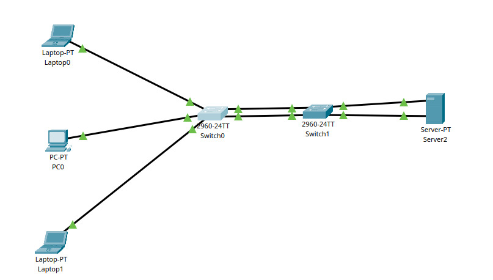
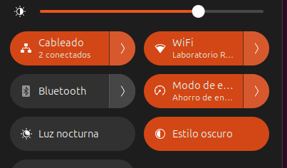
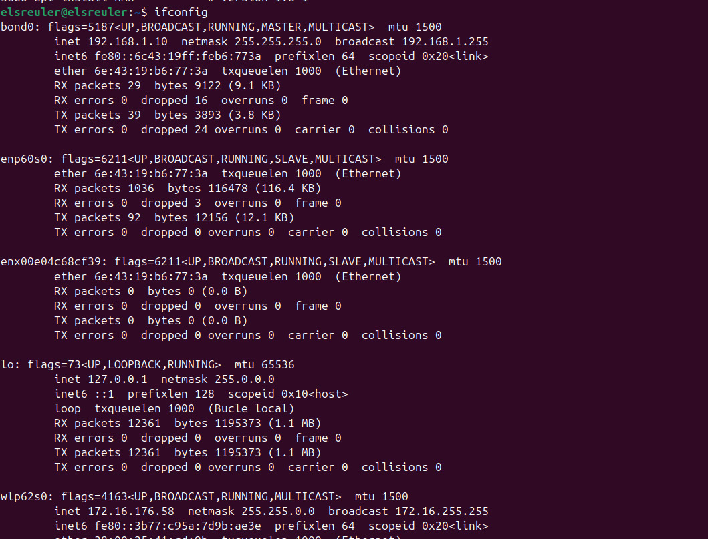
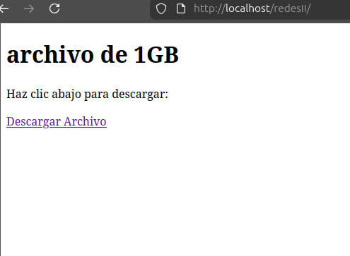
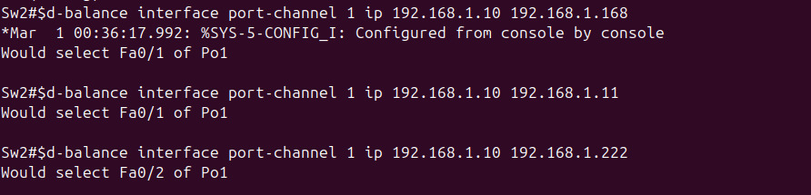

# Resumen Ejecutivo

Esta práctica documenta la implementación de EtherChannel utilizando LACP (Link Aggregation Control Protocol) en switches Cisco, junto con la configuración de bonding en Linux para agregar múltiples enlaces físicos en un único enlace lógico. El objetivo es comprender los mecanismos de agregación de enlaces para incrementar el ancho de banda y proporcionar tolerancia a fallos.

**Resultados:** Se logró configurar un Port-Channel entre dos switches Cisco utilizando LACP, así como bonding en una PC Linux con dos interfaces de red. Durante las pruebas de descarga se identificó un problema donde el tráfico no se distribuía equitativamente entre los enlaces, lo cual se resolvió mediante la configuración de balanceo por IP origen-destino y se validó mediante pruebas de tolerancia a fallos.

# Identificación del Problema

En entornos de red empresariales, un único enlace entre dispositivos presenta limitaciones:

- **Ancho de banda limitado:** Un enlace Fast Ethernet está limitado a 100 Mbps
- **Punto único de fallo:** Si el enlace falla, la comunicación se interrumpe
- **Subutilización de recursos:** Múltiples cables pueden estar disponibles pero no aprovechados

::: warning
**Desafío:** Implementar agregación de enlaces que proporcione mayor ancho de banda agregado y redundancia sin generar bucles de capa 2.
:::

# Metodología Aplicada

**Equipos y herramientas utilizados:**

| Componente | Descripción | Dirección IP |
|------------|-------------|--------------|
| Switch SW1 (Cisco 2960) | Switch de acceso con EtherChannel | N/A |
| Switch SW2 (Cisco 2960) | Switch de distribución con EtherChannel | N/A |
| PC Cliente (Linux) | Equipo con bonding LACP | 192.168.1.10/24 |
| Servidor (Linux) | Servidor de archivos para pruebas | 192.168.1.20/24 |
| Laptop | Equipo adicional de pruebas | DHCP |

**Proceso de la práctica:**

1. **Configuración de EtherChannel:** Establecimiento de Port-Channel entre SW1 y SW2
2. **Configuración de bonding:** Agregación de interfaces en la PC Linux
3. **Generación de archivo de prueba:** Creación de archivo grande para transferencias
4. **Pruebas de descarga:** Validación del ancho de banda agregado
5. **Troubleshooting:** Análisis y solución de problemas de balanceo
6. **Pruebas de tolerancia a fallos:** Verificación de redundancia

# Topología de Red Implementada



**Esquema de conexiones:**

| Origen | Interfaz(es) | Destino | Interfaz(es) | Port-Channel |
|--------|--------------|---------|--------------|--------------|
| SW1 | Fa0/1, Fa0/2 | SW2 | Fa0/1, Fa0/2 | Po1 (Trunk) |
| SW2 | Fa0/3, Fa0/4 | PC Cliente | enp60s0, enx00e04c68cf39 | Po2 (Access) |
| SW1 | Fa0/3 | Laptop | eth0 | N/A |
| SW1 | Fa0/4 | Servidor | eth0 | N/A |

**Direccionamiento de la red:**

| Dispositivo | Interfaz | Dirección IP | Máscara | Gateway |
|-------------|----------|--------------|---------|---------|
| PC Cliente | bond0 | 192.168.1.10 | /24 | 192.168.1.1 |
| Servidor | eth0 | 192.168.1.20 | /24 | 192.168.1.1 |
| Laptop | eth0 | DHCP | /24 | - |

# Configuración Inicial

## Conexión Física con Dos Cables

La PC cliente se conectó al switch SW2 utilizando dos interfaces de red:

- **enp60s0:** Interfaz Ethernet integrada en la placa madre
- **enx00e04c68cf39:** Adaptador USB a Ethernet



# Desarrollo Detallado

## Paso 1: Configuración de EtherChannel en SW1

Se configuró el Port-Channel 1 entre SW1 y SW2 utilizando LACP en modo activo:

::: cisco-ios
Sw1> enable
Sw1# configure terminal

! Configurar las interfaces físicas para EtherChannel
Sw1(config)# interface range FastEthernet0/1-2
Sw1(config-if-range)# switchport mode trunk
Sw1(config-if-range)# channel-protocol lacp
Sw1(config-if-range)# channel-group 1 mode active
Sw1(config-if-range)# exit

! Configurar la interfaz Port-Channel
Sw1(config)# interface Port-channel1
Sw1(config-if)# switchport mode trunk
Sw1(config-if)# exit

! Configurar puertos de acceso para dispositivos finales
Sw1(config)# interface FastEthernet0/3
Sw1(config-if)# description Conectado a Laptop
Sw1(config-if)# switchport mode access
Sw1(config-if)# spanning-tree portfast
Sw1(config-if)# exit

Sw1(config)# interface FastEthernet0/4
Sw1(config-if)# description Conectado a PC
Sw1(config-if)# switchport mode access
Sw1(config-if)# spanning-tree portfast
Sw1(config-if)# exit

Sw1(config)# end
Sw1# write memory
:::

## Paso 2: Configuración de EtherChannel en SW2

Se configuró SW2 con dos Port-Channels: uno hacia SW1 y otro hacia la PC cliente con bonding:

::: cisco-ios
Sw2> enable
Sw2# configure terminal

! Port-Channel 1: Hacia SW1 (Trunk)
Sw2(config)# interface range FastEthernet0/1-2
Sw2(config-if-range)# switchport mode trunk
Sw2(config-if-range)# channel-protocol lacp
Sw2(config-if-range)# channel-group 1 mode active
Sw2(config-if-range)# exit

Sw2(config)# interface Port-channel1
Sw2(config-if)# switchport mode trunk
Sw2(config-if)# exit

! Port-Channel 2: Hacia PC Cliente con Bonding (Access)
Sw2(config)# interface range FastEthernet0/3-4
Sw2(config-if-range)# switchport mode access
Sw2(config-if-range)# channel-protocol lacp
Sw2(config-if-range)# channel-group 2 mode active
Sw2(config-if-range)# exit

Sw2(config)# interface Port-channel2
Sw2(config-if)# switchport mode access
Sw2(config-if)# exit

Sw2(config)# end
Sw2# write memory
:::

::: info
**Nota sobre modos LACP:**
- **active:** Inicia negociación LACP activamente
- **passive:** Responde a negociaciones LACP pero no las inicia
- Para establecer un canal, al menos un extremo debe estar en modo active
:::

## Paso 3: Configuración de Bonding en Linux

En la PC cliente se configuró bonding utilizando Netplan con el modo 802.3ad (LACP):

::: bash
# Crear archivo de configuración de bonding
sudo nano /etc/netplan/01-bonding.yaml
:::

Contenido del archivo de configuración:

```yaml
network:
  version: 2
  renderer: networkd
  ethernets:
    enp60s0:
      dhcp4: no
    enx00e04c68cf39:
      dhcp4: no
  bonds:
    bond0:
      interfaces: [enp60s0, enx00e04c68cf39]
      addresses: [192.168.1.10/24]
      routes:
        - to: default
          via: 192.168.1.1
      parameters:
        mode: 802.3ad
        mii-monitor-interval: 100
        lacp-rate: fast
        transmit-hash-policy: layer2+3
```

::: bash
# Aplicar la configuración
sudo netplan apply

# Verificar la interfaz bond0
ip addr show bond0
:::

**Resultado de la configuración del bond:**



::: info
**Parámetros del bonding explicados:**

| Parámetro | Valor | Descripción |
|-----------|-------|-------------|
| mode | 802.3ad | LACP para agregación dinámica |
| mii-monitor-interval | 100 | Verificar enlace cada 100ms |
| lacp-rate | fast | Intercambio de LACPDUs cada 1 segundo |
| transmit-hash-policy | layer2+3 | Balanceo por MAC + IP |
:::

## Paso 4: Generación de Archivo de Prueba en el Servidor

Para realizar pruebas de transferencia, se generó un archivo de 500 MB en el servidor:

::: bash
# Generar archivo de prueba con dd
sudo dd if=/dev/zero of=/var/www/html/test-file.bin bs=1M count=500 status=progress

# Verificar el archivo creado
ls -lh /var/www/html/test-file.bin
# -rw-r--r-- 1 root root 500M Jan 26 10:30 /var/www/html/test-file.bin
:::

::: info
**Herramienta utilizada:** Se utilizó `dd` (data duplicator), una herramienta estándar de Linux para copiar y convertir datos. Alternativas incluyen `fallocate` para crear archivos más rápidamente.
:::

## Paso 5: Pruebas de Descarga

Se accedió al servidor web para descargar el archivo de prueba:



::: bash
# Descargar archivo desde la PC cliente
wget http://192.168.1.20/test-file.bin -O /tmp/test-file.bin
:::

**Observación inicial:** La velocidad de descarga se mantenía alrededor de 50 Mbps, aproximadamente la mitad de la capacidad de un enlace Fast Ethernet (100 Mbps).

::: warning
**Problema detectado:** La descarga no aprovechaba el ancho de banda agregado de ambos enlaces. El tráfico parecía pasar por un solo enlace en lugar de distribuirse.
:::

# Problemas Encontrados y Soluciones

## Problema 1: Tráfico No Balanceado Entre Enlaces

**Descripción:** Durante las pruebas de descarga, la velocidad máxima alcanzada era de aproximadamente 50 Mbps, la mitad de un enlace Fast Ethernet, en lugar de aprovechar los 200 Mbps teóricos del Port-Channel.

**Diagnóstico:** Se verificó el método de balanceo de carga configurado en los switches:

::: cisco-ios
Sw1# show etherchannel load-balance
EtherChannel Load-Balancing Configuration:
        src-mac

EtherChannel Load-Balancing Addresses Used Per-Protocol:
Non-IP: Source MAC address
  IPv4: Source MAC address
  IPv6: Source MAC address
:::

::: warning
**Causa identificada:** El balanceo estaba configurado por MAC origen (`src-mac`), lo que significa que todo el tráfico de una misma MAC siempre usa el mismo enlace físico.
:::

**Solución aplicada:** Se configuró balanceo por IP origen-destino en ambos switches:

::: cisco-ios
Sw1# configure terminal
Sw1(config)# port-channel load-balance src-dst-ip
Sw1(config)# exit

Sw2# configure terminal
Sw2(config)# port-channel load-balance src-dst-ip
Sw2(config)# exit
:::

::: cisco-ios
Sw1# show etherchannel load-balance
EtherChannel Load-Balancing Configuration:
        src-dst-ip

EtherChannel Load-Balancing Addresses Used Per-Protocol:
Non-IP: Source XOR Destination MAC address
  IPv4: Source XOR Destination IP address
  IPv6: Source XOR Destination IP address
:::

## Problema 2: Tráfico Seguía Sin Distribuirse

**Descripción:** Después de cambiar el método de balanceo, la descarga seguía sin mostrar mejora significativa.

**Diagnóstico:** Se verificó el estado de los puertos del Port-Channel para analizar la distribución del tráfico:

::: cisco-ios
Sw2# show interface FastEthernet0/1
FastEthernet0/1 is up, line protocol is up (connected)
  Hardware is Fast Ethernet, address is 0001.9765.0201
  MTU 1500 bytes, BW 100000 Kbit, DLY 100 usec,
     reliability 255/255, txload 1/255, rxload 1/255
  ...

Sw2# show interface FastEthernet0/2
FastEthernet0/2 is up, line protocol is up (connected)
  Hardware is Fast Ethernet, address is 0001.9765.0202
  MTU 1500 bytes, BW 100000 Kbit, DLY 100 usec,
     reliability 255/255, txload 1/255, rxload 1/255
  ...
:::

::: error
**Hallazgo crítico:** Los valores `txload 1/255, rxload 1/255` indicaban que prácticamente no pasaba tráfico por esos puertos. Esto sugería que el tráfico estaba tomando una ruta diferente o había un problema con la negociación LACP.
:::

**Análisis adicional:** Se verificó el estado del EtherChannel:

::: cisco-ios
Sw2# show etherchannel summary
Flags:  D - down        P - bundled in port-channel
        I - stand-alone s - suspended
        H - Hot-standby (LACP only)
        R - Layer3      S - Layer2
        U - in use

Group  Port-channel  Protocol    Ports
------+-------------+-----------+-----------------------------------------------
1      Po1(SU)         LACP      Fa0/1(P)    Fa0/2(P)
2      Po2(SU)         LACP      Fa0/3(P)    Fa0/4(P)
:::

El estado mostraba los puertos como "bundled" (P), indicando que el EtherChannel estaba formado correctamente.

## Problema 3: Descubrimiento Mediante Prueba de Tolerancia a Fallos

**Descripción:** Para entender mejor el comportamiento, se realizó una prueba de tolerancia a fallos desconectando uno de los cables.

::: bash
# Durante la descarga, se desconectó el cable de enp60s0
# Resultado: La descarga continuó sin interrupción
:::

::: success
**Hallazgo:** La prueba de failover demostró que:
1. El bonding y EtherChannel estaban funcionando correctamente
2. La redundancia estaba activa
3. El problema de velocidad era debido a la naturaleza del balanceo de carga
:::

**Explicación técnica:**

El balanceo de carga en EtherChannel/LACP funciona por flujo (flow-based), no por paquete:

- **Por flujo:** Cada conexión TCP/UDP siempre usa el mismo enlace
- **Por paquete:** Cada paquete podría usar un enlace diferente (no soportado en LACP estándar)

Cuando hay una única conexión TCP (como una descarga de archivo), todo el tráfico de esa conexión usa un solo enlace. El beneficio del ancho de banda agregado se obtiene cuando hay **múltiples conexiones simultáneas**.

::: info
**Conclusión:** El comportamiento observado es el esperado para EtherChannel/LACP. Una única descarga no puede exceder la velocidad de un solo enlace físico. El ancho de banda agregado beneficia escenarios con múltiples flujos de tráfico simultáneos.
:::

## Verificación con Múltiples Conexiones

Para validar que el balanceo funcionaba correctamente, se realizaron múltiples descargas simultáneas:

::: bash
# Desde la PC cliente, iniciar múltiples descargas en paralelo
wget http://192.168.1.20/test-file.bin -O /tmp/test1.bin &
wget http://192.168.1.20/test-file.bin -O /tmp/test2.bin &
wget http://192.168.1.20/test-file.bin -O /tmp/test3.bin &
wget http://192.168.1.20/test-file.bin -O /tmp/test4.bin &
:::

Con múltiples conexiones, el tráfico se distribuyó entre ambos enlaces, aprovechando el ancho de banda agregado.



# Validación y Pruebas

## Verificación del EtherChannel

::: cisco-ios
Sw1# show etherchannel summary
Flags:  D - down        P - bundled in port-channel
        I - stand-alone s - suspended
        H - Hot-standby (LACP only)
        R - Layer3      S - Layer2
        U - in use

Group  Port-channel  Protocol    Ports
------+-------------+-----------+-----------------------------------------------
1      Po1(SU)         LACP      Fa0/1(P)    Fa0/2(P)
:::

::: cisco-ios
Sw1# show etherchannel port-channel
                Port-channels in the group:
                ---------------------------

Port-channel: Po1    (Primary Aggregator)
------------

Age of the Port-channel   = 0d:02h:15m:30s
Logical slot/port   = 2/1          Number of ports = 2
Port state          = Port-channel Ag-Inuse
Protocol            = LACP
:::

## Verificación del Bonding en Linux

::: bash
cat /proc/net/bonding/bond0
:::

```
Ethernet Channel Bonding Driver: v5.15.0

Bonding Mode: IEEE 802.3ad Dynamic link aggregation
Transmit Hash Policy: layer2+3 (2)
MII Status: up
MII Polling Interval (ms): 100
Up Delay (ms): 0
Down Delay (ms): 0
Peer Notification Delay (ms): 0

802.3ad info
LACP rate: fast
Min links: 0
Aggregator selection policy (ad_select): stable
System priority: 65535
System MAC address: 00:e0:4c:68:cf:39
Active Aggregator Info:
        Aggregator ID: 1
        Number of ports: 2
        Actor Key: 15
        Partner Key: 1
        Partner Mac Address: 00:01:97:65:02:03

Slave Interface: enp60s0
MII Status: up
Speed: 100 Mbps
Duplex: full
Link Failure Count: 0
Permanent HW addr: XX:XX:XX:XX:XX:XX
Slave queue ID: 0
Aggregator ID: 1

Slave Interface: enx00e04c68cf39
MII Status: up
Speed: 100 Mbps
Duplex: full
Link Failure Count: 0
Permanent HW addr: 00:e0:4c:68:cf:39
Slave queue ID: 0
Aggregator ID: 1
```

## Prueba de Tolerancia a Fallos

::: bash
# Simular fallo desconectando un cable
# Verificar que la conexión continúa

ping 192.168.1.20
# PING 192.168.1.20 (192.168.1.20) 56(84) bytes of data.
# 64 bytes from 192.168.1.20: icmp_seq=1 ttl=64 time=0.5 ms
# 64 bytes from 192.168.1.20: icmp_seq=2 ttl=64 time=0.4 ms
# --- Al desconectar un cable ---
# 64 bytes from 192.168.1.20: icmp_seq=3 ttl=64 time=0.6 ms  <-- Sin interrupción
# 64 bytes from 192.168.1.20: icmp_seq=4 ttl=64 time=0.5 ms
:::

::: success
**Tolerancia a fallos verificada:** Al desconectar uno de los cables, la comunicación continuó sin interrupción gracias a la redundancia del bonding/EtherChannel.
:::

# Experiencia Adquirida

## Conocimientos Técnicos Clave

### Diferencia entre EtherChannel y Bonding

| Concepto | EtherChannel (Cisco) | Bonding (Linux) |
|----------|---------------------|-----------------|
| Protocolo | LACP (802.3ad) o PAgP | LACP (802.3ad) u otros modos |
| Configuración | CLI del switch | Netplan, ifenslave, nmcli |
| Negociación | Automática con LACP | Automática con LACP |
| Balanceo | src-mac, dst-mac, src-dst-ip | layer2, layer2+3, layer3+4 |

### Modos de Balanceo de Carga

| Modo | Descripción | Uso Recomendado |
|------|-------------|-----------------|
| src-mac | Por MAC origen | Múltiples clientes a un servidor |
| dst-mac | Por MAC destino | Un cliente a múltiples servidores |
| src-dst-mac | XOR de MACs | Tráfico mixto L2 |
| src-dst-ip | XOR de IPs | Tráfico IP con múltiples flujos |

### Limitaciones del Balanceo por Flujo

- Una conexión TCP única siempre usa el mismo enlace
- El ancho de banda agregado beneficia múltiples conexiones simultáneas
- No es posible balancear por paquete sin hardware especializado

## Lecciones Aprendidas

### Importancia de las Pruebas de Failover

Las pruebas de tolerancia a fallos revelaron que:

1. La configuración estaba correcta
2. El problema de velocidad era un comportamiento esperado
3. El valor real del EtherChannel está en la redundancia y múltiples flujos

### Verificación de Carga de Interfaces

Los comandos `show interface` con valores `txload/rxload` son útiles para:

- Identificar interfaces subutilizadas
- Detectar problemas de distribución de tráfico
- Confirmar que el tráfico fluye por las interfaces esperadas

## Comandos Útiles Aprendidos

::: cisco-ios
! Verificación de EtherChannel
show etherchannel summary
show etherchannel port-channel
show etherchannel load-balance
show interfaces port-channel 1

! Configuración de balanceo
port-channel load-balance src-dst-ip

! Verificación de estado de interfaces
show interface FastEthernet0/1 | include load
:::

::: bash
# Verificación de bonding en Linux
cat /proc/net/bonding/bond0
ip link show bond0
ip addr show bond0

# Verificación de tráfico
watch -n 1 cat /proc/net/bonding/bond0
:::

# Exploración de Aplicaciones y Sugerencias

<!-- Esta sección se completará posteriormente con aplicaciones prácticas y sugerencias de mejora -->

# Recursos y Referencias Utilizados

## Documentación Técnica

### Cisco Systems
- **Configuring EtherChannel and Link Aggregation** - Cisco Catalyst 2960 Configuration Guide
- **Understanding EtherChannel Load Balancing** - Cisco Support Documentation
- **Link Aggregation Control Protocol (LACP)** - IEEE 802.3ad

### Linux Networking
- **Netplan Documentation** - https://netplan.io/
- **Linux Bonding Driver** - Kernel Documentation
- **Ubuntu Server Network Configuration** - Ubuntu Documentation

## Archivos de Configuración

Los archivos de configuración de esta práctica se encuentran en el directorio `configs/`:

- **`SW1-etherchannel-v1.cfg`:** Configuración del switch 1 con EtherChannel
- **`SW2-etherchannel-v1.cfg`:** Configuración del switch 2 con EtherChannel
- **`PC-bonding-netplan-v1.yaml`:** Configuración de bonding para Linux

## Scripts de Referencia

Los comandos utilizados se encuentran en el directorio `scripts/`:

- **`configure-bonding.txt`:** Comandos para configurar bonding en Linux
- **`verify-bonding.txt`:** Comandos de verificación de bonding y EtherChannel
- **`generate-test-file.txt`:** Comandos para generar archivos de prueba con `dd`

## Estándares y RFCs

- **IEEE 802.3ad:** Link Aggregation Control Protocol (LACP)
- **IEEE 802.1AX:** Link Aggregation (actualización de 802.3ad)

---

**Documento:** Práctica 06 - EtherChannel con LACP y Bonding en Linux  
**Fecha:** Enero 26, 2026  
**Autores:** Uriel Felipe Vázquez Orozco, Euler Molina Martínez  
**Materia:** Redes de Computadoras 2  
**Profesor:** M.C. Manuel Eduardo Sánchez Solchaga
