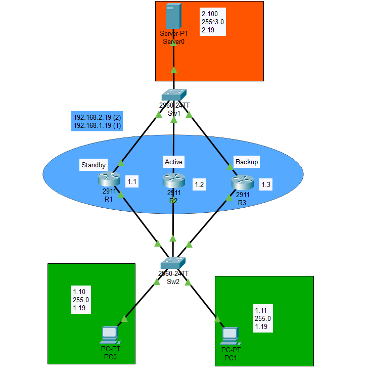

# Resumen Ejecutivo

Esta práctica documenta la implementación del protocolo Hot Standby Router Protocol (HSRP), un protocolo propietario de Cisco que proporciona alta disponibilidad del gateway predeterminado mediante redundancia de primer salto (First Hop Redundancy Protocol - FHRP). La configuración se realizó en Cisco Packet Tracer con una topología de 3 routers Cisco 2911 y 2 switches Cisco 2960.

**Resultados:** Se logró implementar una topología redundante con HSRP configurado en dos grupos (Grupo 1 para la red 192.168.1.0/24 y Grupo 2 para la red 192.168.2.0/24), donde R2 actúa como router Activo con prioridad 110, R1 como Standby con prioridad 105, y R3 como respaldo adicional con prioridad predeterminada (100). Se verificó el funcionamiento de preemption y tracking de interfaces para failover automático.

# Identificación del Problema

En redes empresariales, los hosts utilizan un único gateway predeterminado para comunicarse con redes externas. Este diseño presenta un punto único de falla crítico:

- **Interrupción total:** Si el gateway falla, todos los hosts pierden conectividad externa
- **Reconfiguración manual:** Cambiar el gateway en cada host es costoso y lento
- **Tiempo de inactividad:** El proceso de recuperación puede tomar minutos u horas
- **Impacto en productividad:** Servicios críticos quedan inaccesibles

::: warning
**Desafío:** Proporcionar alta disponibilidad del gateway predeterminado sin requerir cambios en la configuración de los hosts finales, permitiendo failover automático y transparente.
:::

# Metodología Aplicada

**Equipos utilizados:**

- 3 Routers Cisco 2911 con IOS 15.1
- 2 Switches Cisco Catalyst 2960 con IOS 15.0
- 2 PCs para pruebas de conectividad (PC0 y PC1 en LAN 1)
- 1 Servidor (Server-PT) para pruebas de conectividad (Server0 en LAN 2)
- Cisco Packet Tracer como herramienta de simulación

**Proceso:**

1. **Diseño de topología:** Planificación de la red redundante con tres routers conectados a dos segmentos de red
2. **Configuración base:** Asignación de direcciones IP en las interfaces de los routers
3. **Configuración de HSRP:** Implementación de grupos HSRP con IP virtual, prioridades y preemption
4. **Configuración de tracking:** Habilitación de seguimiento de interfaces para failover inteligente
5. **Validación:** Verificación de estados HSRP, pruebas de failover y recuperación

# Topología de Red Implementada

**Configuración de direccionamiento:**

| Dispositivo | Interfaz | Dirección IP | Red | Rol HSRP |
|-------------|----------|--------------|-----|----------|
| R1 | Gi0/0 | 192.168.1.1/24 | LAN 1 | Standby (Prioridad 105) |
| R1 | Gi0/1 | 192.168.2.1/24 | LAN 2 | Standby (Prioridad 105) |
| R2 | Gi0/0 | 192.168.1.2/24 | LAN 1 | Activo (Prioridad 110) |
| R2 | Gi0/1 | 192.168.2.2/24 | LAN 2 | Activo (Prioridad 110) |
| R3 | Gi0/0 | 192.168.1.3/24 | LAN 1 | Listen (Prioridad 100) |
| R3 | Gi0/1 | 192.168.2.3/24 | LAN 2 | Listen (Prioridad 100) |
| **Virtual** | HSRP Grupo 1 | 192.168.1.19/24 | LAN 1 | Gateway Virtual |
| **Virtual** | HSRP Grupo 2 | 192.168.2.19/24 | LAN 2 | Gateway Virtual |
| SW1 | VLAN 1 | - | LAN 2 | Switch de acceso |
| SW2 | VLAN 1 | - | LAN 1 | Switch de acceso |
| PC0 | NIC | 192.168.1.10/24 | LAN 1 | Host de pruebas |
| PC1 | NIC | 192.168.1.11/24 | LAN 1 | Host de pruebas |
| Server0 | NIC | 192.168.2.100/24 | LAN 2 | Servidor de pruebas |

**Configuración de Grupos HSRP:**

| Grupo HSRP | IP Virtual | Red | Router Activo | Router Standby | Respaldo |
|------------|------------|-----|---------------|----------------|----------|
| 1 | 192.168.1.19 | 192.168.1.0/24 | R2 (110) | R1 (105) | R3 (100) |
| 2 | 192.168.2.19 | 192.168.2.0/24 | R2 (110) | R1 (105) | R3 (100) |

::: info
**Nota:** La IP virtual (.19) es la dirección que los hosts utilizan como gateway predeterminado. Esta IP "flota" entre los routers según el estado de HSRP.
:::

# Configuración Inicial

## Configuración Base de Seguridad en Routers

Antes de configurar HSRP, se aplicaron configuraciones de seguridad básicas en todos los routers:

::: cisco-ios
Router> enable
Router# configure terminal
Router(config)# hostname R1
R1(config)# no ip domain-lookup
R1(config)# line console 0
R1(config-line)# exec-timeout 5 0
R1(config-line)# logging synchronous
R1(config-line)# login
R1(config-line)# exit
R1(config)# line vty 0 4
R1(config-line)# exec-timeout 5 0
R1(config-line)# password cisco
R1(config-line)# logging synchronous
R1(config-line)# login
R1(config-line)# exit
:::

## Configuración de Direccionamiento IP

### Router R1

::: cisco-ios
R1(config)# interface GigabitEthernet0/0
R1(config-if)# ip address 192.168.1.1 255.255.255.0
R1(config-if)# no shutdown
R1(config-if)# exit
R1(config)# interface GigabitEthernet0/1
R1(config-if)# ip address 192.168.2.1 255.255.255.0
R1(config-if)# no shutdown
R1(config-if)# exit
:::

### Router R2

::: cisco-ios
R2(config)# interface GigabitEthernet0/0
R2(config-if)# ip address 192.168.1.2 255.255.255.0
R2(config-if)# no shutdown
R2(config-if)# exit
R2(config)# interface GigabitEthernet0/1
R2(config-if)# ip address 192.168.2.2 255.255.255.0
R2(config-if)# no shutdown
R2(config-if)# exit
:::

### Router R3

::: cisco-ios
R3(config)# interface GigabitEthernet0/0
R3(config-if)# ip address 192.168.1.3 255.255.255.0
R3(config-if)# no shutdown
R3(config-if)# exit
R3(config)# interface GigabitEthernet0/1
R3(config-if)# ip address 192.168.2.3 255.255.255.0
R3(config-if)# no shutdown
R3(config-if)# exit
:::

# Desarrollo Detallado

## Paso 1: Conceptos Fundamentales de HSRP

HSRP es un protocolo propietario de Cisco que permite a varios routers trabajar juntos presentando una única IP virtual como gateway predeterminado.

**Estados de HSRP:**

| Estado | Descripción |
|--------|-------------|
| **Initial** | Estado inicial al arrancar HSRP |
| **Learn** | El router no conoce la IP virtual, espera mensaje del router activo |
| **Listen** | El router conoce la IP virtual pero no es activo ni standby |
| **Speak** | El router participa en la elección de activo/standby |
| **Standby** | Router de respaldo, listo para asumir si el activo falla |
| **Active** | Router que responde a las solicitudes del gateway virtual |

**Parámetros HSRP importantes:**

| Parámetro | Valor Predeterminado | Descripción |
|-----------|---------------------|-------------|
| Prioridad | 100 | Determina elección del router activo (mayor = preferido) |
| Hello Timer | 3 segundos | Intervalo entre mensajes Hello |
| Hold Timer | 10 segundos | Tiempo sin Hello antes de declarar router caído |
| Preemption | Deshabilitado | Permite recuperar rol activo automáticamente |

::: info
**Concepto clave:** El router con mayor prioridad se convierte en Activo. En caso de empate, gana el router con la dirección IP más alta en la interfaz HSRP.
:::

## Paso 2: Configuración de HSRP en Router R1 (Standby)

R1 se configura como router Standby con prioridad 105 y tracking de interfaces:

### Grupo HSRP 1 - Red 192.168.1.0/24

::: cisco-ios
R1(config)# interface GigabitEthernet0/0
R1(config-if)# standby 1 ip 192.168.1.19
R1(config-if)# standby 1 priority 105
R1(config-if)# standby 1 preempt
R1(config-if)# standby 1 track GigabitEthernet0/1
R1(config-if)# exit
:::

### Grupo HSRP 2 - Red 192.168.2.0/24

::: cisco-ios
R1(config)# interface GigabitEthernet0/1
R1(config-if)# standby 2 ip 192.168.2.19
R1(config-if)# standby 2 priority 105
R1(config-if)# standby 2 preempt
R1(config-if)# standby 2 track GigabitEthernet0/0
R1(config-if)# exit
:::

::: info
**Tracking:** El comando `standby 1 track GigabitEthernet0/1` reduce la prioridad HSRP en 10 (predeterminado) si la interfaz Gi0/1 cae, permitiendo failover inteligente basado en conectividad.
:::

## Paso 3: Configuración de HSRP en Router R2 (Activo)

R2 se configura como router Activo con la prioridad más alta (110):

### Grupo HSRP 1 - Red 192.168.1.0/24

::: cisco-ios
R2(config)# interface GigabitEthernet0/0
R2(config-if)# standby 1 ip 192.168.1.19
R2(config-if)# standby 1 priority 110
R2(config-if)# standby 1 preempt
R2(config-if)# standby 1 track GigabitEthernet0/1
R2(config-if)# exit
:::

### Grupo HSRP 2 - Red 192.168.2.0/24

::: cisco-ios
R2(config)# interface GigabitEthernet0/1
R2(config-if)# standby 2 ip 192.168.2.19
R2(config-if)# standby 2 priority 110
R2(config-if)# standby 2 preempt
R2(config-if)# standby 2 track GigabitEthernet0/0
R2(config-if)# exit
:::

## Paso 4: Configuración de HSRP en Router R3 (Respaldo)

R3 se configura con prioridad predeterminada (100), actuando como tercer nivel de redundancia:

### Grupo HSRP 1 - Red 192.168.1.0/24

::: cisco-ios
R3(config)# interface GigabitEthernet0/0
R3(config-if)# standby 1 ip 192.168.1.19
R3(config-if)# standby 1 preempt
R3(config-if)# standby 1 track GigabitEthernet0/1
R3(config-if)# exit
:::

### Grupo HSRP 2 - Red 192.168.2.0/24

::: cisco-ios
R3(config)# interface GigabitEthernet0/1
R3(config-if)# standby 2 ip 192.168.2.19
R3(config-if)# standby 2 preempt
R3(config-if)# standby 2 track GigabitEthernet0/0
R3(config-if)# exit
:::

::: info
**Nota:** R3 no tiene prioridad configurada explícitamente, por lo que usa el valor predeterminado de 100. Permanecerá en estado Listen hasta que R1 y R2 fallen.
:::

## Paso 5: Configuración de Hosts y Servidor

Los hosts y el servidor se configuran con la IP virtual de HSRP como gateway predeterminado:

**PC0 (LAN 1):**
- IP Address: 192.168.1.10
- Subnet Mask: 255.255.255.0
- Default Gateway: **192.168.1.19** (IP Virtual HSRP Grupo 1)

**PC1 (LAN 1):**
- IP Address: 192.168.1.11
- Subnet Mask: 255.255.255.0
- Default Gateway: **192.168.1.19** (IP Virtual HSRP Grupo 1)

**Server0 (LAN 2):**
- IP Address: 192.168.2.100
- Subnet Mask: 255.255.255.0
- Default Gateway: **192.168.2.19** (IP Virtual HSRP Grupo 2)

::: success
**Punto clave:** Los hosts no necesitan conocer las IPs reales de los routers. Solo usan la IP virtual, lo que permite failover transparente.
:::

# Validación y Pruebas

## Verificación del Estado HSRP

### Comando `show standby` en R2 (Router Activo)

::: cisco-ios
R2# show standby
GigabitEthernet0/0 - Group 1
  State is Active
    2 state changes, last state change 00:05:32
  Virtual IP address is 192.168.1.19
  Active virtual MAC address is 0000.0c07.ac01
    Local virtual MAC address is 0000.0c07.ac01 (v1 default)
  Hello time 3 sec, hold time 10 sec
    Next hello sent in 1.232 secs
  Preemption enabled
  Active router is local
  Standby router is 192.168.1.1, priority 105 (expires in 8.456 sec)
  Priority 110 (configured 110)
    Track interface GigabitEthernet0/1 state Up decrement 10
  Group name is "hsrp-Gi0/0-1" (default)

GigabitEthernet0/1 - Group 2
  State is Active
    2 state changes, last state change 00:05:30
  Virtual IP address is 192.168.2.19
  Active virtual MAC address is 0000.0c07.ac02
    Local virtual MAC address is 0000.0c07.ac02 (v1 default)
  Hello time 3 sec, hold time 10 sec
    Next hello sent in 2.128 secs
  Preemption enabled
  Active router is local
  Standby router is 192.168.2.1, priority 105 (expires in 7.896 sec)
  Priority 110 (configured 110)
    Track interface GigabitEthernet0/0 state Up decrement 10
  Group name is "hsrp-Gi0/1-2" (default)
:::

### Comando `show standby brief` en todos los routers

::: cisco-ios
R2# show standby brief
                     P indicates configured to preempt.
                     |
Interface   Grp  Pri P State   Active          Standby         Virtual IP
Gi0/0       1    110 P Active  local           192.168.1.1     192.168.1.19
Gi0/1       2    110 P Active  local           192.168.2.1     192.168.2.19
:::

::: cisco-ios
R1# show standby brief
                     P indicates configured to preempt.
                     |
Interface   Grp  Pri P State   Active          Standby         Virtual IP
Gi0/0       1    105 P Standby 192.168.1.2     local           192.168.1.19
Gi0/1       2    105 P Standby 192.168.2.2     local           192.168.2.19
:::

::: cisco-ios
R3# show standby brief
                     P indicates configured to preempt.
                     |
Interface   Grp  Pri P State   Active          Standby         Virtual IP
Gi0/0       1    100 P Listen  192.168.1.2     192.168.1.1     192.168.1.19
Gi0/1       2    100 P Listen  192.168.2.2     192.168.2.1     192.168.2.19
:::

## Prueba de Conectividad Normal

::: cisco-ios
PC0> ping 192.168.1.19

Pinging 192.168.1.19 with 32 bytes of data:
Reply from 192.168.1.19: bytes=32 time<1ms TTL=255
Reply from 192.168.1.19: bytes=32 time<1ms TTL=255
Reply from 192.168.1.19: bytes=32 time<1ms TTL=255
Reply from 192.168.1.19: bytes=32 time<1ms TTL=255

Ping statistics for 192.168.1.19:
    Packets: Sent = 4, Received = 4, Lost = 0 (0% loss)
:::

::: cisco-ios
PC0> ping 192.168.2.100

Pinging 192.168.2.100 with 32 bytes of data:
Reply from 192.168.2.100: bytes=32 time=1ms TTL=127
Reply from 192.168.2.100: bytes=32 time=1ms TTL=127
Reply from 192.168.2.100: bytes=32 time=1ms TTL=127
Reply from 192.168.2.100: bytes=32 time=1ms TTL=127

Ping statistics for 192.168.2.100:
    Packets: Sent = 4, Received = 4, Lost = 0 (0% loss)
:::

::: cisco-ios
PC1> ping 192.168.2.100

Pinging 192.168.2.100 with 32 bytes of data:
Reply from 192.168.2.100: bytes=32 time=1ms TTL=127
Reply from 192.168.2.100: bytes=32 time=1ms TTL=127
Reply from 192.168.2.100: bytes=32 time=1ms TTL=127
Reply from 192.168.2.100: bytes=32 time=1ms TTL=127

Ping statistics for 192.168.2.100:
    Packets: Sent = 4, Received = 4, Lost = 0 (0% loss)
:::

::: success
**Conectividad verificada:** Los hosts en LAN 1 pueden comunicarse con el servidor en LAN 2 utilizando el gateway virtual HSRP.
:::

## Prueba de Failover

### Simulación de falla en R2 (Router Activo)

::: cisco-ios
R2(config)# interface GigabitEthernet0/0
R2(config-if)# shutdown
:::

### Observación de mensajes de consola en R1

::: cisco-ios
%HSRP-5-STATECHANGE: GigabitEthernet0/0 Grp 1 state Standby -> Active
:::

### Verificación del nuevo estado

::: cisco-ios
R1# show standby brief
                     P indicates configured to preempt.
                     |
Interface   Grp  Pri P State   Active          Standby         Virtual IP
Gi0/0       1    105 P Active  local           192.168.1.3     192.168.1.19
Gi0/1       2    105 P Standby 192.168.2.2     local           192.168.2.19
:::

::: success
**Failover exitoso:** R1 asumió el rol Activo automáticamente cuando R2 falló. R3 se convirtió en el nuevo Standby.
:::

## Prueba de Preemption (Recuperación)

### Reactivación de R2

::: cisco-ios
R2(config)# interface GigabitEthernet0/0
R2(config-if)# no shutdown
:::

### Observación de mensajes de consola

::: cisco-ios
%HSRP-5-STATECHANGE: GigabitEthernet0/0 Grp 1 state Speak -> Standby
%HSRP-5-STATECHANGE: GigabitEthernet0/0 Grp 1 state Standby -> Active
:::

### Verificación del estado restaurado

::: cisco-ios
R2# show standby brief
                     P indicates configured to preempt.
                     |
Interface   Grp  Pri P State   Active          Standby         Virtual IP
Gi0/0       1    110 P Active  local           192.168.1.1     192.168.1.19
Gi0/1       2    110 P Active  local           192.168.2.2     192.168.2.19
:::

::: success
**Preemption verificado:** Gracias al comando `standby preempt`, R2 recuperó automáticamente el rol Activo al volver a estar disponible.
:::

## Verificación de MAC Virtual

::: cisco-ios
R2# show standby | include MAC
  Active virtual MAC address is 0000.0c07.ac01
  Active virtual MAC address is 0000.0c07.ac02
:::

::: info
**Formato de MAC HSRP:** La MAC virtual sigue el formato `0000.0c07.acXX` donde XX es el número del grupo HSRP en hexadecimal (01 para grupo 1, 02 para grupo 2).
:::

# Problemas Encontrados y Soluciones

## Problema: Failover No Ocurría Automáticamente

**Descripción:** Inicialmente, cuando R2 fallaba, R1 no asumía el rol Activo de forma inmediata.

**Diagnóstico:** El comando `standby preempt` no estaba configurado en los routers.

**Solución aplicada:** Se habilitó preemption en todos los routers:

::: cisco-ios
Router(config-if)# standby 1 preempt
Router(config-if)# standby 2 preempt
:::

## Problema: Hosts No Podían Comunicarse con la IP Virtual

**Descripción:** Los pings al gateway virtual 192.168.1.19 fallaban inicialmente.

**Diagnóstico:** Se verificó que la IP virtual estaba correctamente configurada:

::: cisco-ios
R2# show standby | include Virtual IP
  Virtual IP address is 192.168.1.19
:::

**Solución aplicada:** Se verificó que los hosts tenían configurada la IP virtual como gateway, no la IP física de algún router.

## Problema: R3 Nunca Se Convertía en Standby

**Descripción:** R3 permanecía siempre en estado Listen, incluso cuando esperábamos que fuera Standby.

**Diagnóstico:** Con tres routers en HSRP, solo uno puede ser Activo y uno Standby. El tercero permanece en Listen.

**Solución aplicada:** Este es el comportamiento esperado de HSRP. R3 solo se convertiría en Standby si R1 fallara, y en Activo si ambos R2 y R1 fallaran. La configuración era correcta:

::: cisco-ios
R3# show standby brief
! R3 en estado Listen es comportamiento normal con 3 routers
Interface   Grp  Pri P State   Active          Standby         Virtual IP
Gi0/0       1    100 P Listen  192.168.1.2     192.168.1.1     192.168.1.19
:::

# Experiencia Adquirida

## Conocimientos Técnicos Clave

### Funcionamiento de HSRP

- HSRP utiliza multicast (224.0.0.2) y UDP puerto 1985 para comunicación entre routers
- Solo un router es Activo y responde a solicitudes ARP para la IP virtual
- El router Standby monitorea al Activo mediante mensajes Hello
- Los routers adicionales permanecen en estado Listen como respaldo terciario

### Elección del Router Activo

El router Activo se selecciona basándose en:
1. **Mayor prioridad** (configurable de 0 a 255, predeterminado 100)
2. **Mayor dirección IP** (desempate cuando las prioridades son iguales)

### Tracking de Interfaces

El tracking permite failover inteligente cuando una interfaz de salida falla:
- Reduce la prioridad en 10 (predeterminado) cuando la interfaz rastreada cae
- Permite que otro router tome el rol Activo si la ruta de salida se pierde

### Comandos Cisco IOS Críticos

::: cisco-ios
! Configuración de HSRP
Router(config-if)# standby [grupo] ip [ip-virtual]
Router(config-if)# standby [grupo] priority [0-255]
Router(config-if)# standby [grupo] preempt
Router(config-if)# standby [grupo] track [interfaz] [decrement]

! Ajuste de temporizadores (opcional)
Router(config-if)# standby [grupo] timers [hello] [hold]

! Verificación de HSRP
Router# show standby
Router# show standby brief
Router# show standby [interfaz] [grupo]

! Debug (usar con precaución)
Router# debug standby events
Router# debug standby packets
:::

## Comparación de Protocolos FHRP

| Característica | HSRP | VRRP | GLBP |
|---------------|------|------|------|
| **Propietario** | Cisco | Estándar IEEE | Cisco |
| **Routers Activos** | 1 | 1 (Master) | Hasta 4 |
| **Balanceo de carga** | No nativo | No nativo | Sí |
| **Prioridad predeterminada** | 100 | 100 | 100 |
| **Preemption** | Deshabilitado | Habilitado | Habilitado |
| **MAC Virtual** | 0000.0c07.acXX | 0000.5e00.01XX | 0007.b400.XXYY |

## Lecciones Aprendidas

### Diseño de Alta Disponibilidad

- Planificar qué router será Activo según su ubicación y capacidad
- Configurar prioridades escalonadas (ej: 110, 105, 100) para orden de failover predecible
- Siempre habilitar preemption para recuperación automática

### Tracking Inteligente

- Rastrear interfaces de salida críticas, no solo las interfaces HSRP
- Ajustar el decremento para asegurar que la prioridad resultante sea menor que la del siguiente router
- Considerar tracking de objetos para condiciones más complejas

### Monitoreo y Mantenimiento

- Documentar las prioridades y roles esperados de cada router
- Verificar periódicamente el estado HSRP con `show standby brief`
- Probar el failover regularmente en ventanas de mantenimiento

# Exploración de Aplicaciones y Sugerencias

<!-- Esta sección se completará posteriormente con aplicaciones prácticas y sugerencias de mejora -->

# Recursos y Referencias Utilizados

## Documentación Técnica Oficial

### Cisco Systems
- **Hot Standby Router Protocol Features and Functionality** - Cisco Documentation
- **First Hop Redundancy Protocols Configuration Guide** - Cisco IOS 15.x
- **HSRP: Frequently Asked Questions** - Cisco Support Community

### Estándares y RFCs
- **RFC 2281:** Cisco Hot Standby Router Protocol (HSRP) - Informational
- **RFC 3768:** Virtual Router Redundancy Protocol (VRRP) - Para comparación

## Configuraciones de Referencia

### Archivos de Configuración

Los archivos de configuración de esta práctica se encuentran en el directorio `configs/`:

- **`R1-final-v1.cfg`:** Router Standby con prioridad 105
- **`R2-final-v1.cfg`:** Router Activo con prioridad 110
- **`R3-final-v1.cfg`:** Router de respaldo con prioridad 100 (predeterminada)
- **`SW1-final-v1.cfg`:** Switch de acceso LAN 1
- **`SW2-final-v1.cfg`:** Switch de acceso LAN 2

## Recursos en Línea

### Laboratorios Virtuales
- **Cisco Packet Tracer** - Simulador oficial de Cisco
- **Archivo de topología:** `topologies/practica-07-fhrp-hsrp.pkt`

---

**Documento:** Práctica 07 - FHRP HSRP  
**Fecha:** Enero 27, 2026  
**Autores:** Uriel Felipe Vázquez Orozco, Euler Molina Martínez  
**Materia:** Redes de Computadoras 2  
**Profesor:** M.C. Manuel Eduardo Sánchez Solchaga
