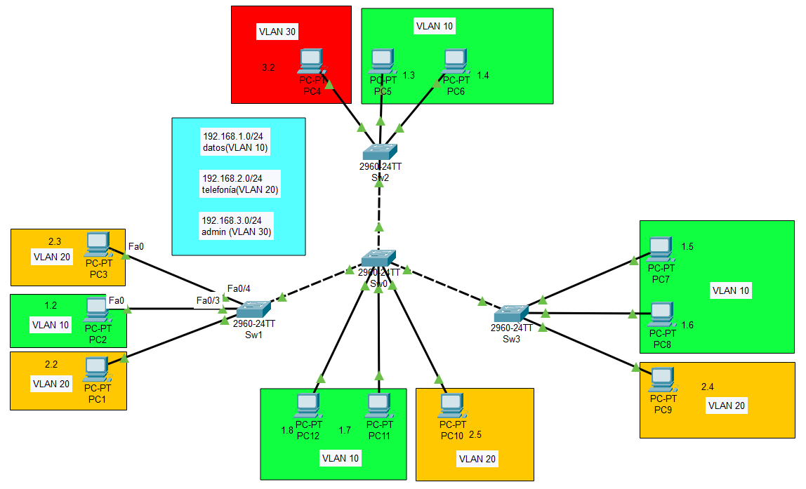

# Resumen Ejecutivo

Esta práctica implementa la configuración básica de VLANs en una topología de cuatro switches interconectados. Se configuran tres VLANs específicas (Datos, Telefonía y Administración) con asignación de puertos de acceso para equipos finales y configuración de enlaces troncales entre switches para permitir el tráfico de múltiples VLANs.

## Objetivos Alcanzados
- Configuración de VLANs 10, 20 y 30 en todos los switches
- Asignación de puertos de acceso según la distribución especificada
- Configuración de enlaces troncales entre switches
- Verificación del funcionamiento mediante comandos show

# Identificación del Problema

Se requiere implementar la segmentación de red mediante VLANs en una topología jerárquica para separar el tráfico de datos, telefonía IP y administración. El escenario incluye un switch central (SW0) conectado a tres switches de acceso (S1, S2, S3), cada uno con equipos finales que deben pertenecer a VLANs específicas según su función.

**Problemática específica:**
- Segmentación de broadcast domains
- Aislamiento de tráfico por tipo de servicio
- Configuración de conectividad entre switches manteniendo las VLANs

# Metodología Aplicada

## Herramientas Utilizadas
- **Simulador:** Cisco Packet Tracer
- **Dispositivos:** Switch Cisco 2950/2960
- **Protocolo:** IEEE 802.1Q (VLAN Tagging)

## Enfoque de Implementación
1. **Planificación de VLANs:** Definición de nombres y números de VLAN
2. **Configuración por switch:** Creación de VLANs en cada dispositivo
3. **Asignación de puertos:** Configuración de puertos de acceso
4. **Enlaces troncales:** Configuración de puertos trunk entre switches
5. **Validación:** Verificación mediante comandos show

# Topología de Red Implementada



## Distribución de VLANs

| VLAN | Nombre | Red | Descripción |
|------|--------|-----|-------------|
| 10 | Datos | 192.168.1.0/24 | Tráfico de datos corporativos |
| 20 | Telefonía | 192.168.2.0/24 | Telefonía IP |
| 30 | Admin | 192.168.3.0/24 | Administración de red |

## Asignación de Equipos por VLAN

| Switch | Puerto | Equipo | IP | VLAN |
|--------|--------|--------|----|----- |
| SW1 | Fa0/1 | PC1 | 192.168.2.2/24 | 20 (Telefonía) |
| SW1 | Fa0/2 | PC2 | 192.168.1.2/24 | 10 (Datos) |
| SW1 | Fa0/3 | PC3 | 192.168.2.3/24 | 20 (Telefonía) |
| SW2 | Fa0/1 | PC4 | 192.168.3.2/24 | 30 (Admin) |
| SW2 | Fa0/2 | PC5 | 192.168.1.3/24 | 10 (Datos) |
| SW2 | Fa0/3 | PC6 | 192.168.1.4/24 | 10 (Datos) |
| SW3 | Fa0/1 | PC7 | 192.168.1.5/24 | 10 (Datos) |
| SW3 | Fa0/2 | PC8 | 192.168.1.6/24 | 10 (Datos) |
| SW3 | Fa0/3 | PC9 | 192.168.2.4/24 | 20 (Telefonía) |
| SW0 | Fa0/4 | PC10 | 192.168.2.5/24 | 20 (Telefonía) |
| SW0 | Fa0/5 | PC11 | 192.168.1.7/24 | 10 (Datos) |
| SW0 | Fa0/6 | PC12 | 192.168.1.8/24 | 10 (Datos) |

## Enlaces Troncales

| Switch Origen | Puerto | Switch Destino | Puerto |
|---------------|--------|----------------|--------|
| SW0 | Fa0/1 | SW1 | Fa0/24 |
| SW0 | Fa0/2 | SW2 | Fa0/24 |
| SW0 | Fa0/3 | SW3 | Fa0/24 |

# Configuración Inicial

Se parte de configuraciones base de switches con configuración básica de nombres y seguridad.

::: info-box
**Nota:** Todas las configuraciones están documentadas en la carpeta `configs/` con versionado apropiado.
:::

# Desarrollo Detallado

## Configuraciones Finales por Switch

Las siguientes configuraciones están listas para copiar y pegar directamente en cada dispositivo:

### Switch SW0 (Core)

```cisco
hostname SW0
no ip domain-lookup
service password-encryption
spanning-tree mode pvst
spanning-tree extend system-id

vlan 10
 name datos
exit
vlan 20
 name telefonia
exit
vlan 30
 name admin
exit

interface FastEthernet0/1
 switchport mode trunk
 switchport trunk allowed vlan 10,20,30
 no shutdown
exit

interface FastEthernet0/2
 switchport mode trunk
 switchport trunk allowed vlan 10,20,30
 no shutdown
exit

interface FastEthernet0/3
 switchport mode trunk
 switchport trunk allowed vlan 10,20,30
 no shutdown
exit

interface FastEthernet0/4
 switchport mode access
 switchport access vlan 20
 no shutdown
exit

interface FastEthernet0/5
 switchport mode access
 switchport access vlan 10
 no shutdown
exit

interface FastEthernet0/6
 switchport mode access
 switchport access vlan 10
 no shutdown
exit

interface Vlan1
 shutdown
exit

line con 0
 logging synchronous
exit

line vty 0 15
 login
exit

end
write memory
```

### Switch SW1 (Acceso)

```cisco
hostname SW1
no ip domain-lookup
service password-encryption
spanning-tree mode pvst
spanning-tree extend system-id

vlan 10
 name datos
exit
vlan 20
 name telefonia
exit
vlan 30
 name admin
exit

interface FastEthernet0/1
 switchport mode access
 switchport access vlan 20
 no shutdown
exit

interface FastEthernet0/2
 switchport mode access
 switchport access vlan 10
 no shutdown
exit

interface FastEthernet0/3
 switchport mode access
 switchport access vlan 20
 no shutdown
exit

interface FastEthernet0/24
 switchport mode trunk
 switchport trunk allowed vlan 10,20,30
 no shutdown
exit

interface Vlan1
 shutdown
exit

line con 0
 logging synchronous
exit

line vty 0 15
 login
exit

end
write memory
```

### Switch SW2 (Acceso)

```cisco
hostname SW2
no ip domain-lookup
service password-encryption
spanning-tree mode pvst
spanning-tree extend system-id

vlan 10
 name datos
exit
vlan 20
 name telefonia
exit
vlan 30
 name admin
exit

interface FastEthernet0/1
 switchport mode access
 switchport access vlan 30
 no shutdown
exit

interface FastEthernet0/2
 switchport mode access
 switchport access vlan 10
 no shutdown
exit

interface FastEthernet0/3
 switchport mode access
 switchport access vlan 10
 no shutdown
exit

interface FastEthernet0/24
 switchport mode trunk
 switchport trunk allowed vlan 10,20,30
 no shutdown
exit

interface Vlan1
 shutdown
exit

line con 0
 logging synchronous
exit

line vty 0 15
 login
exit

end
write memory
```

### Switch SW3 (Acceso)

```cisco
hostname SW3
no ip domain-lookup
service password-encryption
spanning-tree mode pvst
spanning-tree extend system-id

vlan 10
 name datos
exit
vlan 20
 name telefonia
exit
vlan 30
 name admin
exit

interface FastEthernet0/1
 switchport mode access
 switchport access vlan 10
 no shutdown
exit

interface FastEthernet0/2
 switchport mode access
 switchport access vlan 10
 no shutdown
exit

interface FastEthernet0/3
 switchport mode access
 switchport access vlan 20
 no shutdown
exit

interface FastEthernet0/24
 switchport mode trunk
 switchport trunk allowed vlan 10,20,30
 no shutdown
exit

interface Vlan1
 shutdown
exit

line con 0
 logging synchronous
exit

line vty 0 15
 login
exit

end
write memory
```

# Validación y Pruebas

## Verificación de VLANs Configuradas

```cisco
SW0# show vlan brief

VLAN Name                             Status    Ports
---- -------------------------------- --------- -------------------------------
1    default                          active    Fa0/7, Fa0/8, Fa0/9, Fa0/10
                                                Fa0/11, Fa0/12, Fa0/13, Fa0/14
                                                Fa0/15, Fa0/16, Fa0/17, Fa0/18
                                                Fa0/19, Fa0/20, Fa0/21, Fa0/22
                                                Fa0/23
10   Datos                            active    Fa0/5, Fa0/6
20   Telefonia                        active    Fa0/4
30   Admin                            active
```

## Verificación de Estado de Interfaces

```cisco
SW0# show interfaces trunk

Port        Mode             Encapsulation  Status        Native vlan
Fa0/1       on               802.1q         trunking      1
Fa0/2       on               802.1q         trunking      1
Fa0/3       on               802.1q         trunking      1

Port        Vlans allowed on trunk
Fa0/1       10,20,30
Fa0/2       10,20,30
Fa0/3       10,20,30
```

## Verificación de Conectividad por VLAN

```cisco
! Verificar que las PCs de la misma VLAN pueden comunicarse
! y que diferentes VLANs están aisladas
```

::: success-box
**Resultado:** La configuración básica de VLANs funciona correctamente. Los equipos están asignados a sus VLANs correspondientes y los enlaces troncales transportan el tráfico de todas las VLANs configuradas.
:::

# Problemas Encontrados Durante el Desarrollo

Durante la implementación de esta práctica se identificaron y resolvieron los siguientes aspectos:

## 1. Configuración de VLANs en Todos los Switches
**Problema planteado:** Las VLANs deben existir en todos los switches para que el tráfico pueda fluir correctamente.

**Solución aplicada:** Se configuraron las tres VLANs (10, 20, 30) en todos los switches de la topología, asegurando consistencia en nombres y números.

## 2. Configuración Correcta de Enlaces Troncales
**Problema planteado:** Los enlaces entre switches deben permitir el paso de múltiples VLANs.

**Solución aplicada:** Se configuraron todos los enlaces inter-switch como troncales con protocolo 802.1Q, permitiendo específicamente las VLANs 10, 20 y 30.

## 3. Asignación Precisa de Puertos de Acceso
**Problema planteado:** Cada equipo final debe pertenecer a su VLAN correspondiente según la especificación.

**Solución aplicada:** Se configuró cada puerto de acceso con su VLAN específica según la tabla de asignación definida.

# Experiencia Adquirida

## Conocimientos Técnicos Desarrollados
- **Configuración de VLANs:** Creación y nomenclatura de VLANs en switches Cisco
- **Gestión de puertos:** Diferenciación entre puertos de acceso y troncales
- **Protocolo 802.1Q:** Implementación de VLAN tagging en enlaces troncales
- **Comandos de verificación:** Uso de show vlan brief y show interfaces trunk

## Habilidades Prácticas Adquiridas
- Planificación de arquitectura de VLANs
- Configuración sistemática de múltiples switches
- Verificación y troubleshooting de conectividad VLAN
- Documentación de configuraciones con versionado

## Conceptos CCNA Aplicados
- VLAN segmentation y broadcast domains
- Trunk ports y VLAN tagging
- Access ports y VLAN membership
- Switch port configuration modes

::: info-box
**Reflexión:** Esta práctica estableció las bases fundamentales para la segmentación de red mediante VLANs, preparando el terreno para implementaciones más avanzadas como el enrutamiento inter-VLAN.
:::

# Exploración de Aplicaciones y Sugerencias

## Recursos y Referencias Utilizados

- **Cisco Networking Academy:** CCNA Routing and Switching
- **Documentación oficial:** Cisco IOS Configuration Guides
- **Simulador:** Cisco Packet Tracer
- **Estándares:** IEEE 802.1Q VLAN Tagging
