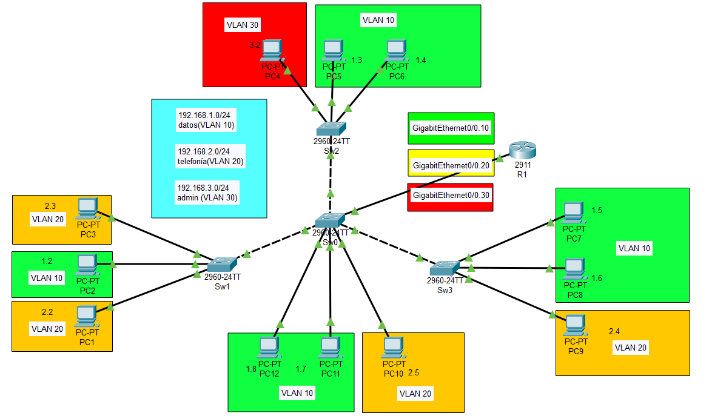

# Resumen Ejecutivo

Esta práctica implementa el enrutamiento inter-VLAN mediante la técnica "Router on a Stick" sobre la topología de VLANs desarrollada en la práctica anterior. Se agrega un router con subinterfaces configuradas para cada VLAN, permitiendo la comunicación entre diferentes segmentos de red manteniendo la segmentación a nivel de switches.

## Objetivos Alcanzados
- Configuración de router con subinterfaces para cada VLAN
- Implementación de encapsulación 802.1Q en subinterfaces
- Habilitación de enrutamiento inter-VLAN
- Configuración de gateway por defecto en equipos finales
- Verificación de conectividad entre VLANs diferentes

# Identificación del Problema

La topología desarrollada en la práctica anterior tiene VLANs completamente aisladas. Se requiere implementar enrutamiento entre estas VLANs para permitir comunicación controlada entre los diferentes segmentos de red (Datos, Telefonía y Administración), manteniendo los beneficios de segmentación de broadcast domains.

**Necesidades específicas:**
- Comunicación entre equipos de diferentes VLANs
- Mantenimiento de la segmentación de broadcast domains
- Implementación eficiente con un solo enlace físico
- Configuración de gateway por defecto para cada VLAN

# Metodología Aplicada

## Herramientas Utilizadas
- **Simulador:** Cisco Packet Tracer
- **Dispositivos:** Router Cisco 1841/2811 y Switches 2950/2960
- **Protocolo:** IEEE 802.1Q (VLAN Tagging) en subinterfaces
- **Técnica:** Router on a Stick (ROAS)

## Enfoque de Implementación
1. **Adición de router:** Conexión del router al switch central
2. **Configuración de subinterfaces:** Una subinterfaz por VLAN
3. **Encapsulación 802.1Q:** Configuración de VLAN tagging
4. **Asignación de IPs:** Gateway para cada segmento de red
5. **Configuración de equipos finales:** Gateway por defecto
6. **Validación:** Pruebas de conectividad inter-VLAN

# Topología de Red Implementada



**Figura 1:** Topología implementada con router on a stick para enrutamiento inter-VLAN

```
                    R1 (Router)
                     |
                   SW0
                 /  |  \
                /   |   \
              SW1  SW2  SW3
              /||\  ||   |||\
            PC1||PC2||PC4|| PC7
            PC3  \   ||PC5|| PC8
                 PC6    PC9
```

## Configuración de Subinterfaces

| Subinterfaz | VLAN | Red | Gateway | Descripción |
|-------------|------|-----|---------|-------------|
| Fa0/0.10 | 10 | 192.168.1.0/24 | 192.168.1.1 | VLAN Datos |
| Fa0/0.20 | 20 | 192.168.2.0/24 | 192.168.2.1 | VLAN Telefonía |
| Fa0/0.30 | 30 | 192.168.3.0/24 | 192.168.3.1 | VLAN Admin |

## Configuración Actualizada de Equipos

| Switch | Puerto | Equipo | IP | Gateway | VLAN |
|--------|--------|--------|----|---------|----- |
| SW1 | Fa0/1 | PC1 | 192.168.2.2/24 | 192.168.2.1 | 20 |
| SW1 | Fa0/2 | PC2 | 192.168.1.2/24 | 192.168.1.1 | 10 |
| SW1 | Fa0/3 | PC3 | 192.168.2.3/24 | 192.168.2.1 | 20 |
| SW2 | Fa0/1 | PC4 | 192.168.3.2/24 | 192.168.3.1 | 30 |
| SW2 | Fa0/2 | PC5 | 192.168.1.3/24 | 192.168.1.1 | 10 |
| SW2 | Fa0/3 | PC6 | 192.168.1.4/24 | 192.168.1.1 | 10 |
| SW3 | Fa0/1 | PC7 | 192.168.1.5/24 | 192.168.1.1 | 10 |
| SW3 | Fa0/2 | PC8 | 192.168.1.6/24 | 192.168.1.1 | 10 |
| SW3 | Fa0/3 | PC9 | 192.168.2.4/24 | 192.168.2.1 | 20 |
| SW0 | Fa0/4 | PC10 | 192.168.2.5/24 | 192.168.2.1 | 20 |
| SW0 | Fa0/5 | PC11 | 192.168.1.7/24 | 192.168.1.1 | 10 |
| SW0 | Fa0/6 | PC12 | 192.168.1.8/24 | 192.168.1.1 | 10 |

## Nuevo Enlace Agregado

| Dispositivo Origen | Puerto | Dispositivo Destino | Puerto | Tipo |
|-------------------|--------|---------------------|--------|------|
| R1 | Fa0/0 | SW0 | Fa0/7 | Trunk 802.1Q |

# Configuración Inicial

Se parte de la configuración completa de VLANs de la práctica anterior, agregando únicamente el router y las configuraciones necesarias para enrutamiento inter-VLAN.

::: info-box
**Prerequisito:** Completar exitosamente la Práctica 2.1 con todas las VLANs configuradas y operativas.
:::

# Desarrollo Detallado

## Configuraciones Finales por Dispositivo

Las siguientes configuraciones están listas para copiar y pegar directamente en cada dispositivo:

### Router R1 (Router on a Stick)

```cisco
hostname R1
no ip domain-lookup
service password-encryption
ip routing

interface FastEthernet0/0
 no ip address
 no shutdown
exit

interface FastEthernet0/0.10
 encapsulation dot1Q 10
 ip address 192.168.1.1 255.255.255.0
exit

interface FastEthernet0/0.20
 encapsulation dot1Q 20
 ip address 192.168.2.1 255.255.255.0
exit

interface FastEthernet0/0.30
 encapsulation dot1Q 30
 ip address 192.168.3.1 255.255.255.0
exit

interface FastEthernet0/1
 shutdown
exit

interface Vlan1
 shutdown
exit

line con 0
 logging synchronous
exit

line vty 0 4
 login
exit

end
write memory
```

### Switch SW0 (Core - Actualizado)

```cisco
hostname SW0
no ip domain-lookup
service password-encryption
spanning-tree mode pvst
spanning-tree extend system-id

vlan 10
 name datos
exit
vlan 20
 name telefonia
exit
vlan 30
 name admin
exit

interface FastEthernet0/1
 switchport mode trunk
 switchport trunk allowed vlan 10,20,30
 no shutdown
exit

interface FastEthernet0/2
 switchport mode trunk
 switchport trunk allowed vlan 10,20,30
 no shutdown
exit

interface FastEthernet0/3
 switchport mode trunk
 switchport trunk allowed vlan 10,20,30
 no shutdown
exit

interface FastEthernet0/4
 switchport mode access
 switchport access vlan 20
 no shutdown
exit

interface FastEthernet0/5
 switchport mode access
 switchport access vlan 10
 no shutdown
exit

interface FastEthernet0/6
 switchport mode access
 switchport access vlan 10
 no shutdown
exit

interface FastEthernet0/7
 switchport mode trunk
 switchport trunk allowed vlan 10,20,30
 no shutdown
exit

interface Vlan1
 shutdown
exit

line con 0
 logging synchronous
exit

line vty 0 15
 login
exit

end
write memory
```

::: info-box
**Nota:** Los switches SW1, SW2 y SW3 mantienen las configuraciones de la práctica anterior sin cambios.
:::

## Configuración de Equipos Finales

### Gateway por VLAN

| VLAN | Gateway | Equipos |
|------|---------|---------|
| 10 (Datos) | 192.168.1.1 | PC2, PC5, PC6, PC7, PC8, PC11, PC12 |
| 20 (Telefonía) | 192.168.2.1 | PC1, PC3, PC9, PC10 |
| 30 (Admin) | 192.168.3.1 | PC4 |

# Validación y Pruebas

## Verificación de Configuración de Subinterfaces

```cisco
R1# show ip interface brief

Interface                  IP-Address      OK? Method Status                Protocol
FastEthernet0/0            unassigned      YES unset  up                    up
FastEthernet0/0.10         192.168.1.1     YES manual up                    up
FastEthernet0/0.20         192.168.2.1     YES manual up                    up
FastEthernet0/0.30         192.168.3.1     YES manual up                    up
FastEthernet0/1            unassigned      YES unset  administratively down down
```

## Verificación de Tabla de Enrutamiento

```cisco
R1# show ip route

Codes: C - connected, S - static, R - RIP, M - mobile, B - BGP
       D - EIGRP, EX - EIGRP external, O - OSPF, IA - OSPF inter area

Gateway of last resort is not set

C    192.168.1.0/24 is directly connected, FastEthernet0/0.10
C    192.168.2.0/24 is directly connected, FastEthernet0/0.20
C    192.168.3.0/24 is directly connected, FastEthernet0/0.30
```

## Verificación de Conectividad Inter-VLAN

```cisco
! Ping desde PC2 (VLAN 10) hacia PC1 (VLAN 20)
PC2> ping 192.168.2.2

Pinging 192.168.2.2 with 32 bytes of data:

Reply from 192.168.2.2: bytes=32 time=1ms TTL=127
Reply from 192.168.2.2: bytes=32 time=1ms TTL=127
Reply from 192.168.2.2: bytes=32 time=1ms TTL=127
Reply from 192.168.2.2: bytes=32 time=1ms TTL=127

Ping statistics for 192.168.2.2:
    Packets: Sent = 4, Received = 4, Lost = 0 (0% loss),
Approximate round trip times in milli-seconds:
    Minimum = 1ms, Maximum = 1ms, Average = 1ms
```

## Verificación de ARP del Router

```cisco
R1# show arp

Protocol  Address          Age (min)  Hardware Addr   Type   Interface
Internet  192.168.1.1             -   00d0.d311.c601  ARPA   FastEthernet0/0.10
Internet  192.168.1.2             0   0001.427e.4a89  ARPA   FastEthernet0/0.10
Internet  192.168.2.1             -   00d0.d311.c601  ARPA   FastEthernet0/0.20
Internet  192.168.2.2             0   0060.2f84.4ab6  ARPA   FastEthernet0/0.20
```

::: success-box
**Resultado:** El enrutamiento inter-VLAN está funcionando correctamente. Los equipos de diferentes VLANs pueden comunicarse a través del router, manteniendo la segmentación de broadcast domains.
:::

# Problemas Encontrados Durante el Desarrollo

Durante la implementación del enrutamiento inter-VLAN se identificaron y resolvieron los siguientes aspectos:

## 1. Configuración de Encapsulación 802.1Q
**Problema planteado:** Las subinterfaces deben entender el etiquetado VLAN para procesar correctamente el tráfico.

**Solución aplicada:** Se configuró la encapsulación dot1Q en cada subinterfaz especificando el número de VLAN correspondiente.

## 2. Habilitación del Enrutamiento IP
**Problema planteado:** El router debe tener habilitado el enrutamiento IP para reenviar tráfico entre subredes.

**Solución aplicada:** Se ejecutó el comando `ip routing` para habilitar las funciones de enrutamiento del router.

## 3. Configuración de Gateway en Equipos Finales
**Problema planteado:** Los equipos finales necesitan conocer la dirección del router para comunicarse con otras redes.

**Solución aplicada:** Se configuró la dirección IP de la subinterfaz correspondiente como gateway por defecto en cada equipo final.

## 4. Enlace Troncal hacia el Router
**Problema planteado:** El puerto del switch conectado al router debe ser configurado como trunk para transportar múltiples VLANs.

**Solución aplicada:** Se configuró el puerto Fa0/7 del SW0 como trunk permitiendo las VLANs 10, 20 y 30.

# Experiencia Adquirida

## Conocimientos Técnicos Desarrollados
- **Router on a Stick:** Implementación de enrutamiento inter-VLAN con un solo enlace físico
- **Subinterfaces:** Configuración de múltiples interfaces lógicas en una física
- **Encapsulación 802.1Q:** Uso de VLAN tagging en subinterfaces del router
- **Enrutamiento IP:** Habilitación y verificación de funciones de routing
- **Gateway Configuration:** Configuración de gateway por defecto en equipos finales

## Habilidades Prácticas Adquiridas
- Diseño de arquitectura de enrutamiento eficiente
- Configuración avanzada de interfaces de router
- Troubleshooting de conectividad inter-VLAN
- Verificación de tabla de enrutamiento y tabla ARP
- Implementación de soluciones escalables

## Conceptos CCNA Aplicados
- Inter-VLAN routing fundamentals
- Subinterface configuration y dot1Q encapsulation
- Default gateway configuration
- Routing table interpretation
- VLAN trunk configuration on router interfaces

::: info-box
**Reflexión:** Esta práctica demostró cómo una configuración simple de router puede habilitar comunicación entre VLANs manteniendo los beneficios de segmentación, estableciendo las bases para topologías más complejas.
:::

# Exploración de Aplicaciones y Sugerencias

## Recursos y Referencias Utilizados

- **Cisco Networking Academy:** CCNA Routing and Switching - Inter-VLAN Routing
- **Documentación oficial:** Cisco IOS Interface Configuration Guide
- **Simulador:** Cisco Packet Tracer
- **Estándares:** IEEE 802.1Q VLAN Tagging
- **Protocolo:** IP Routing Fundamentals
