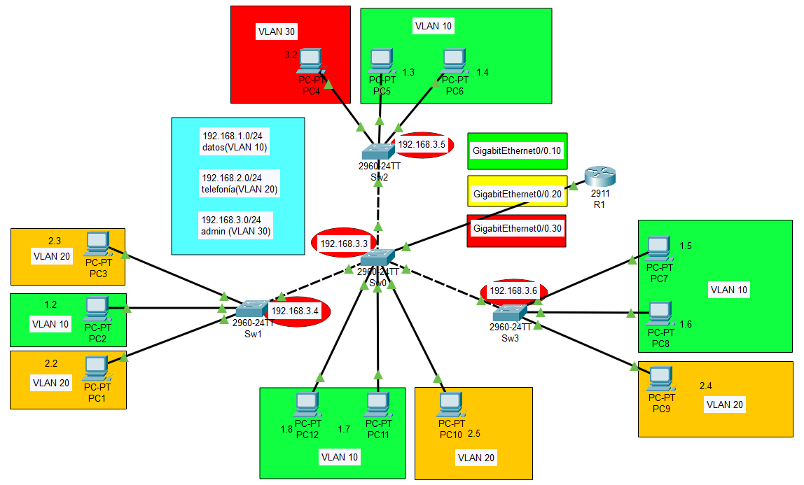

# Resumen Ejecutivo

Esta práctica implementa VTP (VLAN Trunking Protocol) sobre la topología desarrollada en las prácticas anteriores, configurando una gestión centralizada de VLANs. Se establece el switch central SW0 como servidor VTP y los switches S1, S2, S3 como clientes VTP, permitiendo la sincronización automática de la base de datos de VLANs en todo el dominio.

## Objetivos Alcanzados
- Configuración de dominio VTP "REDES_FIE"
- Establecimiento de SW0 como servidor VTP
- Configuración de S1, S2, S3 como clientes VTP
- Sincronización automática de base de datos VLAN
- Verificación de propagación de información VTP
- Implementación de contraseña VTP para seguridad

# Identificación del Problema

En las prácticas anteriores, las VLANs fueron configuradas manualmente en cada switch, lo que resulta ineficiente y propenso a errores en redes de mayor escala. Se requiere implementar una solución centralizada para la gestión de VLANs que permita:

**Necesidades específicas:**
- Gestión centralizada de VLANs desde un punto único
- Sincronización automática de configuraciones VLAN
- Reducción de errores de configuración manual
- Implementación de seguridad en la propagación de información

# Metodología Aplicada

## Herramientas Utilizadas
- **Simulador:** Cisco Packet Tracer
- **Dispositivos:** Switches Cisco 2950/2960
- **Protocolo:** VTP (VLAN Trunking Protocol)
- **Versión VTP:** Versión 1

## Enfoque de Implementación
1. **Configuración de dominio VTP:** Establecimiento del dominio común
2. **Configuración del servidor VTP:** SW0 como servidor principal
3. **Configuración de clientes VTP:** S1, S2, S3 como clientes
4. **Implementación de seguridad:** Contraseña VTP
5. **Verificación de sincronización:** Pruebas de propagación
6. **Validación completa:** Verificación de funcionamiento

# Topología de Red Implementada



## Configuración de Roles VTP

| Switch | Rol VTP | Función | Configuración |
|--------|---------|---------|---------------|
| SW0 | Server | Crear, modificar, eliminar VLANs | Gestión centralizada |
| SW1 | Client | Recibir información VTP | Solo sincronización |
| SW2 | Client | Recibir información VTP | Solo sincronización |
| SW3 | Client | Recibir información VTP | Solo sincronización |

## Configuración del Dominio VTP

| Parámetro | Valor | Descripción |
|-----------|-------|-------------|
| Dominio | REDES_FIE | Dominio VTP común |
| Contraseña | cisco123 | Autenticación VTP |
| Versión | 1 | Versión del protocolo VTP |
| Modo pruning | Deshabilitado | Sin poda automática |

# Configuración Inicial

Se parte de la configuración completa de las prácticas anteriores con VLANs configuradas manualmente en todos los switches. Estas configuraciones serán reemplazadas por la gestión centralizada de VTP.

# Desarrollo Detallado

## Configuraciones Finales por Dispositivo

Las siguientes configuraciones están listas para copiar y pegar directamente en cada dispositivo:

### Switch SW0 (VTP Server)

```cisco
hostname SW0
no ip domain-lookup
service password-encryption
spanning-tree mode pvst
spanning-tree extend system-id

vtp domain REDES_FIE
vtp mode server
vtp password cisco123
vtp version 1

vlan 10
 name datos
exit
vlan 20
 name telefonia
exit
vlan 30
 name admin
exit

interface FastEthernet0/1
 switchport mode trunk
 switchport trunk allowed vlan 10,20,30
 no shutdown
exit

interface FastEthernet0/2
 switchport mode trunk
 switchport trunk allowed vlan 10,20,30
 no shutdown
exit

interface FastEthernet0/3
 switchport mode trunk
 switchport trunk allowed vlan 10,20,30
 no shutdown
exit

interface FastEthernet0/4
 switchport mode access
 switchport access vlan 20
 no shutdown
exit

interface FastEthernet0/5
 switchport mode access
 switchport access vlan 10
 no shutdown
exit

interface FastEthernet0/6
 switchport mode access
 switchport access vlan 10
 no shutdown
exit

interface FastEthernet0/7
 switchport mode trunk
 switchport trunk allowed vlan 10,20,30
 no shutdown
exit

interface Vlan1
 shutdown
exit

line con 0
 logging synchronous
exit

line vty 0 15
 login
exit

end
write memory
```

### Switch SW1 (VTP Client)

```cisco
hostname SW1
no ip domain-lookup
service password-encryption
spanning-tree mode pvst
spanning-tree extend system-id

vtp domain REDES_FIE
vtp mode client
vtp password cisco123
vtp version 1

interface FastEthernet0/1
 switchport mode access
 switchport access vlan 20
 no shutdown
exit

interface FastEthernet0/2
 switchport mode access
 switchport access vlan 10
 no shutdown
exit

interface FastEthernet0/3
 switchport mode access
 switchport access vlan 20
 no shutdown
exit

interface FastEthernet0/24
 switchport mode trunk
 switchport trunk allowed vlan 10,20,30
 no shutdown
exit

interface Vlan1
 shutdown
exit

line con 0
 logging synchronous
exit

line vty 0 15
 login
exit

end
write memory
```

### Switch SW2 (VTP Client)

```cisco
hostname SW2
no ip domain-lookup
service password-encryption
spanning-tree mode pvst
spanning-tree extend system-id

vtp domain REDES_FIE
vtp mode client
vtp password cisco123
vtp version 1

interface FastEthernet0/1
 switchport mode access
 switchport access vlan 30
 no shutdown
exit

interface FastEthernet0/2
 switchport mode access
 switchport access vlan 10
 no shutdown
exit

interface FastEthernet0/3
 switchport mode access
 switchport access vlan 10
 no shutdown
exit

interface FastEthernet0/24
 switchport mode trunk
 switchport trunk allowed vlan 10,20,30
 no shutdown
exit

interface Vlan1
 shutdown
exit

line con 0
 logging synchronous
exit

line vty 0 15
 login
exit

end
write memory
```

### Switch SW3 (VTP Client)

```cisco
hostname SW3
no ip domain-lookup
service password-encryption
spanning-tree mode pvst
spanning-tree extend system-id

vtp domain REDES_FIE
vtp mode client
vtp password cisco123
vtp version 1

interface FastEthernet0/1
 switchport mode access
 switchport access vlan 10
 no shutdown
exit

interface FastEthernet0/2
 switchport mode access
 switchport access vlan 10
 no shutdown
exit

interface FastEthernet0/3
 switchport mode access
 switchport access vlan 20
 no shutdown
exit

interface FastEthernet0/24
 switchport mode trunk
 switchport trunk allowed vlan 10,20,30
 no shutdown
exit

interface Vlan1
 shutdown
exit

line con 0
 logging synchronous
exit

line vty 0 15
 login
exit

end
write memory
```

### Router R1 (Sin cambios)

```cisco
hostname R1
no ip domain-lookup
service password-encryption
ip routing

interface FastEthernet0/0
 no ip address
 no shutdown
exit

interface FastEthernet0/0.10
 encapsulation dot1Q 10
 ip address 192.168.1.1 255.255.255.0
exit

interface FastEthernet0/0.20
 encapsulation dot1Q 20
 ip address 192.168.2.1 255.255.255.0
exit

interface FastEthernet0/0.30
 encapsulation dot1Q 30
 ip address 192.168.3.1 255.255.255.0
exit

interface FastEthernet0/1
 shutdown
exit

interface Vlan1
 shutdown
exit

line con 0
 logging synchronous
exit

line vty 0 4
 login
exit

end
write memory
```

::: info-box
**Nota:** El router mantiene la configuración de router-on-a-stick de la práctica 2.2 para permitir enrutamiento inter-VLAN.
:::

## Orden de Configuración Recomendado

1. **Paso 1:** Configurar SW0 como servidor VTP
2. **Paso 2:** Configurar SW1, SW2, SW3 como clientes VTP  
3. **Paso 3:** Verificar sincronización automática de VLANs
4. **Paso 4:** Confirmar asignación de puertos de acceso

# Validación y Pruebas

## Verificación del Estado VTP en el Servidor

```cisco
SW0# show vtp status

VTP Version                     : 1
Configuration Revision          : 2
Maximum VLANs supported locally : 255
Number of existing VLANs        : 8
VTP Operating Mode              : Server
VTP Domain Name                 : REDES_FIE
VTP Pruning Mode                : Disabled
VTP V2 Mode                     : Disabled
VTP Traps Generation            : Disabled
MD5 digest                      : 0x3F 0x1B 0x2A 0x4C 0x5D 0x6E 0x7F 0x8A
Configuration last modified by 192.168.1.1 at 3-1-93 00:02:14
Local updater ID is 192.168.1.1 on interface Vl1 (lowest numbered VLAN interface found)
```

## Verificación del Estado VTP en los Clientes

```cisco
SW1# show vtp status

VTP Version                     : 1
Configuration Revision          : 2
Maximum VLANs supported locally : 255
Number of existing VLANs        : 8
VTP Operating Mode              : Client
VTP Domain Name                 : REDES_FIE
VTP Pruning Mode                : Disabled
VTP V2 Mode                     : Disabled
VTP Traps Generation            : Disabled
MD5 digest                      : 0x3F 0x1B 0x2A 0x4C 0x5D 0x6E 0x7F 0x8A
Configuration last modified by 192.168.1.1 at 3-1-93 00:02:14
```

## Verificación de Sincronización de VLANs

```cisco
SW1# show vlan brief

VLAN Name                             Status    Ports
---- -------------------------------- --------- -------------------------------
1    default                          active    Fa0/4, Fa0/5, Fa0/6, Fa0/7
                                                Fa0/8, Fa0/9, Fa0/10, Fa0/11
                                                Fa0/12, Fa0/13, Fa0/14, Fa0/15
                                                Fa0/16, Fa0/17, Fa0/18, Fa0/19
                                                Fa0/20, Fa0/21, Fa0/22, Fa0/23
10   datos                            active    Fa0/2
20   telefonia                        active    Fa0/1, Fa0/3
30   admin                            active
```

## Prueba de Creación de Nueva VLAN desde el Servidor

```cisco
SW0# configure terminal

SW0(config)# vlan 40
SW0(config-vlan)# name invitados
SW0(config-vlan)# exit
SW0(config)# end

SW0# show vlan brief | include 40
40   invitados                        active
```

```cisco
! Verificar en cliente SW1
SW1# show vlan brief | include 40
40   invitados                        active
```

::: success-box
**Resultado:** VTP está funcionando correctamente. Las VLANs se sincronizan automáticamente desde el servidor hacia todos los clientes del dominio.
:::

## Verificación de Estadísticas VTP

```cisco
SW0# show vtp counters

VTP statistics:
Summary advertisements received    : 0
Subset advertisements received     : 0
Request advertisements received    : 4
Summary advertisements transmitted : 8
Subset advertisements transmitted  : 4
Request advertisements transmitted : 0
Number of config revision errors   : 0
Number of config digest errors     : 0
Number of V1 summary errors        : 0
```

# Problemas Encontrados Durante el Desarrollo

Durante la implementación de VTP se identificaron y resolvieron los siguientes aspectos:

## 1. Configuración Consistente del Dominio VTP
**Problema planteado:** Todos los switches deben pertenecer al mismo dominio VTP para intercambiar información.

**Solución aplicada:** Se configuró el dominio "REDES_FIE" en todos los switches de manera consistente.

## 2. Implementación de Seguridad VTP
**Problema planteado:** La información VTP debe estar protegida contra modificaciones no autorizadas.

**Solución aplicada:** Se implementó la contraseña "cisco123" en todos los switches para autenticar las comunicaciones VTP.

## 3. Configuración de Roles VTP Apropiados
**Problema planteado:** Debe existir al menos un servidor VTP para gestionar la base de datos de VLANs.

**Solución aplicada:** Se configuró SW0 como servidor VTP y los demás switches como clientes para centralizar la gestión.

## 4. Reconfiguración de Puertos tras Sincronización
**Problema planteado:** Los puertos de acceso deben ser reconfigurados después de la sincronización VTP.

**Solución aplicada:** Se reconfiguraron todos los puertos de acceso en los switches clientes después de recibir las VLANs del servidor.

# Experiencia Adquirida

## Conocimientos Técnicos Desarrollados
- **VTP Fundamentals:** Comprensión del protocolo y sus modos de operación
- **Dominio VTP:** Configuración y gestión de dominios VTP
- **Roles VTP:** Diferencias entre servidor, cliente y transparente
- **Seguridad VTP:** Implementación de autenticación mediante contraseñas
- **Sincronización automática:** Propagación de información VLAN

## Habilidades Prácticas Adquiridas
- Planificación de arquitectura VTP centralizada
- Configuración sistemática de roles VTP
- Troubleshooting de sincronización VTP
- Verificación de propagación de información
- Gestión centralizada de VLANs a escala

## Conceptos CCNA Aplicados
- VTP modes (Server, Client, Transparent)
- VTP domain configuration
- VTP password authentication
- VLAN database synchronization
- VTP advertisements y revision numbers

::: info-box
**Reflexión:** VTP proporciona una solución eficiente para la gestión centralizada de VLANs, reduciendo significativamente la carga administrativa en redes de múltiples switches.
:::

# Exploración de Aplicaciones y Sugerencias

## Recursos y Referencias Utilizados

- **Cisco Networking Academy:** CCNA Routing and Switching - VTP Configuration
- **Documentación oficial:** Cisco IOS VLAN Configuration Guide
- **Simulador:** Cisco Packet Tracer
- **Protocolo:** VTP (VLAN Trunking Protocol)
- **Estándares:** Cisco Proprietary Protocol
