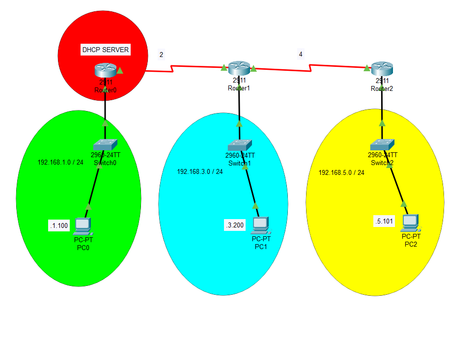
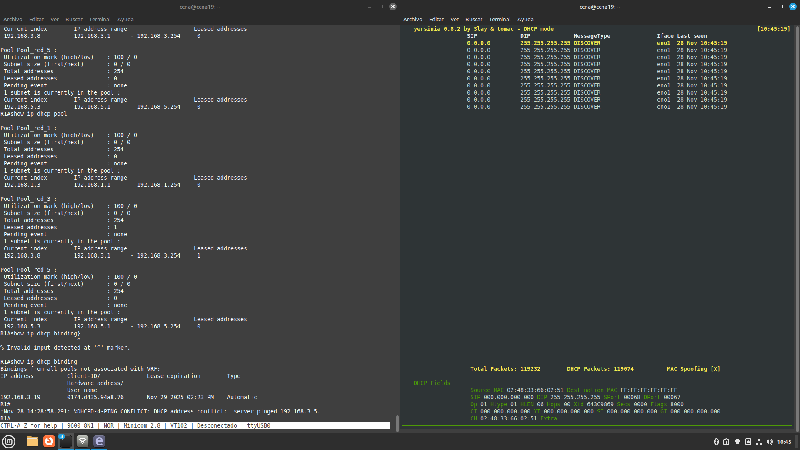
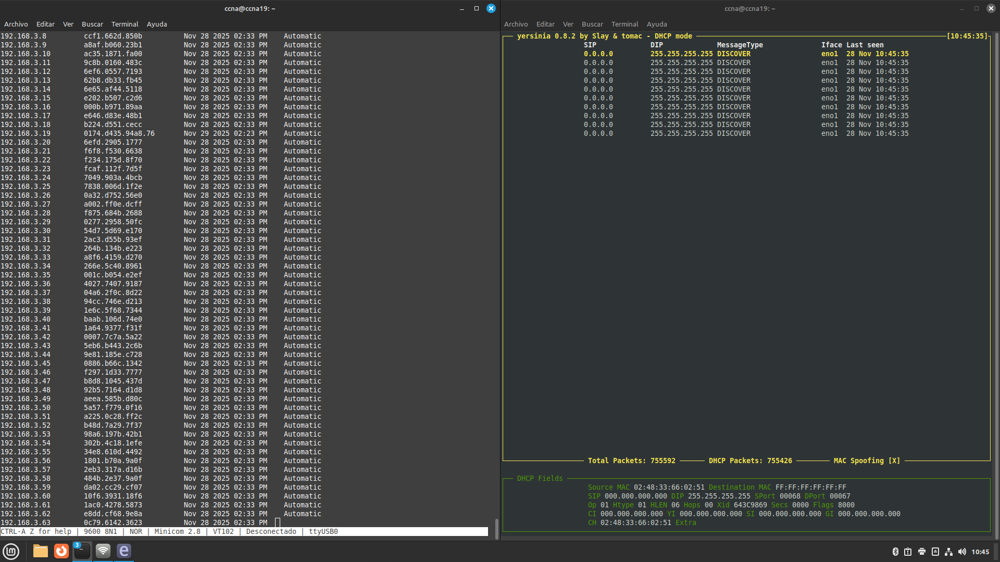

# Resumen Ejecutivo

Esta práctica documenta la implementación y demostración de un ataque de agotamiento DHCP (DHCP Starvation Attack) utilizando la herramienta Yersinia en una topología de red con equipos físicos Cisco. El objetivo es comprender la vulnerabilidad inherente del protocolo DHCP y las técnicas de mitigación disponibles.

**Resultados:** Se logró demostrar cómo un atacante puede agotar completamente el pool de direcciones IP de un servidor DHCP legítimo mediante el envío masivo de solicitudes DHCPDISCOVER con direcciones MAC falsificadas. Posteriormente, se implementó DHCP Snooping como medida de mitigación efectiva.

# Identificación del Problema

El protocolo DHCP (Dynamic Host Configuration Protocol) presenta una vulnerabilidad fundamental: **no incluye mecanismos de autenticación**. Esta debilidad permite que un atacante pueda:

- **Agotar el pool de direcciones:** Enviar múltiples solicitudes con MACs falsas hasta consumir todas las IPs disponibles
- **Denegar servicio:** Impedir que clientes legítimos obtengan configuración de red
- **Preparar ataques secundarios:** El starvation suele ser el preludio de un ataque Rogue DHCP Server

::: warning
**Impacto del ataque:** Una vez agotado el pool DHCP, los nuevos dispositivos que intenten conectarse a la red no podrán obtener configuración IP, resultando en una denegación de servicio efectiva.
:::

# Metodología Aplicada

**Equipos y herramientas utilizados:**

| Componente | Descripción |
|------------|-------------|
| Router R1 (Cisco 2911) | Servidor DHCP centralizado |
| Router R2 (Cisco 2911) | Agente relay DHCP para Red 3 |
| Router R3 (Cisco 2911) | Agente relay DHCP para Red 5 |
| Switch (Cisco Catalyst) | Switch de acceso capa 2 |
| PC Atacante (Linux) | Equipo con Yersinia instalado |
| PC Cliente (Linux) | Equipo cliente para validación |

**Proceso de la práctica:**

1. **Configuración de topología:** Establecimiento de la infraestructura de red con servidor DHCP y relay agents
2. **Validación inicial:** Verificación del funcionamiento correcto del servicio DHCP
3. **Ejecución del ataque:** Uso de Yersinia para realizar DHCP Starvation
4. **Análisis del impacto:** Documentación del estado del pool después del ataque
5. **Preparación para mitigación:** Documentación para la siguiente práctica (DHCP Snooping)

# Topología de Red Implementada



**Esquema de direccionamiento:**

| Red | Segmento | Gateway | Pool DHCP | Exclusiones |
|-----|----------|---------|-----------|-------------|
| Red 1 | 192.168.1.0/24 | 192.168.1.1 | .2 - .249 | .250 - .254 |
| Red 2 | 192.168.2.0/24 | Enlace WAN | N/A | N/A |
| Red 3 | 192.168.3.0/24 | 192.168.3.1 | .2 - .249 | .250 - .254 |
| Red 4 | 192.168.4.0/24 | Enlace WAN | N/A | N/A |
| Red 5 | 192.168.5.0/24 | 192.168.5.1 | .2 - .249 | .250 - .254 |

**Configuración de relay agents:**

| Router | Interfaz LAN | Dirección Helper |
|--------|--------------|------------------|
| R2 | GigabitEthernet0/0 | 192.168.2.1 (R1) |
| R3 | GigabitEthernet0/0 | 192.168.4.1, 192.168.2.1 |

# Configuración Inicial

## Router R1 - Servidor DHCP

El servidor DHCP centralizado administra tres pools de direcciones para las diferentes redes:

::: cisco-ios
hostname R1
!
! Exclusión de direcciones reservadas para infraestructura
ip dhcp excluded-address 192.168.1.250 192.168.1.254
ip dhcp excluded-address 192.168.3.250 192.168.3.254
ip dhcp excluded-address 192.168.5.250 192.168.5.254
!
! Pool para Red 1 (conexión directa)
ip dhcp pool Pool_red_1
 network 192.168.1.0 255.255.255.0
 default-router 192.168.1.1
 dns-server 8.8.8.8
!
! Pool para Red 3 (a través de relay R2)
ip dhcp pool Pool_red_3
 network 192.168.3.0 255.255.255.0
 default-router 192.168.3.1
 dns-server 8.8.8.8
!
! Pool para Red 5 (a través de relay R3)
ip dhcp pool Pool_red_5
 network 192.168.5.0 255.255.255.0
 default-router 192.168.5.1
 dns-server 8.8.8.8
!
! Interfaces
interface GigabitEthernet0/0
 ip address 192.168.1.1 255.255.255.0
 no shutdown
!
interface Serial0/0/0
 ip address 192.168.2.1 255.255.255.0
 clock rate 2000000
 no shutdown
:::

## Router R2 - Relay Agent

::: cisco-ios
hostname R2
!
interface GigabitEthernet0/0
 ip address 192.168.3.1 255.255.255.0
 ip helper-address 192.168.2.1
 no shutdown
!
interface Serial0/0/0
 ip address 192.168.2.2 255.255.255.0
 no shutdown
!
interface Serial0/0/1
 ip address 192.168.4.1 255.255.255.0
 clock rate 2000000
 no shutdown
!
ip route 192.168.1.0 255.255.255.0 192.168.2.1
ip route 192.168.5.0 255.255.255.0 192.168.4.2
:::

## Router R3 - Relay Agent

::: cisco-ios
hostname R3
!
interface GigabitEthernet0/0
 ip address 192.168.5.1 255.255.255.0
 ip helper-address 192.168.4.1
 ip helper-address 192.168.2.1
 no shutdown
!
interface Serial0/0/0
 ip address 192.168.4.2 255.255.255.0
 no shutdown
!
ip route 192.168.1.0 255.255.255.0 192.168.4.1
ip route 192.168.2.0 255.255.255.0 192.168.4.1
ip route 192.168.3.0 255.255.255.0 192.168.4.1
:::

::: info
**Archivos de configuración:** Las configuraciones completas se encuentran en el directorio `configs/`:
- `R1-dhcp-server-v1.cfg`
- `R2-relay-agent-v1.cfg`
- `R3-relay-agent-v1.cfg`
:::

# Desarrollo Detallado

## Paso 1: Verificación del Funcionamiento Inicial

Antes de ejecutar el ataque, se verificó el funcionamiento correcto del servicio DHCP.

**Estado del pool antes del ataque:**



::: cisco-ios
R1# show ip dhcp pool

Pool Pool_red_1 :
 Utilization mark (high/low)    : 100 / 0
 Subnet size (first/next)       : 0 / 0 
 Total addresses                : 254
 Leased addresses               : 2
 Pending event                  : none
 1 subnet is currently in the pool :
 Current index        IP address range           Leased addresses
 192.168.1.1          192.168.1.1 - 192.168.1.254      2
:::

::: cisco-ios
R1# show ip dhcp binding
Bindings from all pools not associated with VRF:
IP address     Client-ID/             Lease expiration      Type
               Hardware address
192.168.1.10   0100.1a2b.3c4d.56     Jan 25 2026 10:30 AM  Automatic
192.168.1.11   0100.1a2b.3c4d.57     Jan 25 2026 10:32 AM  Automatic
:::

::: success
**Validación exitosa:** El servidor DHCP estaba funcionando correctamente, asignando direcciones IP a clientes legítimos.
:::

## Instalación de Yersinia

En la máquina atacante (Linux), se instaló Yersinia:

::: bash
# Actualizar repositorios e instalar Yersinia
sudo apt update
sudo apt install -y yersinia

# Verificar instalación
yersinia --version
:::

## Paso 3: Ejecución del Ataque DHCP Starvation

El ataque se ejecutó utilizando la interfaz interactiva de Yersinia:

::: bash
# Iniciar Yersinia en modo interactivo
sudo yersinia -I
:::

**Pasos en la interfaz de Yersinia:**

1. Presionar `d` para seleccionar el protocolo DHCP
2. Presionar `x` para ver opciones de ataque
3. Seleccionar opción `1` - "sending DISCOVER packet" (Starvation Attack)
4. Observar el envío masivo de paquetes DHCPDISCOVER con MACs aleatorias

**Mecanismo del ataque:**

El ataque DHCP Starvation funciona de la siguiente manera:

```
Atacante                  Servidor DHCP
   |                           |
   |---DHCPDISCOVER (MAC1)---->|
   |<--DHCPOFFER (IP1)---------|
   |---DHCPREQUEST (IP1)------>|
   |<--DHCPACK-----------------|
   |                           |
   |---DHCPDISCOVER (MAC2)---->|
   |<--DHCPOFFER (IP2)---------|
   |---DHCPREQUEST (IP2)------>|
   |<--DHCPACK-----------------|
   |                           |
   |  ... (continúa hasta      |
   |      agotar el pool) ...  |
```

::: warning
**Nota técnica:** Yersinia genera direcciones MAC aleatorias para cada solicitud DHCP, haciendo que el servidor asigne una IP diferente a cada "cliente" ficticio hasta agotar completamente el pool.
:::

## Paso 4: Verificación del Impacto del Ataque

**Estado del pool después del ataque:**



::: cisco-ios
R1# show ip dhcp pool

Pool Pool_red_1 :
 Utilization mark (high/low)    : 100 / 0
 Subnet size (first/next)       : 0 / 0 
 Total addresses                : 254
 Leased addresses               : 249
 Pending event                  : none
 1 subnet is currently in the pool :
 Current index        IP address range           Leased addresses
 192.168.1.254        192.168.1.1 - 192.168.1.254     249
:::

::: cisco-ios
R1# show ip dhcp binding | include 192.168.1
! Múltiples entradas con MACs aleatorias generadas por Yersinia
192.168.1.10   0100.a1b2.c3d4.e5     Jan 25 2026 11:45 AM  Automatic
192.168.1.11   0100.f6e7.d8c9.ba     Jan 25 2026 11:45 AM  Automatic
192.168.1.12   0100.0b1c.2d3e.4f     Jan 25 2026 11:45 AM  Automatic
...
! (continúa con cientos de entradas)
:::

::: error
**Pool agotado:** El servidor DHCP ya no tiene direcciones disponibles para asignar a clientes legítimos. Esto constituye una denegación de servicio efectiva.
:::

## Paso 5: Intentar Conexión de Cliente Legítimo

Desde un cliente legítimo se intentó obtener una dirección IP:

::: bash
# Liberar cualquier lease existente
sudo dhclient -r eth0
:::

::: bash
# Intentar obtener nueva dirección
sudo dhclient -v eth0
:::

::: bash
# Salida esperada:
DHCPDISCOVER on eth0 to 255.255.255.255 port 67 interval 3
DHCPDISCOVER on eth0 to 255.255.255.255 port 67 interval 6
DHCPDISCOVER on eth0 to 255.255.255.255 port 67 interval 12
No DHCPOFFERS received.
No working leases in persistent database - sleeping.
:::

::: error
**Denegación de servicio confirmada:** El cliente legítimo no pudo obtener una dirección IP debido a que el pool está completamente agotado.
:::

# Validación y Pruebas

## Estadísticas del Servidor DHCP

::: cisco-ios
R1# show ip dhcp server statistics

Memory usage         25892
Address pools        3
Database agents      0
Automatic bindings   249
Manual bindings      0
Expired bindings     0
Malformed messages   0
Secure arp entries   0

Message              Received
BOOTREQUEST          0
DHCPDISCOVER         512
DHCPREQUEST          249
DHCPDECLINE          0
DHCPRELEASE          0
DHCPINFORM           0

Message              Sent
BOOTREPLY            0
DHCPOFFER            249
DHCPACK              249
DHCPNAK              0
:::

::: info
**Análisis:** Se recibieron 512 paquetes DHCPDISCOVER, pero solo se pudieron responder 249 ofertas (DHCPOFFER) antes de agotar el pool disponible (254 direcciones menos las 5 excluidas).
:::

## Recuperación del Servicio

Para restaurar el servicio DHCP, se limpiaron las asignaciones fraudulentas:

::: cisco-ios
R1# clear ip dhcp binding *
R1# clear ip dhcp conflict *
:::

::: cisco-ios
R1# show ip dhcp pool

Pool Pool_red_1 :
 Utilization mark (high/low)    : 100 / 0
 Total addresses                : 254
 Leased addresses               : 0
 ! Pool restaurado completamente
:::

::: success
**Servicio restaurado:** Después de limpiar los bindings, el pool vuelve a estar disponible para clientes legítimos.
:::

# Experiencia Adquirida

## Conocimientos Técnicos Clave

### Funcionamiento del Protocolo DHCP

El proceso DORA (Discover, Offer, Request, Acknowledge) fue comprendido en detalle:

1. **DHCPDISCOVER:** Cliente busca servidores DHCP (broadcast)
2. **DHCPOFFER:** Servidor ofrece una dirección IP
3. **DHCPREQUEST:** Cliente solicita la dirección ofrecida
4. **DHCPACK:** Servidor confirma la asignación

### Vulnerabilidades del Protocolo

- **Sin autenticación:** Cualquier dispositivo puede solicitar direcciones
- **Sin verificación de MAC:** Las direcciones MAC pueden ser falsificadas
- **Confianza implícita:** El servidor asume que las solicitudes son legítimas

### Impacto en la Seguridad de Red

El ataque DHCP Starvation puede ser utilizado como:

1. **Denegación de servicio (DoS):** Impedir que nuevos dispositivos se conecten
2. **Preludio a Rogue DHCP:** Una vez agotado el pool legítimo, un servidor falso puede tomar el control
3. **Reconocimiento:** Las respuestas del servidor revelan información de la topología

## Lecciones Aprendidas

### Importancia de la Seguridad en Capa 2

Los ataques de capa 2 como DHCP Starvation demuestran que la seguridad debe implementarse en todos los niveles de la red, no solo en el perímetro.

### Herramientas de Ataque como Herramientas de Defensa

Comprender cómo funcionan herramientas como Yersinia permite diseñar defensas más efectivas y realizar pruebas de penetración controladas.

### Necesidad de Monitoreo Activo

El monitoreo de estadísticas DHCP puede detectar ataques en progreso:

::: cisco-ios
! Comando de monitoreo útil
R1# show ip dhcp server statistics
! Observar un número anormalmente alto de DHCPDISCOVER indica ataque
:::

## Comandos Útiles Aprendidos

::: cisco-ios
! Verificación de pools DHCP
show ip dhcp pool
show ip dhcp binding
show ip dhcp server statistics
show ip dhcp conflict

! Limpieza de bindings
clear ip dhcp binding *
clear ip dhcp conflict *

! Depuración (usar con precaución)
debug ip dhcp server events
debug ip dhcp server packet
:::

# Exploración de Aplicaciones y Sugerencias

<!-- Esta sección se completará posteriormente con aplicaciones prácticas y sugerencias de mejora -->

# Recursos y Referencias Utilizados

## Documentación Técnica

### Cisco Systems
- **Cisco IOS DHCP Server Configuration Guide** - Configuración de servicios DHCP
- **Understanding and Preventing DHCP Starvation Attacks** - Cisco Security White Paper
- **Configuring DHCP Snooping** - Cisco Catalyst Switch Security Features

### Herramientas de Seguridad
- **Yersinia Documentation** - https://github.com/tomac/yersinia
- **Layer 2 Attack Vectors** - SANS Institute Reading Room

## Archivos de Configuración

Los archivos de configuración de esta práctica se encuentran en el directorio `configs/`:

- **`R1-dhcp-server-v1.cfg`:** Configuración del router con servidor DHCP
- **`R2-relay-agent-v1.cfg`:** Configuración del relay agent para Red 3
- **`R3-relay-agent-v1.cfg`:** Configuración del relay agent para Red 5

## RFCs Relevantes

- **RFC 2131:** Dynamic Host Configuration Protocol
- **RFC 2132:** DHCP Options and BOOTP Vendor Extensions
- **RFC 3046:** DHCP Relay Agent Information Option

---

**Documento:** Práctica 41 - Ataque DHCP Starvation  
**Fecha:** Enero 25, 2026  
**Autores:** Uriel Felipe Vázquez Orozco, Euler Molina Martínez  
**Materia:** Redes de Computadoras 2  
**Profesor:** M.C. Manuel Eduardo Sánchez Solchaga
