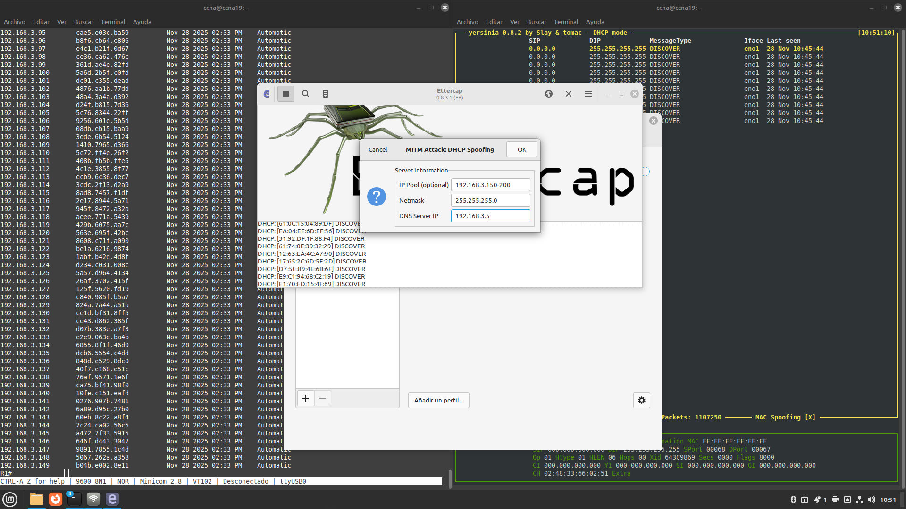
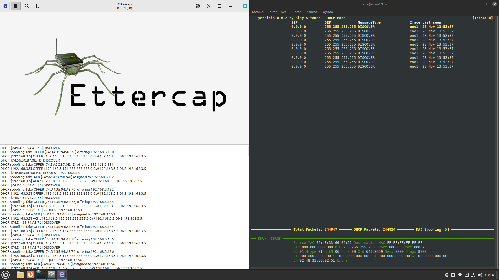
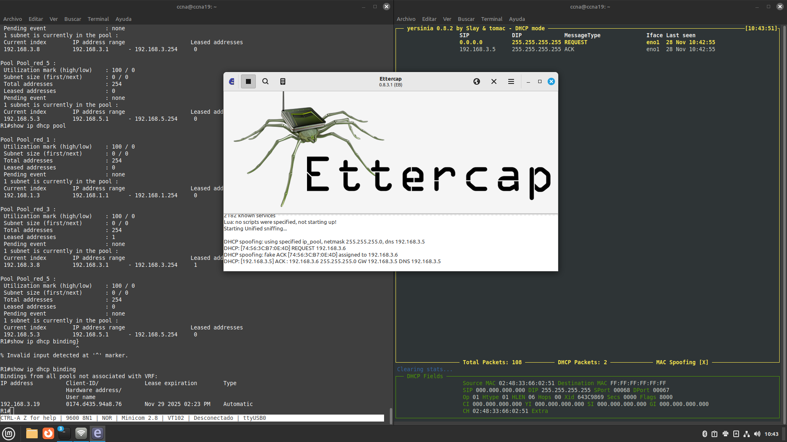
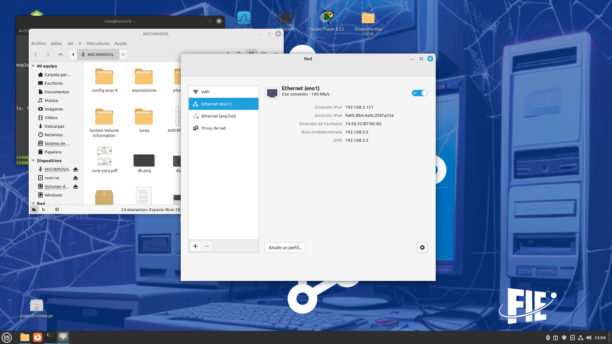

# Resumen Ejecutivo

Esta práctica documenta la implementación y demostración de un ataque de servidor DHCP fraudulento (DHCP Rogue Server) utilizando Ettercap, como continuación de la práctica de DHCP Starvation. El objetivo es comprender cómo un atacante puede tomar control de la configuración de red de los clientes y posteriormente implementar DHCP Snooping como medida de mitigación efectiva.

**Resultados:** Se demostró exitosamente cómo después de ejecutar un ataque de starvation, un servidor DHCP malicioso puede responder a las solicitudes de los clientes, asignándoles configuraciones falsas que permiten ataques Man-in-the-Middle. Posteriormente, se implementó DHCP Snooping en el switch, verificando que el ataque es completamente neutralizado.

# Identificación del Problema

Después de agotar el pool DHCP legítimo (Práctica 41), un atacante puede desplegar un **servidor DHCP fraudulento** que responda a las solicitudes de los clientes. Este ataque permite:

- **Asignación de gateway falso:** Redirigir todo el tráfico a través del atacante (MITM)
- **DNS Spoofing:** Asignar un servidor DNS controlado por el atacante
- **Captura de credenciales:** Interceptar tráfico no cifrado
- **Modificación de tráfico:** Inyectar contenido malicioso en las comunicaciones

::: warning
**Secuencia de ataque:** 
1. DHCP Starvation → Agotar pool legítimo
2. DHCP Rogue → Responder con configuración maliciosa
3. Man-in-the-Middle → Interceptar todo el tráfico
:::

# Metodología Aplicada

**Equipos y herramientas utilizados:**

| Componente | Descripción |
|------------|-------------|
| Router R1 (Cisco 2911) | Servidor DHCP legítimo |
| Switch SW1 (Cisco Catalyst) | Switch de acceso con DHCP Snooping |
| PC Atacante (Linux) | Ettercap para Rogue DHCP |
| PC Víctima (Linux) | Cliente que recibe configuración falsa |

**Proceso de la práctica:**

1. **Prerrequisito:** Ejecución exitosa de DHCP Starvation (Práctica 41)
2. **Despliegue del ataque:** Configuración de servidor DHCP falso en Ettercap
3. **Verificación del impacto:** Análisis de la configuración obtenida por la víctima
4. **Implementación de mitigación:** Configuración de DHCP Snooping
5. **Validación de la defensa:** Comprobación de que el ataque es bloqueado

# Topología de Red Implementada

La topología utilizada es la misma que en la Práctica 41, con la adición de la máquina atacante ejecutando el servidor DHCP fraudulento.

**Esquema del ataque:**

| Dispositivo | IP Real | IP Maliciosa Asignada |
|-------------|---------|----------------------|
| Gateway legítimo (R3) | 192.168.3.1 | - |
| Atacante (Rogue DHCP) | 192.168.3.5 | - |
| Víctima | - | 192.168.3.151 (del pool falso) |
| Gateway falso | - | 192.168.3.5 (atacante) |
| DNS falso | - | 192.168.3.5 (atacante) |

# Configuración Inicial

## Servidor DHCP Legítimo (R1)

Se mantiene la misma configuración del servidor DHCP legítimo de la Práctica 41:

::: cisco-ios
hostname R1
!
ip dhcp excluded-address 192.168.1.250 192.168.1.254
!
ip dhcp pool Pool_red_1
 network 192.168.1.0 255.255.255.0
 default-router 192.168.1.1
 dns-server 8.8.8.8
!
interface GigabitEthernet0/0
 ip address 192.168.1.1 255.255.255.0
 no shutdown
:::

::: info
**Referencia:** La configuración completa se encuentra en `configs/R1-dhcp-server-v1.cfg`
:::

# Desarrollo Detallado

## Paso 1: Verificación del Estado Post-Starvation

Después de ejecutar el ataque DHCP Starvation (Práctica 41), el pool del servidor legítimo está agotado:

::: cisco-ios
R1# show ip dhcp pool

Pool Pool_red_1 :
 Total addresses                : 254
 Leased addresses               : 249
 ! Pool completamente agotado
:::

::: warning
**Estado del pool:** El servidor legítimo no puede responder a nuevas solicitudes DHCP, creando la oportunidad para el servidor fraudulento.
:::

## Instalación y Configuración de Ettercap

En la máquina atacante, se instaló Ettercap:

::: bash
# Actualizar repositorios e instalar Ettercap
sudo apt update
sudo apt install -y ettercap-graphical ettercap-text-only

# Verificar instalación
ettercap --version
:::

## Paso 3: Configuración del Servidor DHCP Rogue

Se inició Ettercap en modo gráfico para configurar el servidor DHCP fraudulento:

::: bash
# Iniciar Ettercap con interfaz gráfica
sudo ettercap -G
:::

**Configuración del ataque DHCP Spoofing:**

1. **Menú Sniff → Unified Sniffing:** Seleccionar la interfaz conectada a la red objetivo
2. **Menú Mitm → DHCP Spoofing:** Configurar los parámetros del servidor falso

**Parámetros configurados:**

| Parámetro | Valor | Propósito |
|-----------|-------|-----------|
| IP Pool | 192.168.3.150-200 | Rango de IPs falsas a asignar |
| Netmask | 255.255.255.0 | Máscara de subred |
| DNS Server | 192.168.3.5 | IP del atacante como DNS |
| Gateway | 192.168.3.5 | IP del atacante como gateway |

1. **Menú Start → Start Sniffing:** Iniciar el servidor DHCP fraudulento

## Paso 4: Verificación del Ataque - Perspectiva del Atacante

Desde Ettercap, se observó la respuesta DHCPACK enviada a la víctima:

::: info
**Observación:** Ettercap muestra cada transacción DHCP completada, incluyendo la MAC del cliente y la IP asignada del pool fraudulento.
:::

## Paso 5: Verificación del Ataque - Perspectiva de la Víctima

En el equipo víctima, se verificó la configuración de red obtenida:

::: bash
# Verificar configuración IP en la víctima
ip addr show eth0

# Salida del ataque exitoso:
inet 192.168.3.151/24 brd 192.168.3.255 scope global dynamic eth0

# Verificar gateway
ip route show
default via 192.168.3.5 dev eth0  <-- Gateway del atacante
# Verificar DNS
cat /etc/resolv.conf
nameserver 192.168.3.5  <-- DNS del atacante
:::

::: error
**Ataque exitoso:** La víctima obtuvo configuración del servidor fraudulento. Todo su tráfico ahora pasa a través del atacante.
:::

## Paso 6: Implementación de Mitigación - DHCP Snooping

Para mitigar este tipo de ataques, se configuró DHCP Snooping en el switch:

::: cisco-ios
SW1> enable
SW1# configure terminal

! Habilitar DHCP Snooping globalmente
SW1(config)# ip dhcp snooping

! Habilitar en la VLAN correspondiente
SW1(config)# ip dhcp snooping vlan 1

! Configurar puerto hacia servidor DHCP legítimo como TRUSTED
SW1(config)# interface GigabitEthernet0/1
SW1(config-if)# description Uplink hacia Router R1 - DHCP Server
SW1(config-if)# ip dhcp snooping trust
SW1(config-if)# exit

! Configurar puertos de acceso como UNTRUSTED con rate limiting
SW1(config)# interface range FastEthernet0/1-24
SW1(config-if-range)# description Puertos de acceso - Clientes
SW1(config-if-range)# ip dhcp snooping limit rate 10
SW1(config-if-range)# exit

! Opcional: Deshabilitar Option 82 si causa problemas
SW1(config)# no ip dhcp snooping information option

SW1(config)# end
SW1# write memory
:::

::: info
**Archivo de configuración:** La configuración completa de DHCP Snooping se encuentra en `configs/SW1-dhcp-snooping-v1.cfg`
:::

**Conceptos clave de DHCP Snooping:**

| Concepto | Descripción |
|----------|-------------|
| Puerto Trusted | Puede enviar respuestas DHCP (servidores legítimos) |
| Puerto Untrusted | Solo puede enviar solicitudes DHCP (clientes) |
| Rate Limiting | Limita la cantidad de paquetes DHCP por segundo |
| Binding Table | Base de datos de asociaciones MAC-IP legítimas |

## Paso 7: Verificación de la Mitigación

Después de habilitar DHCP Snooping, se repitió el intento de ataque:

::: cisco-ios
SW1# show ip dhcp snooping

Switch DHCP snooping is enabled
DHCP snooping is configured on following VLANs:
1
DHCP snooping is operational on following VLANs:
1
DHCP snooping is configured on the following L3 Interfaces:
Insertion of option 82 is disabled
Option 82 on untrusted port is not allowed
Verification of hwaddr field is enabled
Verification of giaddr field is enabled
DHCP snooping trust/rate is configured on the following Interfaces:

Interface                  Trusted    Allow option    Rate limit (pps)
-----------------------    -------    ------------    ----------------
GigabitEthernet0/1         yes        yes             unlimited
FastEthernet0/1            no         no              10
FastEthernet0/2            no         no              10
:::

**Intentar nuevamente el ataque desde Ettercap:**

::: cisco-ios
SW1# show ip dhcp snooping statistics

Packets Forwarded                          = 125
Packets Dropped                            = 47
Packets Dropped due to MAC verify failure  = 0
Packets Dropped due to invalid GIADDR      = 0
Packets Dropped due to DHCP Server detected = 47  <-- Respuestas del rogue bloqueadas
Packets Dropped due to rate limit          = 0
:::

::: success
**Mitigación exitosa:** Las respuestas DHCP del servidor fraudulento son descartadas por el switch. Los clientes solo pueden obtener configuración del servidor legítimo a través del puerto trusted.
:::

## Paso 8: Restaurar Pool y Verificar Funcionamiento Normal

Primero, se restauró el pool DHCP agotado por el starvation:

::: cisco-ios
R1# clear ip dhcp binding *
R1# clear ip dhcp conflict *
:::

Luego, se verificó que un cliente puede obtener IP del servidor legítimo:

::: bash
# En el cliente
sudo dhclient -r eth0
sudo dhclient -v eth0

# Salida esperada:
DHCPDISCOVER on eth0 to 255.255.255.255 port 67
DHCPOFFER from 192.168.3.2
DHCPREQUEST on eth0 to 255.255.255.255 port 67
DHCPACK from 192.168.3.2
bound to 192.168.3.2 -- renewal in 43200 seconds.
:::

::: success
**Funcionamiento restaurado:** Con DHCP Snooping habilitado, el cliente obtiene configuración únicamente del servidor legítimo, incluso si hay un servidor fraudulento activo en la red.
:::

# Validación y Pruebas

## Verificación de la Base de Datos de Bindings

::: cisco-ios
SW1# show ip dhcp snooping binding

MacAddress          IpAddress        Lease(sec)  Type           VLAN  Interface
------------------  ---------------  ----------  -------------  ----  ----------
00:1A:2B:3C:4D:5F   192.168.3.2      86400       dhcp-snooping   1     Fa0/1
:::

::: info
**Binding Table:** DHCP Snooping mantiene una base de datos de las asociaciones MAC-IP legítimas, que puede utilizarse para otras funciones de seguridad como Dynamic ARP Inspection (DAI).
:::

## Prueba de Integridad con Cliente Legítimo

::: bash
# Verificar configuración correcta
ip addr show eth0
# inet 192.168.3.2/24 brd 192.168.3.255 scope global dynamic eth0

ip route show
# default via 192.168.3.1 dev eth0  <-- Gateway legítimo

cat /etc/resolv.conf
# nameserver 8.8.8.8  <-- DNS legítimo

# Prueba de conectividad
ping -c 4 192.168.3.1
ping -c 4 8.8.8.8
:::

::: success
**Validación completa:** Los clientes obtienen configuración legítima y tienen conectividad normal a la red.
:::

# Problemas Encontrados y Soluciones

## Problema: Yersinia No Funcionaba para Rogue Server

**Descripción:** Inicialmente se intentó usar Yersinia para el ataque de servidor DHCP fraudulento, pero no funcionaba correctamente.

**Solución aplicada:** Se utilizó Ettercap como alternativa, que resultó más estable y con mejor interfaz para este tipo de ataque:

::: bash
# Ettercap proporciona funcionalidad similar con mayor estabilidad
sudo ettercap -G
# Mitm -> DHCP Spoofing
:::

# Experiencia Adquirida

## Conocimientos Técnicos Clave

### Funcionamiento del Ataque DHCP Rogue

El ataque aprovecha que los clientes DHCP aceptan respuestas de cualquier servidor:

1. El atacante agota el pool legítimo (starvation)
2. El atacante configura su propio servidor DHCP
3. Los clientes reciben configuración del servidor más rápido en responder
4. Con el pool legítimo agotado, el atacante siempre gana

### Mecanismo de DHCP Snooping

DHCP Snooping funciona como un firewall para tráfico DHCP:

| Tráfico | Puerto Trusted | Puerto Untrusted |
|---------|----------------|------------------|
| DHCPDISCOVER | Permitido | Permitido |
| DHCPREQUEST | Permitido | Permitido |
| DHCPOFFER | Permitido | **Bloqueado** |
| DHCPACK | Permitido | **Bloqueado** |
| DHCPNAK | Permitido | **Bloqueado** |

### Beneficios Adicionales de DHCP Snooping

- **Binding Table:** Base de datos para DAI y IP Source Guard
- **Rate Limiting:** Mitiga ataques de starvation
- **Logging:** Registro de intentos de ataque

## Lecciones Aprendidas

### Defensa en Profundidad

DHCP Snooping es solo una capa de protección. Para una defensa completa se recomienda:

1. **DHCP Snooping:** Bloquear servidores DHCP no autorizados
2. **Dynamic ARP Inspection:** Usar binding table para validar ARP
3. **IP Source Guard:** Prevenir IP spoofing
4. **Port Security:** Limitar MACs por puerto

### Importancia de la Configuración Correcta

Un solo puerto mal configurado puede comprometer toda la red. Es esencial:

- Documentar qué puertos son trusted
- Auditar regularmente la configuración
- Usar automatización para evitar errores

### Comandos Críticos para Verificación

::: cisco-ios
! Verificar estado de DHCP Snooping
show ip dhcp snooping
show ip dhcp snooping statistics
show ip dhcp snooping binding
show ip dhcp snooping interface

! Verificar puertos trusted
show ip dhcp snooping | include Trusted
:::

# Exploración de Aplicaciones y Sugerencias

<!-- Esta sección se completará posteriormente con aplicaciones prácticas y sugerencias de mejora -->

# Recursos y Referencias Utilizados

## Documentación Técnica

### Cisco Systems
- **Configuring DHCP Snooping** - Cisco Catalyst Switch Security Configuration Guide
- **DHCP Snooping Design Guide** - Cisco Design Zone
- **Understanding DHCP Spoofing and Rogue DHCP Servers** - Cisco Security Intelligence

### Herramientas de Seguridad
- **Ettercap Documentation** - https://www.ettercap-project.org/
- **Man-in-the-Middle Attack Techniques** - OWASP

## Archivos de Configuración

Los archivos de configuración de esta práctica se encuentran en el directorio `configs/`:

- **`R1-dhcp-server-v1.cfg`:** Configuración del servidor DHCP legítimo
- **`SW1-dhcp-snooping-v1.cfg`:** Configuración de DHCP Snooping

## RFCs y Estándares

- **RFC 2131:** Dynamic Host Configuration Protocol
- **RFC 3118:** Authentication for DHCP Messages
- **RFC 3046:** DHCP Relay Agent Information Option (Option 82)

## Prácticas Relacionadas

- **Práctica 4.1:** DHCP Starvation Attack - Prerrequisito para este ataque
- **Práctica 9.2:** ARP Poisoning - Ataque complementario usando binding table

---

**Documento:** Práctica 4.2 - Servidor DHCP Rogue (Fraudulento)  
**Fecha:** Enero 25, 2026  
**Autores:** Uriel Felipe Vázquez Orozco, Euler Molina Martínez  
**Materia:** Redes de Computadoras 2  
**Profesor:** M.C. Manuel Eduardo Sánchez Solchaga
